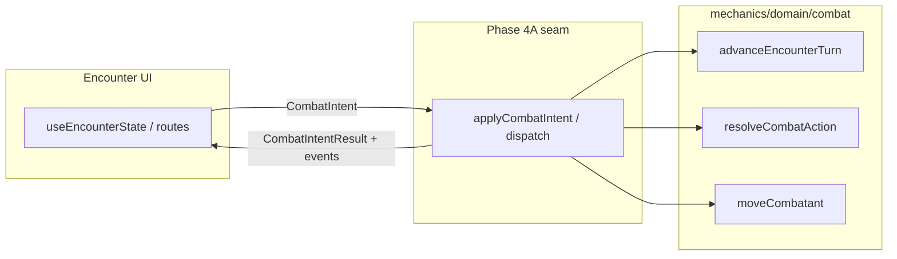

# Phase 4A — Define combat intent boundary and local dispatch architecture

**Reads:** [docs/reference/combat/README.md](../../docs/reference/combat/README.md), [docs/reference/combat/engine/intents-and-events.md](../../docs/reference/combat/engine/intents-and-events.md), [docs/reference/combat/architecture.md](../../docs/reference/combat/architecture.md), [docs/reference/combat/roadmap.md](../../docs/reference/combat/roadmap.md), prior phases [.cursor/plans/phase_1_combat_encounter_ownership.plan.md](./phase_1_combat_encounter_ownership.plan.md), [phase_3_combat_ui_decomposition.plan.md](./phase_3_combat_ui_decomposition.plan.md).

**Goal:** Introduce the **intent dispatch boundary** between Encounter UI and the shared combat engine. This pass is **architecture-first**: contracts + seam + proof; **not** a broad migration of gameplay flows.

---

## Context from prior phases

- **Phase 1:** `src/features/mechanics/domain/combat` owns engine truth; `src/features/encounter` owns workflow/UI composition; engine must not import Encounter.
- **Phase 3:** `src/features/combat` owns reusable client combat UI and must not import Encounter.
- **Phase 4A** adds: intents → local dispatch → results/events → (later) server authority. Contracts should live in **combat-owned** shared code (`mechanics/domain/combat`), not in Encounter components.

---

## 1. Audit: current truth-changing entry points

Primary concentration: `[useEncounterState.ts](../../src/features/encounter/hooks/useEncounterState.ts)`.


| Flow                | Current path                                                                               | Engine / space API                                                                                                                         |
| ------------------- | ------------------------------------------------------------------------------------------ | ------------------------------------------------------------------------------------------------------------------------------------------ |
| Start encounter     | `handleStartEncounter`                                                                     | `createEncounterState`                                                                                                                     |
| End turn            | `handleNextTurn`                                                                           | `advanceEncounterTurn`                                                                                                                     |
| Resolve action      | `handleResolveAction`                                                                      | `resolveCombatAction` (+ selection from hook state)                                                                                        |
| Move on grid        | `handleMoveCombatant`                                                                      | `moveCombatant`, `getCellForCombatant`, `reconcileBattlefieldEffectAnchors`, `resolveAttachedAuraSpatialEntryAfterMovement`, stealth notes |
| DM / manual control | `handleApplyDamage`, healing, condition/state add/remove, `handleTriggerReducedToZeroHook` | Various state mutators                                                                                                                     |
| Reset               | `handleResetEncounter`                                                                     | `setEncounterState(null)`                                                                                                                  |


**Route wiring:** `[EncounterActiveRoute.tsx](../../src/features/encounter/routes/EncounterActiveRoute.tsx)` calls `handleMoveCombatant`, `handleResolveAction`, `handleNextTurn`; `[EncounterRuntimeContext.tsx](../../src/features/encounter/routes/EncounterRuntimeContext.tsx)` passes them into layout/footer.

**UI-local (must stay out of authoritative intents):** `aoeStep`, `aoeHoverCellId`, `singleCellPlacementHoverCellId`, `objectAnchorHoverCellId`, drawer/modal open state, `presentationSelectedCombatantId`, hover/selection before confirm—already documented in [intents-and-events.md](../../docs/reference/combat/engine/intents-and-events.md).

### 4B migration candidate classification (for comments / short internal note)


| Candidate                    | Notes                                                                                         |
| ---------------------------- | --------------------------------------------------------------------------------------------- |
| **End turn**                 | Narrow engine call; few hook side effects beyond log toast queue → **best optional 4A proof** |
| **Move combatant**           | Medium: post-move reconciliation and log appends in hook                                      |
| **Resolve action**           | Complex: bundles many selection fields + `resetAoePlacement` + clears                         |
| **AoE confirm / spawn cell** | Complex: tied to multi-step UI state; defer to 4B+                                            |


Deliverable: a short `**MUTATION_ENTRY_POINTS.md`** or block comment in the new application module pointing to this table (avoid bloating README).

---

## 2. Define initial combat intent types

**Location:** `src/features/mechanics/domain/combat/intents/` (or `.../combat/intent/` if you prefer singular—pick one and stay consistent).

**Shape:** Discriminated union (e.g. `kind` or `type` field), explicit payloads only:

- `**EndTurnIntent`** — optional `actorId` if you want explicit actor (or omit if always “active combatant” from state).
- `**MoveCombatantIntent`** — `combatantId`, `destinationCellId` (and any minimal fields the engine already needs).
- `**ResolveActionIntent`** — align with existing `resolveCombatAction` arg shape: `actorId`, `actionId`, optional `targetId`, `casterOptions`, `aoeOriginCellId`, `singleCellPlacementCellId`, `unaffectedCombatantIds`, `objectId` — **mirror engine DTO**, not drawer props.
- `**PlaceAreaIntent`** — e.g. confirm step: `actorId`, `actionId`, `originCellId` (map current `aoeStep === 'confirm'` semantics when wired in 4B).
- `**ChooseSpawnCellIntent`** — `actorId`, `actionId`, `cellId` (for future spawn confirm).

**Rules:** Serializable plain objects/arrays/strings; **no** React nodes, router, or component refs; **no** renaming `EncounterState` / `EncounterSpace`.

**Exports:** Add to `[combat/index.ts](../../src/features/mechanics/domain/combat/index.ts)` only if barrel-safe (prefer deep imports inside engine if cycles appear).

---

## 3. Define result / event / error model

**Location:** `src/features/mechanics/domain/combat/results/` and/or `.../combat/events/` — or a single `intent-outcomes.ts` if the first pass is small.

**Minimum concepts:**

- `**CombatIntentResult`** — success vs failure; optional `nextState: EncounterState` (or “patch” later); `**events: CombatEvent[]`** for canonical records; `**validationIssues`** or `**error: CombatDispatchError`**.
- `**CombatValidationIssue**` — code + message (stable for UI).
- `**CombatDispatchError**` — not-found, illegal, permission (future), wrapped validation list.
- `**CombatEvent**` — narrow v1 set: e.g. `turn-ended`, `combatant-moved`, `action-resolved`, `log-appended` — enough to subsume “log slice appended” without rewriting log UI in 4A.

**Principle:** Results must be sufficient for later toasts/log rows **without** requiring ad hoc strings from mutation helpers—4A may still **derive** messages from events in one place only.

---

## 4. Local application / dispatch seam

**Purpose:** Single place that:

1. Accepts `CombatIntent` + **resolution context** (e.g. `EncounterState`, spell lookup, `buildSummonAllyCombatant`, RNG).
2. Validates and routes to the correct **existing** engine functions (`advanceEncounterTurn`, `resolveCombatAction`, `moveCombatant`, …).
3. Returns `**CombatIntentResult`** (never silent mutation).

**Recommended split:**


| Layer                     | Location                                                                                                                                                                | Role                                                           |
| ------------------------- | ----------------------------------------------------------------------------------------------------------------------------------------------------------------------- | -------------------------------------------------------------- |
| **Pure apply / dispatch** | `src/features/mechanics/domain/combat/application/` (e.g. `applyCombatIntent.ts`, `dispatchCombatIntent.ts`)                                                            | No React; testable; future server can import the same function |
| **React binding**         | Optional: `useCombatDispatch()` in **Encounter** (or a tiny helper in `features/combat` that does **not** import Encounter) that closes over `setEncounterState` + deps | Thin wrapper only                                              |


**Public API (v1):** Pick one stable name, e.g. `dispatchCombatIntent(ctx, intent)` or `applyCombatIntent(state, intent, ctx) => CombatIntentResult`.

**Documentation:** Module-level comment: *today local reducer/service; tomorrow same signature can be backed by server round-trip or websocket—do not add route/setup types here.*

**Dependency rule:** `intents` / `results` / `application` **must not** import from `src/features/encounter` or `src/features/encounter/**/*`.

---

## 5. Optional minimal proof: `EndTurnIntent`

If risk stays low:

- Implement `applyCombatIntent` (or equivalent) for `EndTurnIntent` only.
- Change `handleNextTurn` to call the dispatcher and, on success, `setEncounterState` with `nextState` and preserve existing `combatLogAppendedRef` / `queueMicrotask` behavior.

**Do not** migrate movement, resolve, or AoE in 4A unless unavoidable.

---

## 6. Documentation updates

- `**docs/reference/combat/engine/intents-and-events.md`** — add “Implementation status: Phase 4A introduces types under …” and link to source paths.
- `**docs/reference/combat/client/overview.md`** (or a short `**client/local-dispatch.md`**) — describe Encounter → dispatch → engine flow and UI-local vs authoritative state.
- `**docs/reference/combat/roadmap.md`** — add a **Phase 4A** bullet under Phase 4: “4A — contracts + local seam (complete); 4B+ — migrate flows.” (`migration-roadmap.md` now redirects to `roadmap.md`.)

---

## 7. Verification

### Grep / structure

```bash
rg 'features/encounter' src/features/mechanics/domain/combat/intents src/features/mechanics/domain/combat/results src/features/mechanics/domain/combat/application
# expect empty (or only if a mistaken import—fix)
```

- Intent payloads: no React/router imports in combat intent modules.
- UI-only state not modeled as intents.

### Commands

- Full **typecheck** (project script).
- **Full test suite** after adding focused unit tests for dispatcher + types.

### Architectural checklist

- Encounter UI can **conceptually** move to “submit intent → apply result” without owning engine mutation details.
- Same dispatch entry could be **replaced** by server-backed implementation later.
- Intents/results are **combat-concept-shaped**, not drawer-shaped.

---

## 8. Definition of done (4A)

- Initial intent types exist under combat-owned paths.
- Dispatch / apply interface exists and returns canonical results.
- Result / event / validation error shapes exist.
- Local application module sits between UI and engine (React binding optional/thin).
- Mutation entry points documented with 4B hints.
- At most **one** low-risk flow (prefer end turn) optionally migrated.
- Typecheck + tests green; reference docs updated.

---

## 9. Explicitly out of scope (4A)

- End-to-end migration of movement, action resolve, AoE, spawn placement.
- Log/toast overhaul, server transport, multiplayer.
- Broad renames of `EncounterState` / `EncounterSpace`.

**Follow-ups:** 4B single-flow migration, 4C action resolution, 4D log/toast from events, 4E remove legacy helpers.

---

## Suggested execution order

1. Audit + short classification note (§1).
2. Intent types (§2).
3. Result/event/error types (§3).
4. `applyCombatIntent` / `dispatchCombatIntent` skeleton with `not-implemented` or narrow routing for non-migrated kinds.
5. Wire optional `EndTurnIntent` (§5).
6. Tests + docs + verification (§6–7).




