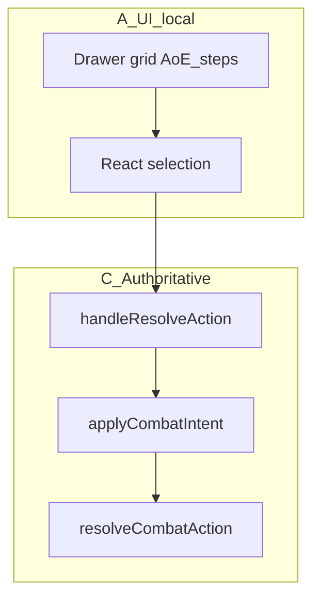

# Phase 4C — Harden and document the existing action intent seam

**Reads:** [docs/reference/combat-encounter-refactor-reference.md](../../docs/reference/combat-encounter-refactor-reference.md), [docs/reference/combat/engine/intents-and-events.md](../../docs/reference/combat/engine/intents-and-events.md), [docs/reference/combat/client/local-dispatch.md](../../docs/reference/combat/client/local-dispatch.md), Phase 4A/4B notes, [apply-combat-intent.ts](../../src/features/mechanics/domain/combat/application/apply-combat-intent.ts), [apply-resolve-action-intent.ts](../../src/features/mechanics/domain/combat/application/apply-resolve-action-intent.ts), [useEncounterState.ts](../../src/features/encounter/hooks/useEncounterState.ts).

## Important scope correction

**Do not treat Phase 4C as a second large migration pass for action execution.**

Committed action execution is already unified on:

- `handleResolveAction`
- `ResolveActionIntent`
- `applyCombatIntent`
- `applyResolveActionIntent`
- `resolveCombatAction`

Phase 4C must **not** invent duplicate migration work.

Instead, Phase 4C should:

- document the prep-vs-commit boundary
- harden the application-layer action seam
- optionally extract a pure confirmed-payload builder
- enrich result/event semantics in a narrow way
- update architecture/reference docs to match reality

## Goal

Make the action intent seam more explicit, testable, and durable **without** broad UX or architecture churn.

After this pass, the codebase should clearly express:

- what stays UI-local preparation
- what counts as confirmed action input
- what the authoritative action commit path is
- what canonical result/event output the application layer produces

## Current architecture (audit)

- Single production entry: [`useEncounterState.ts`](../../src/features/encounter/hooks/useEncounterState.ts) `handleResolveAction` → [`applyCombatIntent`](../../src/features/mechanics/domain/combat/application/apply-combat-intent.ts) → [`applyResolveActionIntent`](../../src/features/mechanics/domain/combat/application/apply-resolve-action-intent.ts) → [`resolveCombatAction`](../../src/features/mechanics/domain/combat/resolution/action/action-resolver.ts).
- Drawers/footer/route only call `onResolveAction` / `handleResolveAction`. Encounter production code should have **no** direct `resolveCombatAction` imports (tests may).

---

## 1. Prep-vs-commit classification note (required)

Add a short **combat-owned** note (extend [`MUTATION_ENTRY_POINTS.md`](../../src/features/mechanics/domain/combat/application/MUTATION_ENTRY_POINTS.md) and/or add [`PHASE_4C_ACTION_PREP_VS_COMMIT.md`](../../src/features/mechanics/domain/combat/application/PHASE_4C_ACTION_PREP_VS_COMMIT.md)).

| Class | Examples | Owner |
|-------|-----------|--------|
| **A — UI-local preparation** | hover, drawer open, `aoeStep` before confirmation, temporary target, temporary placement preview | Encounter / UI-local state |
| **B — Confirmed input normalization** | fields matching `ResolveCombatActionSelection`; pure mapping from confirmed hook/UI state to committed payload | Hook-local mapping or extracted pure helper before dispatch |
| **C — Authoritative execution** | `applyCombatIntent`, `applyResolveActionIntent`, `resolveCombatAction` | Combat application / engine |

Explicitly state:

- All action categories that share `resolveCombatAction` already share the **same** commit path.
- AoE / spawn / caster-option data remain **fields on `ResolveActionIntent`** unless a later phase justifies splitting intents.

---

## 2. Audit `ResolveActionIntent` payload (narrow)

Review [`combat-intent.types.ts`](../../src/features/mechanics/domain/combat/intents/combat-intent.types.ts) vs [`action-resolution.types.ts`](../../src/features/mechanics/domain/combat/resolution/action-resolution.types.ts) `ResolveCombatActionSelection`.

**Default:** keep `{ kind: 'resolve-action' } & ResolveCombatActionSelection` unless a real mismatch appears.

**Do not add:** router-shaped fields, raw panel state, React objects, UI-only temporary state.

---

## 3. Harden [`apply-resolve-action-intent.ts`](../../src/features/mechanics/domain/combat/application/apply-resolve-action-intent.ts) (narrow, test-backed)

Acceptable only:

- clearer validation for unknown actor (keep)
- optional **cheap** check that `actionId` exists on the actor’s action list → `validation-failed` if stable
- preserve or improve canonical events
- optional lightweight summary event, e.g. `action-log-slice` with `entryTypes` from appended log (helps 4D)

**Do not:** duplicate full engine legality; guess failure from unstable heuristics (e.g. reference equality); broad log/toast redesign.

If `CombatEvent` grows, extend [`combat-intent-result.types.ts`](../../src/features/mechanics/domain/combat/results/combat-intent-result.types.ts) and update consumers that pattern-match events (e.g. `useEncounterState` log microtask only cares about `log-appended` today).

---

## 4. Optional: pure `buildResolveActionIntentFromActiveSelection(...)`

Extract **only if** `handleResolveAction` is still long or hard to test.

- **Pure, React-free,** maps confirmed fields → `ResolveActionIntent`.
- **Ownership:** prefer **Encounter** (`src/features/encounter/domain/` or `helpers/`) if it is primarily hook-field mapping; combat application only if broadly reusable and concept-only.
- **Tests:** focused unit tests; **behavior unchanged**.

---

## 5. Reference docs

Update:

- [`docs/reference/combat/engine/intents-and-events.md`](../../docs/reference/combat/engine/intents-and-events.md)
- [`docs/reference/combat/client/local-dispatch.md`](../../docs/reference/combat/client/local-dispatch.md)
- [`docs/reference/combat/roadmap.md`](../../docs/reference/combat/roadmap.md)

State clearly:

- committed action execution already routes through `ResolveActionIntent` + `applyCombatIntent`
- UI preparation stays UI-local
- Phase 4C is **document / harden / narrow enrich**, not a second migration

---

## Hard constraints

- **Do not** build a second action dispatch path, parallel seam, or duplicate intent entry points—**one** canonical committed path remains.
- **Do not** broaden into drawer/grid/AoE preview/selection/toast/log UX redesign.
- **Do not** over-validate in the application layer (no full engine legality reimplementation).
- **Do not** move UI-local prep (hover, preview, temporary selection, modal/step flow) into authoritative intents.

---

## Suggested execution order

1. Confirm current seam entry points and document real architecture (grep).
2. Add prep-vs-commit classification note.
3. Audit `ResolveActionIntent` payload; change only if necessary.
4. Narrow improvements to `applyResolveActionIntent` + tests.
5. Optionally extract pure payload builder + tests.
6. Update reference docs and roadmap wording.
7. Run verification.

---

## Verification

- **Grep:** no new `resolveCombatAction` in Encounter **production**; no duplicate dispatch path.
- **Intent payloads:** no router/component objects, no raw panel state.
- **`tsc -b`** and **`npm run test:run`** (note pre-existing repo `tsc` failures if any remain outside touched files).
- **Manual smoke:** single-target, AoE confirm, caster options—familiar UX.

---

## Definition of done

- Short prep-vs-commit note exists (combat-owned location).
- `applyResolveActionIntent` improved in a **narrow**, test-backed way.
- `ResolveActionIntent` stays aligned with `ResolveCombatActionSelection` unless a justified fix.
- Optional intent builder only if it materially improves clarity; tests if added.
- Reference docs + roadmap reflect current seam; Phase 4C described as harden/document, not a second migration.
- No duplicate action execution path.
- Typecheck and tests pass (per project reality).

---

## Explicitly out of scope

- Drawer/grid orchestration refactors, toast/log overhaul (4D), server sync, separate spawn-only intent systems, broad action taxonomy redesign.

**Likely follow-ups:** 4D event-driven log/toast; 4E legacy mutation cleanup; later server-backed dispatch.

---

## Honest scope note

If stakeholders expected a large new migration, the repo **already** centralizes committed resolution on `applyCombatIntent`. Phase 4C **documents, hardens, and narrowly enriches** that seam—**not** a second parallel migration.
