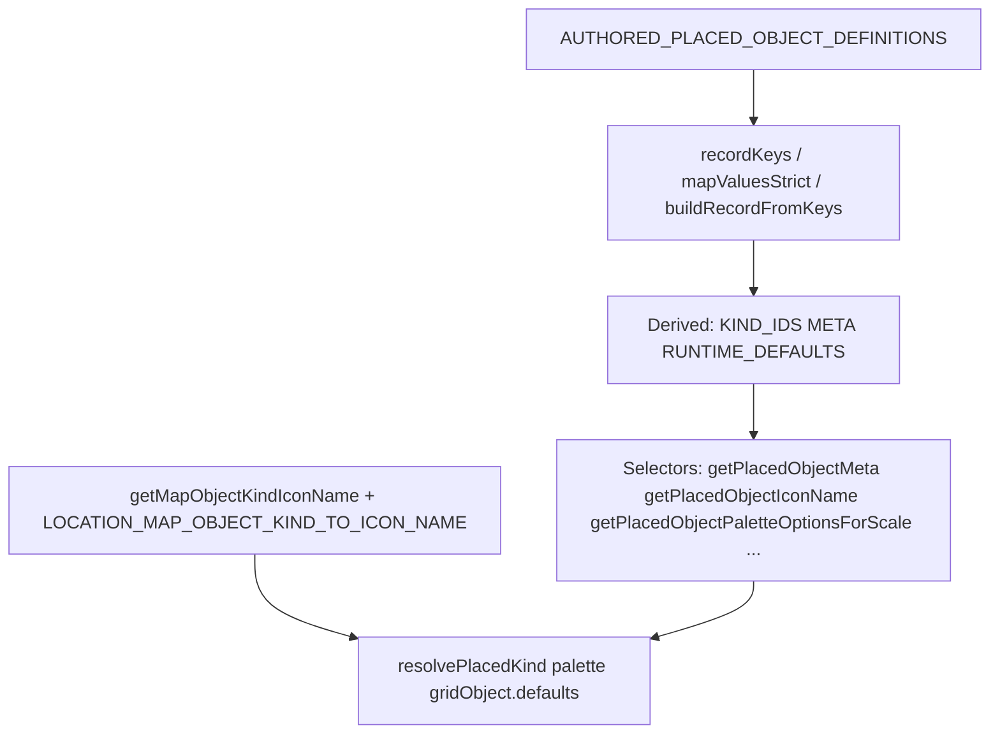

# Second pass: derived placed-object records and selector-first API

## Context and constraints

- **Canonical source:** [`AUTHORED_PLACED_OBJECT_DEFINITIONS`](src/features/content/locations/domain/mapContent/locationPlacedObject.registry.ts) — each entry owns `label`, `description`, `iconName`, optional `linkedScale`, `allowedScales`, `runtime`.
- **`obstacle`** is already removed from active map-object flows. **Do not** spend this pass on obstacle migration unless a remaining reference **blocks compile or runtime behavior**.
- **Primary maintainability goal:** adding a new authored placed object kind should mainly require **(1)** one registry entry and **(2)** optionally **one** MUI mapping in [`locationMapIconNameMap.tsx`](src/features/content/locations/domain/mapPresentation/locationMapIconNameMap.tsx) **only if** a **new** `LocationMapIconName` token is introduced (existing tokens like `map_room`, `stairs` need no change).

## Problem (current state)

- [`locationPlacedObject.selectors.ts`](src/features/content/locations/domain/mapContent/locationPlacedObject.selectors.ts) still **manually lists** `LOCATION_PLACED_OBJECT_KIND_IDS` and **manually enumerates** `LOCATION_PLACED_OBJECT_KIND_META` key-by-key.
- [`locationPlacedObject.runtime.ts`](src/features/content/locations/domain/mapContent/locationPlacedObject.runtime.ts) already derives `LOCATION_PLACED_OBJECT_KIND_RUNTIME_DEFAULTS` via `Object.fromEntries`, but it depends on the **manual** kind-id tuple.
- Consumers still **index raw maps**:
  - [`resolvePlacedKindToAction.ts`](src/features/content/locations/domain/mapEditor/placement/resolvePlacedKindToAction.ts) — `LOCATION_PLACED_OBJECT_KIND_META[placedKind]`
  - [`locationMapEditorPalette.helpers.ts`](src/features/content/locations/domain/mapEditor/palette/locationMapEditorPalette.helpers.ts) — same
  - [`gridObject.defaults.ts`](packages/mechanics/src/combat/space/gridObject/gridObject.defaults.ts) — `LOCATION_PLACED_OBJECT_KIND_META[key].label`

**Already aligned:** [`getPlacedObjectKindsForScale`](src/features/content/locations/domain/mapContent/locationPlacedObject.selectors.ts) walks definitions using `allowedScales`; [`getAllowedPlacedObjectKindsForScale`](src/features/content/locations/domain/mapContent/locationScaleMapContent.policy.ts) delegates to it — **no duplicate per-scale authored lists** in scale policy.

## Target architecture

## Scope A — Remove manual mirror maps

| Manual mirror (remove) | Replace with |
|------------------------|--------------|
| Hand-written `LOCATION_PLACED_OBJECT_KIND_IDS` tuple | `recordKeys(AUTHORED_PLACED_OBJECT_DEFINITIONS)` with preserved `LocationPlacedObjectKindId` typing |
| Hand-written `LOCATION_PLACED_OBJECT_KIND_META = { city: toMeta(...), ... }` | `mapValuesStrict(definitions, toMeta)` |
| Runtime default object built from manual ids + per-entry `.runtime` | `mapValuesStrict(definitions, (d) => d.runtime)` (single derivation; optionally move from `runtime.ts` into selectors and re-export) |
| (None expected) duplicate per-scale **authored** lists | Already derived via `allowedScales`; verify no stray duplicates in grep |

## Scope B — Typed derivation helpers (local to feature)

Add something like [`locationPlacedObject.recordUtils.ts`](src/features/content/locations/domain/mapContent/locationPlacedObject.recordUtils.ts):

- **`recordKeys(def)`** — `(keyof typeof def)[]` without widening to `string[]`.
- **`mapValuesStrict(def, fn)`** — `Record<K, V>` with `K` preserved.
- Optionally **`buildRecordFromKeys(keys, lookup)`** if it simplifies runtime/meta derivation.

**Preference:** keep helpers **local** to `mapContent` unless an existing shared utility already matches (none found in prior grep).

**Registry typing:** Keep `AUTHORED_PLACED_OBJECT_DEFINITIONS` as `as const satisfies` with a structurally sound `AuthoredPlacedObjectDefinition` so `keyof typeof` stays the authored id union.

## Scope C — Selector / helper layer (preferred API)

Implement or extend in [`locationPlacedObject.selectors.ts`](src/features/content/locations/domain/mapContent/locationPlacedObject.selectors.ts):

| Selector / helper | Behavior |
|-------------------|----------|
| `getPlacedObjectDefinition(kindId)` | existing — index registry |
| `getPlacedObjectMeta(kindId)` | read **derived** `LOCATION_PLACED_OBJECT_KIND_META[id]` or `toMeta(definition)` — single code path |
| `getPlacedObjectRuntimeDefaults(kindId)` | existing — delegate to registry |
| `getPlacedObjectKindsForScale(scaleId)` | existing — filter by `allowedScales` (iterate **derived** keys, not a manual tuple) |
| `getPlacedObjectIconName(kindId)` | `getPlacedObjectDefinition(kindId).iconName` |
| `getPlacedObjectPaletteOptionsForScale(scale)` | narrow DTO array: kinds for scale + label/description/iconName/linkedScale — used to simplify [`getPlacePaletteItemsForScale`](src/features/content/locations/domain/mapEditor/palette/locationMapEditorPalette.helpers.ts) (map to `MapPlacePaletteItem` with linked vs object category) |

**Persisted map object kinds (separate concern):**

- Add **`getMapObjectKindIconName(kind)`** (or `getPersistedMapObjectKindIconName`) wrapping [`LOCATION_MAP_OBJECT_KIND_ICON_NAME`](src/features/content/locations/domain/mapContent/locationMapPresentation.constants.ts) (or renamed symbol below).
- Optional rename: **`LOCATION_MAP_OBJECT_KIND_ICON_NAME` → `LOCATION_MAP_OBJECT_KIND_TO_ICON_NAME`** — only where it improves “persisted kind → icon token” clarity; update imports in one pass.

## Scope D — Consumer updates

1. **`resolvePlacedKindToAction`** — use `getPlacedObjectMeta(placedKind)` (or `linkedScale` helper) instead of `LOCATION_PLACED_OBJECT_KIND_META[...]`.
2. **`locationMapEditorPalette.helpers`** — prefer `getPlacedObjectPaletteOptionsForScale` + map to `MapPlacePaletteItem`, or at minimum `getPlacedObjectMeta(kind)` per iteration.
3. **`gridObject.defaults.ts`** — `getPlacedObjectMeta(key)` after narrowing `key` to `LocationPlacedObjectKindId` (keep procedural `tree`/`pillar` branch as-is).
4. **`parseLocationPlacedObjectKindId`** — rebuild `Set` from **derived** kind ids (registry keys).

## Scope E — Exports and ergonomics

- **Re-export** derived `LOCATION_PLACED_OBJECT_KIND_META` / `LOCATION_PLACED_OBJECT_KIND_IDS` from [`locationPlacedObject.types.ts`](src/features/content/locations/domain/mapContent/locationPlacedObject.types.ts) for **`@rpg-world-builder/mechanics`** and existing comments — **acceptable** if documented as “derived from registry; prefer selectors for new code.”
- **Tradeoff:** keeping **one** derived `LOCATION_PLACED_OBJECT_KIND_META` object export avoids repeated `toMeta()` calls in hot paths and keeps referential stability for any code that relies on object identity (unlikely but cheap to keep).

## Scope F — Intentionally separate static maps

These are **not** authored-registry mirrors and **stay** static unless proven to be thin duplicates:

- [`LOCATION_MAP_ICON_COMPONENT_BY_NAME`](src/features/content/locations/domain/mapPresentation/locationMapIconNameMap.tsx) — MUI component by `LocationMapIconName` token.
- [`LOCATION_SCALE_MAP_ICON_NAME`](src/features/content/locations/domain/mapContent/locationMapPresentation.constants.ts) — scale affordance icons.
- Terrain / cell-fill / path / edge registries — different vocabularies.

Persisted **`LocationMapObjectKindId` → `LocationMapIconName`** remains a **separate** map from authored **palette** `iconName` on definitions (marker vs table vs door, etc.).

## Verification

- Unit test: **key count** of derived meta equals **key count** of `AUTHORED_PLACED_OBJECT_DEFINITIONS` (drift guard).
- `npm run test` + `npm run build`.
- Grep: no **`obstacle`** reintroduced in map object kind unions or placement policy.

---

## Post-implementation summary (fill in when executing)

### Manual mirror maps removed

- _(e.g. hand-built `LOCATION_PLACED_OBJECT_KIND_IDS` tuple, hand-built `LOCATION_PLACED_OBJECT_KIND_META` object)_

### New selectors/helpers introduced

- _(e.g. `recordKeys`, `mapValuesStrict`, `getPlacedObjectIconName`, `getPlacedObjectPaletteOptionsForScale`, `getMapObjectKindIconName`)_

### Consumer call sites simplified

- _(e.g. resolvePlacedKindToAction, locationMapEditorPalette.helpers, gridObject.defaults)_

### Static maps intentionally left as-is (separate concern)

- _(e.g. icon component map, scale icon map, fill/path/edge registries, persisted-kind → icon token map)_

### Tradeoffs / raw derived exports kept for ergonomics

- _(e.g. exported derived `LOCATION_PLACED_OBJECT_KIND_META` for backward compat + mechanics package)_
