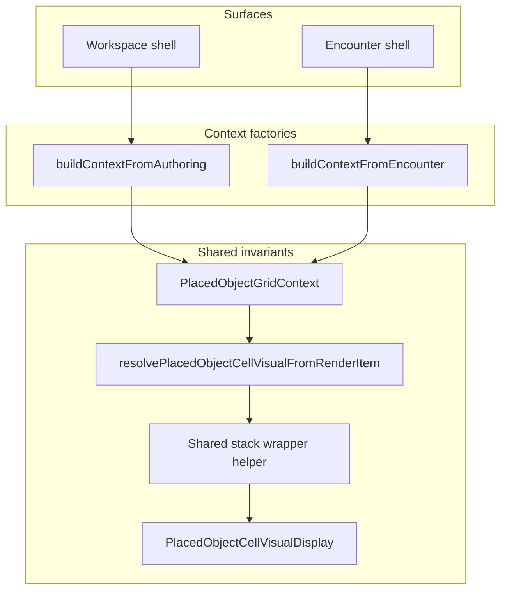

# Placed-object workspace vs encounter alignment

## 1. Recommended strategy (short)

Treat **silent geometry drift** as a **data contract** problem first, a **grid policy** problem second, and only then a **component duplication** problem. Today the shared trio ([`deriveLocationMapAuthoredObjectRenderItems`](shared/domain/locations/map/locationMapAuthoredObjectRender.helpers.ts) → [`resolvePlacedObjectCellVisualFromRenderItem`](src/features/content/locations/domain/presentation/map/resolvePlacedObjectCellVisual.ts) → [`PlacedObjectCellVisualDisplay`](src/features/content/locations/domain/presentation/map/PlacedObjectCellVisualDisplay.tsx)) is already the right **leaf**; drift comes from **different `feetPerCell` / `cellPx` / `gapPx` wiring**, **CSS layout around the leaf** ([`GridEditor`](src/features/content/locations/components/mapGrid/GridEditor.tsx) vs [`CombatGrid`](src/features/combat/components/grid/CombatGrid.tsx)), and **wrapper stacks** ([`LocationMapAuthoredObjectIconsCellInline`](src/features/content/locations/components/mapGrid/LocationMapAuthoredObjectIconsLayer.tsx) vs authoring overlay).

**Opinionated direction:**

- **Unify grid gutter policy** for square maps: one named value used by **both** workspace CSS grid and combat `inline-grid`, and by **all** [`squareGridOverlayGeometry`](shared/domain/grid/squareGridOverlayGeometry.ts) math (centers, hit tests, edges). Today both are effectively **1px** but **combat hardcodes** `gap: '1px'` while workspace uses [`SQUARE_GRID_GAP_PX`](shared/domain/grid/squareGridOverlayGeometry.ts)—eliminate that duplication before debating pixels.
- **Introduce a single typed “render context”** (see [Shared contract recommendation](#shared-contract-recommendation)) produced at each surface’s boundary and passed into resolver + shared wrapper helpers. Surfaces **must not** assemble `PlacedObjectCellVisualFootprintLayoutContext` ad hoc in multiple places.
- **Do not** merge workspace and encounter into one parent tree; **do** merge **geometry derivation** and **leaf wrapper contract** so differences are explicit flags, not accidental props.

**Pixel-identical output** between workspace and encounter is **not** a realistic goal if `cellPx` is intentionally different (responsive authoring vs fixed [`BASE_CELL_SIZE`](src/features/combat/components/grid/CombatGrid.tsx) tactical cell). The realistic goal is **same math given same inputs**, and **no hidden divergence** in feet/cell, gutter, and anchor policy for a **given map + encounter configuration**.

---

## 2. Level of unification (explicit recommendation)

**Target:**

| Layer | Unify? | Notes |
|-------|--------|--------|
| **Inputs** (`feetPerCell`, `cellPx`, `gapPx` for math, `applyPlacementAnchor`, geometry mode) | **Yes** — one contract, one construction path per surface | Surfaces build the contract; domain consumes it |
| **Footprint + anchor resolution** | **Yes** — already mostly shared; enforce **single entry** + tests | [`placedObjectFootprintLayout`](shared/domain/locations/map/placedObjectFootprintLayout.ts), [`placedObjectPlacementAnchorLayout`](shared/domain/locations/map/placedObjectPlacementAnchorLayout.ts), [`resolvePlacedObjectCellVisualFromRenderItem`](src/features/content/locations/domain/presentation/map/resolvePlacedObjectCellVisual.ts) |
| **Leaf display** (`PlacedObjectCellVisualDisplay`) | **Yes** (already) | Optional tiny shared **wrapper** for stack/`maxWidth` policy |
| **Outer shells** (GridEditor cell, Combat cell, regions, tokens) | **No** — separate trees | Intentional product differences |

**Verdict:** **Shared leaf + shared geometry context + small shared wrapper contract** is the right ceiling. A **single giant shared component** for both apps is **not** recommended: layering (regions, paths, tokens, tool modes), pointer-events, and overflow policies differ by design; forcing one tree increases coupling and makes intentional differences harder to express.

---

## 3. Phased refactor plan

### Phase A — Grid policy and gutter alignment (foundation)

**Goal:** Remove **hidden** gutter divergence and make square-grid **physical layout** and **overlay math** use the **same `gapPx` value** from one place.

**Scope:**

- Audit all uses of [`SQUARE_GRID_GAP_PX`](shared/domain/grid/squareGridOverlayGeometry.ts) and combat’s literal [`gap: '1px'`](src/features/combat/components/grid/CombatGrid.tsx) (and any other square grid UIs that represent the same map).
- **Import the same constant** (or a renamed `SQUARE_GRID_GUTTER_PX`) into `CombatGrid` so workspace and combat cannot drift to `1` vs `2` silently.
- Ensure [`useLocationAuthoringGridLayout`](src/features/content/locations/hooks/useLocationAuthoringGridLayout.ts) (`GRID_GAP_PX`), [`GridEditor`](src/features/content/locations/components/mapGrid/GridEditor.tsx), edge/path geometry ([`LocationGridAuthoringSection`](src/features/content/locations/components/workspace/LocationGridAuthoringSection.tsx), [`locationMapEdgeGeometry.helpers`](shared/domain/locations/map/locationMapEdgeGeometry.helpers.ts)), and [`squareGridOverlayGeometry`](shared/domain/grid/squareGridOverlayGeometry.ts) all reference that **one** gutter for square maps.

**What does not change yet:**

- Resolver APIs and JSX structure beyond swapping the gap **source**.
- Whether gutter is 0 or 1 (see [Preconditions](#preconditions-for-pixel-stable-rendering)).

**Risks / watchouts:**

- Edge/path SVG and select-mode hit testing assume **consistent** `cellPx + gap` stepping; any gutter change must move **all** consumers together.

**Exit criteria:**

- Combat and workspace square grids read gutter from **one module**; no stray `'1px'` for the same semantic gutter.
- Document in one line: **“Square map gutter for authoring + tactical = X px.”**

---

### Phase B — Shared resolved render context (contract + construction sites)

**Goal:** **One explicit type** for “everything the placed-object resolver needs from the grid,” built **once per render region** (or memoized per stable key), not reassembled in each component.

**Scope:**

- Define a **shared contract** (name TBD, see below) that includes at minimum:
  - `feetPerCell: number`
  - `cellPx: number`
  - `gapPx: number` (meaning: **gutter used in footprint/anchor overlay math** — today this is the same physical gutter as the CSS grid when aligned in Phase A)
  - `geometryMode: 'square' | 'hex'` (or `square | hex` as today’s product supports)
  - `applyPlacementAnchor: boolean` (workspace square vs combat tactical centering policy)
  - `surface: 'workspace' | 'encounter'` (optional, for logging, dev assertions, or feature flags — **not** for math branches if avoidable)
- **Construction:** workspace builds from [`resolveAuthoringCellUnitFeetPerCell`](shared/domain/locations/map/locationCellUnitAuthoring.ts) + `squareCellPx` + gutter constant; encounter builds from `grid.cellFeet` + `cellSizePx` + same gutter constant + `applyPlacementAnchor: false` (current combat behavior in [`CombatGrid`](src/features/combat/components/grid/CombatGrid.tsx)).
- Replace inline object literals passed to `resolvePlacedObjectCellVisualFromRenderItem` with this contract.

**What does not change yet:**

- **Feet-per-cell provenance** (authoring `gridCellUnit` vs encounter `grid.cellFeet`) — only **wrap** it; proving they match for the same map may be a separate **validation** task (tests or dev-only asserts).

**Risks / watchouts:**

- **Semantic overload of `gapPx`:** document whether it is **only** for resolver math or also for **layout box** width caps ([`LocationMapAuthoredObjectIconsCellInline`](src/features/content/locations/components/mapGrid/LocationMapAuthoredObjectIconsLayer.tsx) `maxWidth: cellPx`). Today `maxWidth` is **cell** width, not “cell + gap”; keep that distinction explicit in the contract doc.

**Exit criteria:**

- All call sites of `resolvePlacedObjectCellVisualFromRenderItem` for map objects take **`PlacedObjectCellVisualFootprintLayoutContext` derived only via the new contract** (or a single factory function).
- No duplicate `{ feetPerCell, cellPx, gapPx, applyPlacementAnchor }` literals in workspace + combat paths.

---

### Phase C — Shared layout helper / wrapper contract (not full tree)

**Goal:** Align **wrapper** behavior that affects perceived scale (stack `maxWidth`, flex gap between multiple objects in a cell) without merging outer shells.

**Scope:**

- Extract a **small** presentational helper used by both [`LocationMapAuthoredObjectIconsCellInline`](src/features/content/locations/components/mapGrid/LocationMapAuthoredObjectIconsLayer.tsx) and the authoring overlay path: same **row stack**, **wrap**, **`maxWidth` policy** (likely `cellPx` from context, documented), **tooltip + data attributes** remain on the surface if needed for selection.
- Optionally centralize “**multi-object-in-cell**” spacing (`gap={0.25}`) in one place.

**What does not change yet:**

- Absolute positioning for workspace [`LocationMapAuthoredObjectIconsLayer`](src/features/content/locations/components/mapGrid/LocationMapAuthoredObjectIconsLayer.tsx) vs inline flow in combat — those are **shell** differences.

**Risks / watchouts:**

- Editor **padding** inside [`GridEditor`](src/features/content/locations/components/mapGrid/GridEditor.tsx) (`p: 0.25`) is **shell**; do not fold into shared leaf without an explicit **“content inset”** field or accepting residual drift for this phase.

**Exit criteria:**

- Inline combat and authoring **inline** paths share the same **inner** stack rules for placed-object rasters where product intends parity.

---

### Phase D — Large / multi-cell visuals and overflow (geometry-first)

**Goal:** Treat **elongated and multi-cell footprint** visuals as **layout geometry**, with explicit invariants and tests—not ad hoc `overflow` fixes.

**Scope:**

- Reaffirm invariants from [`placedObjectFootprintLayout`](shared/domain/locations/map/placedObjectFootprintLayout.ts) and [`placed-objects-flow.md`](docs/reference/locations/placed-objects-flow.md): layout box can exceed one `cellPx`; DOM stays on anchor cell.
- Add **focused unit tests** for: same contract → same `layoutWidthPx` / `layoutHeightPx` / anchor offsets (golden values for a few registry variants).
- Document **surface responsibilities**: workspace vs encounter **clipping** and **z-index** are allowed to differ; **math** must not.

**What does not change yet:**

- Full multi-cell hit mesh or selection (out of scope unless product demands it).

**Risks / watchouts:**

- Changing gutter to **0** in a later step changes **neighbor overlap** geometry; large sprites need visual QA on both surfaces.

**Exit criteria:**

- Tests lock **resolver output** for representative large objects; regressions caught without manual grid comparison.

---

### Phase E (optional) — `feetPerCell` / `cellPx` parity policy

**Goal:** When encounter represents an **authored** location map, **avoid silent mismatch** between `gridCellUnit` and `grid.cellFeet`, and between authoring `cellPx` and combat `BASE_CELL_SIZE`.

**Scope:**

- Trace where [`grid.cellFeet`](src/features/combat/components/grid/CombatGrid.tsx) is populated relative to authoring [`gridCellUnit`](src/features/content/locations/components/mapGrid/LocationMapCellAuthoringOverlay.tsx).
- Add **tests or dev assertions** when both are available for the same map; optionally document **intentional** scaling (zoom) vs **bug**.

**Exit criteria:**

- Known list of **when** encounter and workspace inputs are guaranteed equal vs **when** they differ by design (fixed tactical cell size).

---

## 4. Shared contract recommendation

**Responsibility boundary:**

- **Owns:** All **numeric inputs** that flow into [`PlacedObjectCellVisualFootprintLayoutContext`](src/features/content/locations/domain/presentation/map/resolvePlacedObjectCellVisual.ts) and any future extensions (e.g. content inset if you add it).
- **Does not own:** React tree structure, `pointer-events`, selection highlights, region tint, token layers, or combat-specific affordances.

**Suggested shape (conceptual, not final names):**

- **`PlacedObjectGridViewModel`** or **`ResolvedPlacedObjectGridContext`**: `{ feetPerCell, cellPx, gapPx, geometryMode, applyPlacementAnchor }` plus optional **`surface`** for diagnostics only.
- **Factory functions** (one per surface): `buildPlacedObjectGridContextFromAuthoring(...)`, `buildPlacedObjectGridContextFromEncounter(...)` living next to or under `domain/presentation/map/` or `shared/domain/locations/map/` depending on dependency direction.

**Rule:** Surfaces **only** pass this object into resolver helpers and shared wrapper components—**no** parallel construction.

---

## 5. Intentional surface differences

Keep these **out** of the shared contract’s math path:

- **Selection / hit targets:** `[data-map-object-id]`, select-mode resolution, gutter-inclusive anchor behavior for painting ([`resolveSquareAnchorCellIdForSelectPx`](shared/domain/grid/squareGridOverlayGeometry.ts)).
- **Pointer events:** workspace overlay vs combat cell may differ; do not unify.
- **Editor chrome:** region overlay, linked-location icon, padding in [`GridEditor`](src/features/content/locations/components/mapGrid/GridEditor.tsx), `centerChildren={false}` on [`GridCellVisual`](src/features/content/locations/components/mapGrid/GridCellVisual.tsx) vs combat defaults.
- **Combat chrome:** tokens, highlights, popovers, grid border styling.
- **Overflow / clipping policy:** may differ; **document** if large sprites clip in one surface and spill in another.

---

## 6. Why shared leaf + shared geometry beats one giant shared tree

- **Different composition:** Workspace stacks **region paths, edges, SVG underlay, authoring overlay**; combat stacks **tokens, movement highlights, encounter affordances**. One parent component becomes a prop explosion or context soup.
- **Clear invariants:** Geometry belongs in **domain + typed context**; UI chrome belongs in **surface shells**.
- **Safer iteration:** You can change editor padding or combat token layout without risking footprint math.
- **Testing:** Pure functions + contract types are easier to test than a monolithic JSX tree.

---

## 7. Preconditions for pixel-stable rendering

**What must align for “same pixels” (given same raster and registry):**

1. **`feetPerCell`** — must match if footprint scaling should match.
2. **`cellPx`** — must match for identical layout box dimensions; **encounter fixed cell size vs responsive authoring** will **always** produce different pixel sizes unless you **drive combat cell size from the same layout** or accept scale-only equivalence.
3. **Gutter** — workspace CSS `gap`, overlay `squareCellCenterPx` / hit tests, and combat `inline-grid` `gap` must use the **same** value ([`SQUARE_GRID_GAP_PX`](shared/domain/grid/squareGridOverlayGeometry.ts) vs `'1px'` today).
4. **`applyPlacementAnchor`** — intentional; both surfaces should document why true vs false.
5. **Wrapper `maxWidth` / padding** — must match **if** you want identical framing; otherwise treat as **shell** drift.

**Removing `SQUARE_GRID_GAP_PX` (setting gutter to 0):**

- **Do not treat as trivial:** It affects [`useLocationAuthoringGridLayout`](src/features/content/locations/hooks/useLocationAuthoringGridLayout.ts) (cell size from available canvas), [`GridEditor`](src/features/content/locations/components/mapGrid/GridEditor.tsx), **all** [`squareGridOverlayGeometry`](shared/domain/grid/squareGridOverlayGeometry.ts) consumers, edge/path SVG, and select-mode coordinate math—**high coordination cost**.
- **Recommendation:** **Phase A first** — **single shared gutter constant** used everywhere (including combat). **Then** decide product-wise whether to move to **0px** gutter as a **dedicated** follow-up with full regression on edges, paths, and hit testing.
- **If** the priority is **maximum alignment with combat** and you accept **dense** square grids: moving gutter to **0** **early** (after constant unification) **does** eliminate a major class of workspace-vs-encounter layout differences—but only **together with** updating **all** square geometry call sites; partial removal increases drift.

---

## Mermaid: data flow after refactor (target)

