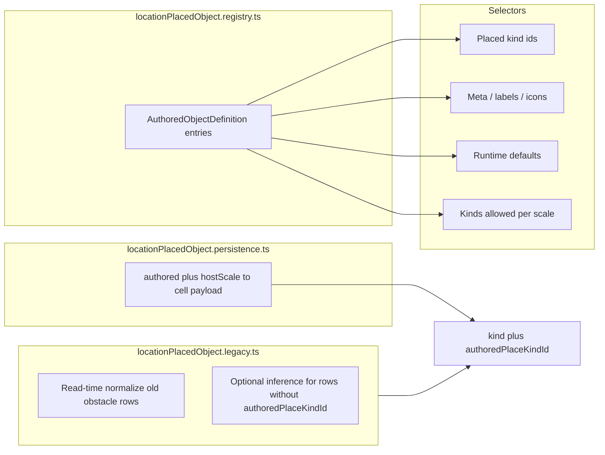

# Placed-object registry refactor and `obstacle` retirement

## Current state (relevant facts)

- **Authored vocabulary** lives in `[locationPlacedObject.types.ts](src/features/content/locations/domain/mapContent/locationPlacedObject.types.ts)` (`LOCATION_PLACED_OBJECT_KIND_IDS`, `LOCATION_PLACED_OBJECT_KIND_META`).
- **Runtime defaults** duplicate keys in `[locationPlacedObject.runtime.ts](src/features/content/locations/domain/mapContent/locationPlacedObject.runtime.ts)` (`LOCATION_PLACED_OBJECT_KIND_RUNTIME_DEFAULTS`).
- **Per-scale palette** lists are hand-maintained in `[locationScaleMapContent.policy.ts](src/features/content/locations/domain/mapContent/locationScaleMapContent.policy.ts)` (`objectKinds` per scale).
- **Persisted cell-object kinds** are defined in shared `[locationMap.constants.ts](shared/domain/locations/map/locationMap.constants.ts)` (`LOCATION_MAP_OBJECT_KIND_IDS` includes `**obstacle`**).
- **Bridge** `[placeObjectBridge.ts](src/features/content/locations/domain/mapEditor/placement/placeObjectBridge.ts)` maps floor **table** → persisted `**obstacle`** (must change).
- **Server policy** `[locationMapPlacement.policy.ts](shared/domain/locations/map/locationMapPlacement.policy.ts)` still allows `**obstacle`** on several scales (e.g. floor, city, room).
- **Hydration** `[hydrateGridObjectsFromLocationMap.ts](src/features/game-session/combat/hydrateGridObjectsFromLocationMap.ts)` has `**case 'obstacle': return 'tree'`** — the lossy inference to remove from active code.
- **Icons for persisted kinds** in `[locationMapPresentation.constants.ts](src/features/content/locations/domain/mapContent/locationMapPresentation.constants.ts)` (`LOCATION_MAP_OBJECT_KIND_ICON_NAME` includes `**obstacle`**).
- **Mongoose** `[CampaignLocationMap.model.ts](server/shared/models/CampaignLocationMap.model.ts)`: `objects[].kind` is an unconstrained `String` (no enum), so adding new persisted strings is backward-compatible at the DB layer.

**Out of scope (per your note):** `LOCATION_MAP_ICON_COMPONENT_BY_NAME`, `LOCATION_SCALE_MAP_ICON_NAME`, fill/path/edge registries, and mechanics’ generic “grid obstacle” / `EncounterSpace.obstacles` naming (those are combat VM concepts, not `LocationMapObjectKindId`).

---

## Target architecture

**Canonical registry shape (per authored id):** one object with:

- `id` (authored id: `city` | `building` | …)
- `label`, `description`, `iconName`, optional `linkedScale`
- **Placement:** `allowedScales: readonly LocationScaleId[]` (replaces duplicated `LOCATION_SCALE_MAP_CONTENT_POLICY.objectKinds` lists for objects)
- **Persistence (new saves):** explicit `persistedKind: LocationMapObjectKindId` and rule for when `**authoredPlaceKindId`** must also be stored (e.g. tree on city: `marker` + `authoredPlaceKindId: 'tree'`; table on floor: `**table`** + `authoredPlaceKindId: 'table'` if you want redundancy, or `**table`** alone if you treat `kind === 'table'` as sufficient — your acceptance criteria favor always setting `**authoredPlaceKindId`** for authored rows; align the registry with that single rule)
- **Runtime:** `blocksMovement`, `blocksLineOfSight`, `coverKind`, `isMovable` (today in `LOCATION_PLACED_OBJECT_KIND_RUNTIME_DEFAULTS`)

**New files (suggested):**

| File                                                                                                                                                                           | Role                                                                                                                                                                                                                                              |
| ------------------------------------------------------------------------------------------------------------------------------------------------------------------------------ | ------------------------------------------------------------------------------------------------------------------------------------------------------------------------------------------------------------------------------------------------- |
| `[src/features/content/locations/domain/mapContent/locationPlacedObject.registry.ts](src/features/content/locations/domain/mapContent/locationPlacedObject.registry.ts)`       | `AUTHORED_PLACED_OBJECT_DEFINITIONS` + `satisfies` typing                                                                                                                                                                                         |
| `[src/features/content/locations/domain/mapContent/locationPlacedObject.selectors.ts](src/features/content/locations/domain/mapContent/locationPlacedObject.selectors.ts)`     | `getPlacedObjectDefinition`, `getPlacedObjectKindsForScale`, `getPlacedObjectMeta`, `getPlacedObjectRuntimeDefaults`, derived `LOCATION_PLACED_OBJECT_KIND_IDS` tuple                                                                             |
| `[src/features/content/locations/domain/mapContent/locationPlacedObject.persistence.ts](src/features/content/locations/domain/mapContent/locationPlacedObject.persistence.ts)` | Replace `[placeObjectBridge.ts](src/features/content/locations/domain/mapEditor/placement/placeObjectBridge.ts)`: `mapPlacedObjectKindToPersistedCellPayload(placedKind, hostScale)` returning `{ kind, authoredPlaceKindId? }` for **new** saves |
| `[src/features/content/locations/domain/mapContent/locationPlacedObject.legacy.ts](src/features/content/locations/domain/mapContent/locationPlacedObject.legacy.ts)`           | **Only** old-data paths: normalize `kind: 'obstacle'` → modern shape; **no** `obstacle -> tree` in active hydration                                                                                                                               |

**Deprecate / thin wrappers:** Keep `[locationPlacedObject.types.ts](src/features/content/locations/domain/mapContent/locationPlacedObject.types.ts)` and `[locationPlacedObject.runtime.ts](src/features/content/locations/domain/mapContent/locationPlacedObject.runtime.ts)` as re-exports or thin facades that **delegate to selectors** so existing import paths can be migrated incrementally (or update imports in one pass — pick one strategy and apply consistently).

---

## Persisted kind model: remove `obstacle` from active paths

**Add** `table` to `[LOCATION_MAP_OBJECT_KIND_IDS](shared/domain/locations/map/locationMap.constants.ts)` and to `[LOCATION_MAP_OBJECT_KIND_ICON_NAME](src/features/content/locations/domain/mapContent/locationMapPresentation.constants.ts)` (reuse table/furniture icon — likely `map_room` or a dedicated icon name if one exists).

**Active union (`LocationMapObjectKindId`):** remove `**obstacle`** from the **primary** exported type used for new code, **or** split:

- `LocationMapObjectKindId` — active set: `marker` | `table` | `treasure` | `door` | `stairs` (plus any others you keep)
- `LegacyLocationMapObjectKindId` — `'obstacle'` only, used in legacy module + normalization

Because Mongo stores arbitrary strings, **read paths** should accept `kind` as `string` at the boundary and **narrow** after `legacyNormalizeCellObject`.

**Placement policy** `[locationMapPlacement.policy.ts](shared/domain/locations/map/locationMapPlacement.policy.ts)`: replace `**obstacle`** with `**table`** wherever interior/macro props should use the table authored concept (at minimum **floor**; audit **city / district / site / room** rows — today they list `obstacle` for manual cell tools; align lists with registry `allowedScales` + persisted kind allowlist).

**Bridge / resolver:** `[resolvePlacedKindToAction.ts](src/features/content/locations/domain/mapEditor/placement/resolvePlacedKindToAction.ts)`: change **table + floor** branch from `**obstacle`** to `**table`**; keep `**authoredPlaceKindId: 'tree'`** for city trees on `**marker**`.

---

## Hydration: prefer `authoredPlaceKindId`, isolate legacy

**Active** `[inferAuthoredPlaceKindFromMapCellObject](src/features/game-session/combat/hydrateGridObjectsFromLocationMap.ts)` (or rename to `inferAuthoredPlaceKindFromMapCellObjectModern`):

1. If `parseLocationPlacedObjectKindId(authoredPlaceKindId)` succeeds → use it.
2. Else if `kind` is a **direct** 1:1 mapping for non-ambiguous kinds (`stairs`, `treasure`, `door`, `stairs`, `**table`**, `marker` without ambiguity — **avoid** inferring from `marker` alone) — define minimal rules in **registry** or persistence inverse map.
3. **Delete** `case 'obstacle': return 'tree'`.

**Legacy module:** For rows with `**kind === 'obstacle'`** (and optionally missing `authoredPlaceKindId`):

- If `authoredPlaceKindId === 'table'` → treat as `**table`** authored kind (already true for many new-ish saves).
- If missing: either map to `**table`** with a **documented** default (explicit product choice) or **drop** grid object until migration — **do not** infer `**tree`** from `**obstacle`**.

Call legacy normalization **once** at the boundary (e.g. when building `GridObject` list or when normalizing map doc on load) so active code never branches on `obstacle`.

**Note:** `[gridObject.defaults.ts](packages/mechanics/src/combat/space/gridObject/gridObject.defaults.ts)` `gridObjectPlacementKindKey` falls back to `**'tree'`** when no `authoredPlaceKindId` — flag as **legacy / procedural** and avoid relying on it for authored map objects (optional small follow-up in same refactor if you want stricter behavior).

---

## Call sites to update (non-exhaustive but critical)

| Area                                                                                                                                 | Change                                                                                                                              |
| ------------------------------------------------------------------------------------------------------------------------------------ | ----------------------------------------------------------------------------------------------------------------------------------- |
| `[locationScaleMapContent.policy.ts](src/features/content/locations/domain/mapContent/locationScaleMapContent.policy.ts)`            | Derive `**objectKinds`** per scale from registry (`allowedScales`), or delete duplicate lists and use selector from palette helpers |
| `[locationMapEditorPalette.helpers.ts](src/features/content/locations/domain/mapEditor/palette/locationMapEditorPalette.helpers.ts)` | `getPlacePaletteItemsForScale` uses `getAllowedPlacedObjectKindsForScale` — wire to selector                                        |
| `[locationMapPlacement.policy.ts](shared/domain/locations/map/locationMapPlacement.policy.ts)`                                       | Align `ALLOWED_MAP_OBJECT_KINDS_BY_HOST_SCALE` with new persisted set (no `**obstacle`**, include `**table`**)                      |
| `[placeObjectBridge.ts](src/features/content/locations/domain/mapEditor/placement/placeObjectBridge.ts)`                             | Delete or re-export from `persistence.ts`                                                                                           |
| `[useLocationEditWorkspaceModel.ts](src/features/content/locations/routes/locationEdit/useLocationEditWorkspaceModel.ts)`            | Ensure placed objects always persist `**authoredPlaceKindId**` when registry says required                                          |
| Tests under `map/`, `mapEditor/`, `game-session/combat/`, `cellAuthoringMappers`                                                     | Replace `**kind: 'obstacle'**` with `**kind: 'table'**` where representing modern table props                                       |
| `[locationMapCellAuthoring.validation.ts](shared/domain/locations/map/locationMapCellAuthoring.validation.ts)`                       | Uses `LOCATION_MAP_OBJECT_KIND_IDS` — will accept `**table**` once constant updates                                                 |

**Grep-driven cleanup:** search for `**obstacle`** in `shared/domain/locations`, `src/features/content/locations/domain/mapContent`, `src/features/game-session/combat`, `src/features/content/locations/domain/mapEditor` and classify each hit as **active** vs **legacy** vs **unrelated** (combat grid “obstacle” UI is unrelated).

---

## Migration / risk summary

- **Risk:** Campaigns with `**kind: 'obstacle'`** without `**authoredPlaceKindId`** cannot be interpreted as `**tree`** anymore — **do not** preserve that incorrect inference; choose an explicit legacy rule (e.g. treat as `**table`** or ignore for combat props) and document it in `locationPlacedObject.legacy.ts`.
- **Risk:** Any client still emitting `**obstacle`** on save will fail `**canPlaceObjectKindOnHostScale`** once policy drops `**obstacle`** — ensure editor paths only emit `**table`** / `**marker`** + ids.
- **Risk:** TypeScript narrowing: loading maps may need `**kind as string`** until normalized — keep normalization in one function to avoid scattered casts.
- **Compatibility:** Mongoose remains permissive; no DB migration required for **adding** `table`; **removing** `obstacle` from active types is a **code contract** change, not a BSON constraint change.

---

## Acceptance criteria mapping

- **One registry entry per new authored object** — primary edit surface is `[locationPlacedObject.registry.ts](src/features/content/locations/domain/mapContent/locationPlacedObject.registry.ts)`.
- **No scavenger hunt** — META / runtime / scale lists derived from registry (selectors).
- `**obstacle` not in active placement/save/hydration** — only `[locationPlacedObject.legacy.ts](src/features/content/locations/domain/mapContent/locationPlacedObject.legacy.ts)` (or deleted if product drops compat).
- **New saves:** always persist `**authoredPlaceKindId`** when the registry marks it required; `**kind`** uses explicit `**table`** (not `**obstacle`**) for table props.
- **UI parity:** labels/icons/runtime defaults come from registry-derived data; verify palette and combat build tests.

