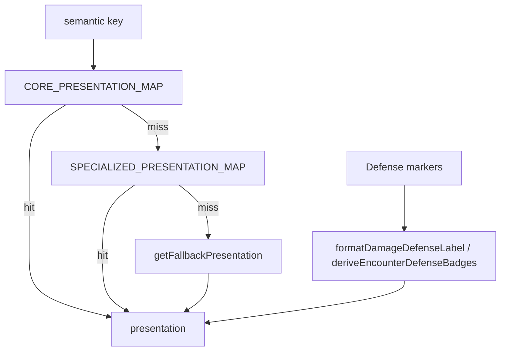

# Two-tier effect/state presentation taxonomy

## Goal

Keep **one unified pipeline** ([`enrichWithPresentation`](src/features/encounter/domain/effects/presentable-effects.ts), preview chips, defense derivation) but **stop treating every named effect as a first-class core combat state**. Separate:

1. **Tier 1 — Core encounter presentation** — generic, reusable, system-level concepts users expect as “standard” status/defense badges.
2. **Tier 2 — Specialized / niche presentation** — named, source-specific, monster/spell/curse/disease/custom ids; clean labels and tone, **not** promoted into the same flat “universal” map as PHB conditions.

**Mechanics unchanged** except optional tiny semantic-key fixes for stable lookup.

## Current state (inspected)

- [`combat-state-ui-map.ts`](src/features/encounter/domain/effects/combat-state-ui-map.ts) merges **`EFFECT_CONDITION_PRESENTATION_MAP`** (PHB) + **[`COMBAT_STATE_MARKER_UI_MAP`](src/features/encounter/domain/effects/combat-state-markers.ts)** into a **single** [`COMBAT_STATE_UI_MAP`](src/features/encounter/domain/effects/combat-state-ui-map.ts). Niche entries (e.g. `mummy-rot`, `engulfed`, `limb-severed`) sit beside universal markers (`bloodied`, `concentrating`, `banished`).
- [`resolvePresentationForSemanticKey`](src/features/encounter/domain/effects/combat-state-ui-map.ts) and [`enrichWithPresentation`](src/features/encounter/domain/effects/presentable-effects.ts) use one lookup then [`getFallbackPresentation`](src/features/encounter/domain/effects/combat-state-ui-map.ts).
- Defense remains canonical via [`formatDamageDefenseLabel`](src/features/encounter/domain/badges/defense/encounter-defense-badges.ts) — **already a distinct path**; keep it as the “defense tier” without folding into condition maps.
- [`presentation-map-coverage.test.ts`](src/features/encounter/domain/effects/presentation-map-coverage.test.ts) currently requires **every** `EFFECT_CONDITION_ID` + **every** key in `COMBAT_STATE_MARKER_UI_MAP` to hit the **same** merged map with `usedFallbackPresentation === false`. That implicitly pushes all marker keys (including niche) into one “core” bucket for testing.

## Target architecture

**Rule:** Runtime markers identify (`marker.id` / `effect.key`). **Resolvers classify and name.** UI renders **resolved** `CombatStatePresentation` only (no new raw-label display logic).

### Suggested file shape (minimal)

| Artifact | Role |
|----------|------|
| `core-combat-state-presentation.ts` (or section in existing file) | **Tier 1** map: PHB rows (reuse `EFFECT_CONDITION_DEFINITIONS` / `EFFECT_CONDITION_PRESENTATION_MAP`), core engine markers only (`banished`, `bloodied`, `concentrating`, plus `exhaustion` from [`CONDITION_IMMUNITY_ONLY_DEFINITIONS`](src/features/mechanics/domain/conditions/effect-condition-definitions.ts) if applied as a condition key). |
| `specialized-effect-presentation.ts` | **Tier 2** map: move entries such as `mummy-rot`, `engulfed`, `limb-severed`, `battle-focus`, `speed_halved`, `on_turn_start_bleed`, `suppression_shield_bonus` from today’s `COMBAT_STATE_MARKER_UI_MAP` into this map (same `CombatStatePresentation` shape). |
| `combat-state-ui-map.ts` | Export **`resolveEffectPresentation(key, effect?)`**: try core → specialized → `getFallbackPresentation`. Optionally export **`CORE_PRESENTATION_KEYS`** / **`SPECIALIZED_PRESENTATION_KEYS`** as `readonly string[]` for tests. Keep **`COMBAT_STATE_UI_MAP`** as `Record<string, CombatStatePresentation>` for backward compat **or** deprecate in favor of explicit merge only inside resolver (prefer one merge point). |
| `presentable-effects.ts` | `enrichWithPresentation` calls the new resolver; set **`presentationTier: 'core' \| 'specialized' \| 'fallback'`** on [`EnrichedPresentableEffect`](src/features/encounter/domain/effects/presentable-effects.types.ts) (optional but useful for tests/debug). |
| Preview / drawer | Continue using [`getUserFacingEffectLabel`](src/features/encounter/domain/effects/presentable-effects.ts) / enriched `label` — no raw-label branches. |

**Optional** thin wrappers (only if they clarify call sites, not abstraction for its own sake):

- `resolveCoreCombatStatePresentation(key)` — internal or test-only
- `resolveSpecializedEffectPresentation(key)` — internal
- `resolveDefensePresentation` — already covered by defense module; **do not duplicate** defense rows into condition maps

### Classification heuristics (for audit + future keys)

- **Core:** PHB conditions; derived UI states (`bloodied`, `concentrating`); plane/defense-adjacent universal markers (`banished`); immunity-only ids that appear as conditions (`exhaustion`); defense badges (separate pipeline).
- **Specialized:** Named afflictions, monster-specific states, spell-named persistent states, curses/diseases, system-niche markers (`mummy-rot`, `engulfed`, …).
- **Unknown:** No row in either map → fallback; tests flag for triage (promote to specialized vs core vs explicit allowlist).

## Phase 1 — Audit (classification only)

1. Enumerate keys in current [`COMBAT_STATE_MARKER_UI_MAP`](src/features/encounter/domain/effects/combat-state-markers.ts) and assign **core vs specialized** per heuristics above (adjust list during implementation).
2. Sample **spell `stateId`** values from [`rulesets/system/spells/data/`](src/features/mechanics/domain/rulesets/system/spells/data/) (grep/script) — expect **most** to remain **unknown/specialized candidates**, not core. Do **not** add all spell ids to core.
3. Note **turn hooks** / **stat modifiers** (dynamic keys) — remain **fallback or explicit allowlist**, not core map pollution.

Deliverable: short table in plan or comment block: **Core list | Specialized list | Unknown policy**.

## Phase 2 — Implement split maps + resolver

1. Move specialized rows out of the “core marker” file into `specialized-effect-presentation.ts`.
2. Build **`CORE_COMBAT_STATE_MAP`** (PHB + selected core markers + immunity-only presentation built from `CONDITION_IMMUNITY_ONLY_DEFINITIONS` if needed).
3. Implement **`resolveEffectPresentation`** with order: core → specialized → fallback.
4. Replace direct `COMBAT_STATE_UI_MAP[key]` usage in enrichment / `resolvePresentationForSemanticKey` with the resolver.
5. Keep **defense** logic in [`encounter-defense-badges.ts`](src/features/encounter/domain/badges/defense/encounter-defense-badges.ts) unchanged.

## Phase 3 — Tests

Replace the single “everything in one map” assertion with **tier-aware** expectations:

- **Core keys** (explicit `CORE_PRESENTATION_KEYS` or `EFFECT_CONDITION_IDS` ∪ agreed core marker ids): `usedFallbackPresentation === false` and not resolved only by generic fallback.
- **Specialized keys** (explicit `SPECIALIZED_PRESENTATION_KEYS`): must resolve via **specialized map** (not mistaken for “core gap”); may set `presentationTier === 'specialized'`.
- **Unknown / dynamic**: `usedFallbackPresentation === true` allowed; maintain small **`FALLBACK_ONLY_ALLOWLIST`** for keys that are **never** intended to have rows (e.g. instance-specific hook ids) — document why.
- **Do not** add a test that requires every spell `stateId` in the codebase to appear in the **core** map.

Optional: one test that a **representative** spell-only key resolves via specialized map **once** promoted, or remains fallback until promoted.

## Phase 4 — Documentation

Update [`docs/reference/badges.md`](docs/reference/badges.md):

- Core vs specialized vs fallback; runtime `marker.label` not canonical; resolver order; defense path separate.
- Explicit statement: **niche effects are not second-class UX** — they get structured presentation from the specialized map, not a bloated core table.

## Deliverables

1. Small taxonomy-oriented refactor (split maps + resolver + optional `presentationTier`).
2. Audit table: keys classified.
3. Tests enforcing **core** coverage, **specialized** coverage, and **controlled** unknown/fallback behavior.
4. Doc update in `badges.md` (or sibling reference doc).

## Non-goals

- Mechanics refactor, broad spell data migration, or flattening all spell states into core.
- Over-abstract resolver factories beyond the small functions above.

## Relation to prior “fallback audit” plan

The older [fallback key audit](.cursor/plans/fallback_key_audit_fixes_a8fdd74f.plan.md) (exhaustion map, spell inventory) **feeds into** this plan: immunity-only and high-traffic keys land in **core** or **specialized** maps per classification, not a single undifferentiated flat map.
