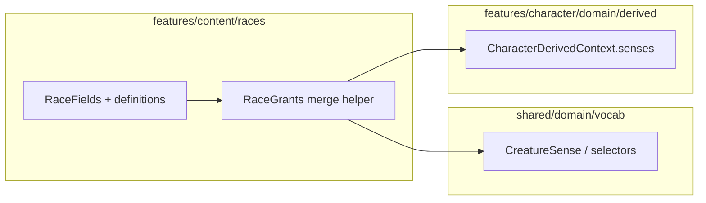

# Race/species ancestry and grants model

## Current baseline (verified)

- [`race.types.ts`](src/features/content/races/domain/types/race.types.ts): `RaceFields` already has `grants?: { senses?: readonly CreatureSense[] }` (no `generation` on race).
- [`packages/mechanics/src/rulesets/system/races.ts`](packages/mechanics/src/rulesets/system/races.ts): `withRaceSenseSources()` injects `source: { kind: 'race', id: raceId }` on **top-level** `grants.senses` only; `toSystemRace()` wraps catalog rows.
- [`creatureSenses.selectors.ts`](src/features/content/shared/domain/vocab/creatureSenses.selectors.ts): `getDarkvisionRange` / `getCreatureSenseRange` already take the **maximum** numeric range when multiple rows share a type—so Elf 60 + Drow 120 both in `special` yields **120** without new math.
- Character persistence: [`Character`](src/features/character/domain/types/character.types.ts) has `race?: RaceId` only; [`CharacterPatchFields`](src/features/character/domain/types/character.types.ts) is an explicit `Pick` used by PATCH.
- Derivation: [`raceSenseGrants.ts`](src/features/character/domain/derived/grants/raceSenseGrants.ts) only reads `race?.grants?.senses`. Consumers: [`buildCharacterDerivedContext.ts`](src/features/character/domain/derived/buildCharacterDerivedContext.ts), [`combatant-builders.ts`](src/features/encounter/helpers/combatants/combatant-builders.ts), [`perception.capabilities.test.ts`](packages/mechanics/src/perception/__tests__/perception.capabilities.test.ts).
- Shared boundaries doc already describes creature-sense vocabulary location: [`content-vs-mechanics-boundaries.md`](docs/reference/content/content-vs-mechanics-boundaries.md).

## Aligned vocab with classes (no shared TypeScript type)

Mirror the **field names and nesting** of class definitions so authors and code read the same way as [`CharacterClass.definitions`](src/features/content/classes/domain/types/class.types.ts) → [`SubclassSelection`](src/features/content/classes/domain/types/subclass.types.ts), but **define separate race types** in `features/content/races`—do **not** unify into a generic `DefinitionSelection<T>` or make races extend `SubclassSelection`.

| Class (`SubclassSelection`) | Race (parallel vocab) |
|----------------------------|------------------------|
| `id`, `name` | Same on the group (e.g. `elven-lineage`, `"Elven Lineage"`). |
| `selectionLevel: number \| null` | Same: when the choice is locked in (usually **`1`** for ancestry at creation; use `null` only if you explicitly mean “not level-gated”). Prefer **`selectionLevel`** instead of a bespoke `selection: { min, max }` for the common “pick exactly one” case. |
| `options: Subclass[]` | `options: RaceDefinitionOption[]` (race-local type, same role as `Subclass`). |
| `Subclass`: `id`, `name`, `features?` | Each option: `id`, `name`, optional **`features`** with per-row **`level`** (and spellcasting rows, effects, etc.). |
| Class `progression` (hit die, ASI, …) | **Do not** duplicate full `ClassProgression` on race. Base chassis stays in **`RaceGrants`** at the race root; level-gated content lives on **option `features`**, like domain spells on a cleric subclass ([`classes.ts`](packages/mechanics/src/rulesets/system/classes.ts) Life Domain example). |

**Race-specific discriminator:** keep **`kind: RaceDefinitionGroupKind`** (`'lineage' \| 'ancestry' \| 'ancestor' \| …`) on the **group** only—classes do not need this because there is one subclass bucket; races need it to label Forest vs Cloud vs Draconic without separate fields.

**Reusing feature shapes:** Optionally type **`features`** as **`SubclassFeature[]`** imported from [`subclass.types.ts`](src/features/content/classes/domain/types/subclass.types.ts) *or* define **`RaceLineageFeature`** as a **copy/alias** of the same union (same members, race-owned export). Prefer **import** if dependency direction is acceptable (races → classes types for the feature union only); otherwise duplicate the minimal union needed for SRD data. **Do not** introduce a third shared “features” package in this pass.

Optional on options: **`tags?: string[]`**, **`grants?: RaceGrants`** for always-on option payloads (e.g. dragon damage type + senses) **in addition to** `features` for level-gated rows—same idea as static grants vs `features` on a subclass option.

## 1. Split race-specific types (race domain only)

Add new modules under [`src/features/content/races/domain/types/`](src/features/content/races/domain/types/) and re-export from [`index.ts`](src/features/content/races/domain/types/index.ts):

| File | Responsibility |
|------|------------------|
| `race-grants.types.ts` | `RaceGrants`: **`senses`**, **`traits`** (`RaceTraitGrant[]`). Add **`damageType?: DamageType`** now (Dragonborn ancestor) via import from [`@/features/mechanics/domain/damage/damage.types`](packages/mechanics/src/damage/damage.types.ts) (same pattern as [`monster-traits.types.ts`](src/features/content/monsters/domain/types/monster-traits.types.ts)). For **spells / movement / proficiencies / resistances / actions**: either omit or add **comment-only `// TODO:` extension notes**—avoid unused empty interfaces. |
| `race-traits.types.ts` | `RaceTraitGrant`: align with [`MonsterTrait`](src/features/content/monsters/domain/types/monster-traits.types.ts)—`name`, `description`, optional `effects?: Effect[]`, `uses?: EffectUses`, `notes?`—import `Effect` from [`effects.types`](packages/mechanics/src/effects/effects.types.ts) and `EffectUses` from [`timing.types`](packages/mechanics/src/effects/timing.types.ts). Add stable **`id: string`** for CMS/selection traceability. |
| `race-definitions.types.ts` (name TBD; e.g. `race-choice.types.ts`) | **`RaceDefinitionGroupKind`**, **`RaceDefinitionGroup`**: `id`, `name`, `kind`, optional `description`, **`selectionLevel`**, **`options`**. **`RaceDefinitionOption`**: `id`, `name`, optional `description`, **`grants?: RaceGrants`**, **`features?`** (parallel to `Subclass.features`—level-gated spell rows use `kind: 'spellcasting'`, `grants: [{ level, spellIds }]`, etc., per [`SubclassFeature`](src/features/content/classes/domain/types/subclass.types.ts)), **`tags?`**. For “pick exactly one” at creation, set **`selectionLevel: 1`**; reserve **`min`/`max`** only if multi-select is required later. |

Update [`race.types.ts`](src/features/content/races/domain/types/race.types.ts):

- Replace inline `grants` shape with `grants?: RaceGrants` and **`definitions?: readonly RaceDefinitionGroup[]`** (or `definitionGroups`—pick one name and use consistently; avoid `choiceGroups` if it diverges from class `definitions` vocabulary). **Recommendation:** **`definitions`** keyed the same way as classes (`RaceFields.definitions` could be `readonly RaceDefinitionGroup[]` **or** a single group—prefer **array of groups** to support multiple dimensions without multiple field names).
- Keep `Race`, `RaceSummary`, `RaceInput` composition unchanged.

**Constraint:** No new shared vocab under [`features/content/shared/domain/vocab`](src/features/content/shared/domain/vocab) except continuing to use existing `CreatureSense` types/selectors.

## 2. Race-owned sense collection (merge base + selected options)

Add a small pure helper under **`src/features/content/races/domain/`** (e.g. `grants/collectRaceCreatureSenses.ts` or `resolve/collectRaceCreatureSenses.ts`):

- Inputs: `race: Race | undefined`, `raceChoices: Record<string, string> | undefined`, optional **`characterLevel`** for future level-gated feature resolution.
- Logic:
  1. Start with `race.grants?.senses ?? []`.
  2. For each **definition group** on `race` (same array as §1), look up `optionId = raceChoices[group.id]`; if missing, skip (or apply a documented default when UI exists).
  3. Append **`selectedOption.grants?.senses ?? []`** (static option grants, e.g. Drow extra darkvision).
  4. **Optional (this pass or follow-up):** collect senses from **`selectedOption.features`** where a feature contributes senses and **`feature.level <= characterLevel`**—only if those features are modeled with structured grants; otherwise defer.
  5. Return `CreatureSense[]` (then wrap as `{ special: [...] }` at the callsite or inside helper returning `CreatureSenses`).

Refactor [`raceSenseGrants.ts`](src/features/character/domain/derived/grants/raceSenseGrants.ts):

- Replace `buildCreatureSensesFromResolvedRace(race)` with a function that takes **`race` + `raceChoices`** (from `CharacterQuerySource`), delegating to the race-domain collector.
- Keep `resolveRaceForCharacter` unchanged.

Update call sites:

- [`buildCharacterDerivedContext.ts`](src/features/character/domain/derived/buildCharacterDerivedContext.ts): pass `character.raceChoices`.
- [`combatant-builders.ts`](src/features/encounter/helpers/combatants/combatant-builders.ts): pass `raceChoices` from the character detail DTO once the field exists.

## 3. System catalog: annotate nested senses + SRD-shaped content

Extend [`withRaceSenseSources`](packages/mechanics/src/rulesets/system/races.ts) so it also annotates **`definitions[].options[].grants?.senses`** (path follows §1 naming) with `source: { kind: 'race', id: raw.id, label?: optionId }` (use **`label`** for the option id to avoid overloading `CreatureSenseSource.id` semantics; base rows keep current behavior). This keeps sources traceable without duplicating “Darkvision” display strings (labels still come from [`creatureSenses.vocab.ts`](src/features/content/shared/domain/vocab/creatureSenses.vocab.ts)).

Expand **`RACES_RAW`** for **gnome, goliath, elf, dragonborn** per your examples, **SRD 5.2.1–only** wording:

- **Gnome**: base `grants`: darkvision 60 + `RaceTraitGrant` for Gnomish Cunning (description-only effects OK; no prose parsing).
- **Goliath**: one **`RaceDefinitionGroup`** (`kind: 'ancestry'`, `selectionLevel: 1`) with five **options**; each giant gift as **`RaceTraitGrant`** on the option or as **`features`** rows with `level` where appropriate—**structured `Effect[]` only where already straightforward**; otherwise descriptive text in `description`/`notes` (no inferring grants from prose elsewhere).
- **Elf**: base darkvision 60; **`definitions`**: elven lineage group with Drow / High / Wood—Drow adds **additional** darkvision 120 on **option `grants.senses`** (merge + max). Level-gated spells: model as **`SubclassFeature`-style** `features` with `kind: 'spellcasting'` and `grants: [{ level, spellIds }]` where spell ids exist (mirror Life Domain in [`classes.ts`](packages/mechanics/src/rulesets/system/classes.ts)); otherwise descriptive `RaceTraitGrant` only.
- **Dragonborn**: base darkvision 60; draconic ancestor group with **`damageType`** on each option’s **`grants`** for chromatic/metallic mapping.

Reconfirm **existing darkvision rows** for dwarf 120, elf 60, gnome 60, orc 120, tiefling 60, dragonborn 60, halfling none.

## 4. Character `raceChoices` (minimal persistence)

- Add optional **`raceChoices?: Record<string, string>`** to [`Character`](src/features/character/domain/types/character.types.ts).
- Extend [`CharacterPatchFields`](src/features/character/domain/types/character.types.ts) `Pick` to include `raceChoices`.
- Add **`raceChoices`** to [`OWNER_ALWAYS_KEYS`](src/features/character/domain/characterPatchPolicy.ts) next to `race`.
- Read model: extend [`CharacterDetailDto`](src/features/character/read-model/character-read.types.ts), [`CharacterDocForDetail`](src/features/character/read-model/character-read.mappers.ts), [`toCharacterDetailDto`](src/features/character/read-model/character-read.mappers.ts), [`toCharacterForEngine`](src/features/character/read-model/character-read.mappers.ts).
- Server: [`character.service.ts`](server/features/character/services/character.service.ts) — include `raceChoices` in detail doc assembly, `createCharacter` insert object, and rely on existing `$set` PATCH for updates once `CharacterPatchFields` includes it.

No migration scripts: new field is optional; old documents omit it.

## 5. Tests

- Update [`buildCharacterDerivedContext.test.ts`](src/features/character/domain/derived/__tests__/buildCharacterDerivedContext.test.ts): Drow vs Elf darkvision (fixture race object or system race + `raceChoices`).
- Add a **focused unit test** for `collectRaceCreatureSenses` (race domain): base-only, option-only merge, race without senses → empty.
- Update [`perception.capabilities.test.ts`](packages/mechanics/src/perception/__tests__/perception.capabilities.test.ts) if the `buildCreatureSensesFromResolvedRace` signature changes.

## 6. Documentation

- Extend [`docs/reference/content/content-vs-mechanics-boundaries.md`](docs/reference/content/content-vs-mechanics-boundaries.md) with a short subsection: race-specific types live under `features/content/races/domain/types`; lineage/ancestry/ancestor modeled via **`RaceDefinitionGroup.kind`**; **vocabulary aligns with class `definitions` / `SubclassSelection`** (`selectionLevel`, `options`, per-option `features`) without a shared TS type; `race.grants` are ongoing capabilities; `raceChoices` stores stable ids; shared creature senses remain under `shared/domain/vocab`.

## Implementation report (what you will get at the end)

You can paste this back into the PR:

- **Files changed:** new race type modules; edits to `race.types.ts`, mechanics `races.ts`, `raceSenseGrants.ts`, `buildCharacterDerivedContext.ts`, `combatant-builders.ts`, character types/patch policy, read-model mappers/types, `character.service.ts`, tests, `content-vs-mechanics-boundaries.md`.
- **Final type locations:** `race-grants.types.ts`, `race-traits.types.ts`, `race-definitions.types.ts` (or equivalent), barrel [`index.ts`](src/features/content/races/domain/types/index.ts).
- **`RaceFields`:** `id`, `name`, `description`, `imageKey?`, `grants?`, **`definitions?`** (readonly array of **`RaceDefinitionGroup`**), `campaigns?`.
- **`RaceGrants`:** at minimum `senses?`, `traits?`, `damageType?` (dragon ancestor); other categories per TODO policy above.
- **`RaceDefinitionGroup` / `RaceDefinitionOption`:** class-aligned: `id`, `name`, **`selectionLevel`**, **`kind`** (race-only discriminator), `options` with optional **`grants`** and **`features`** (parallel to `Subclass` / `SubclassFeature`).
- **Darkvision:** `CreatureSense[]` rows `{ type: 'darkvision', range, source }`; display via shared vocab; effective range via existing selectors (max wins).
- **`raceChoices`:** implemented as optional `Record<string,string>` on character + PATCH + DTO + service, unless you choose to defer persistence in a follow-up (recommended **implement** for end-to-end derived senses).
- **Character-derived senses:** base `race.grants.senses` + selected **`RaceDefinitionOption.grants.senses`** merged in race-domain collector, consumed by `CharacterDerivedContext` and combatant builder.
- **Follow-ups:** UI/character builder for picking options; merge **feature-derived** senses/spells when `characterLevel` is threaded; `RaceGrants.spells` when spell-grant shape is defined; trait `Effect[]` wiring to engine.
