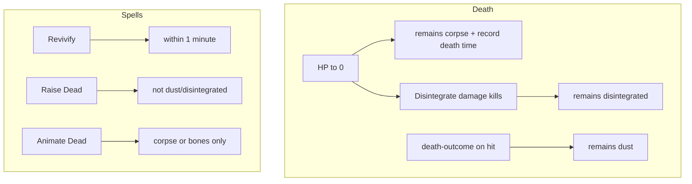

# Remains, death outcomes, Disintegrate, Revivify, Animate Dead

## Baseline (unchanged from prior plan)

- `**[CombatantInstance](src/features/mechanics/domain/encounter/state/types/combatant.types.ts)**` today has no remains field; death is `currentHitPoints === 0`.
- `**[isValidActionTarget](src/features/mechanics/domain/encounter/resolution/action/action-targeting.ts)**` (`dead-creature`): valid iff HP === 0.
- `**death-outcome` / `turns-to-dust**` in `[action-effects.ts](src/features/mechanics/domain/encounter/resolution/action/action-effects.ts)` is log-only today; must persist state.
- **Raise Dead** `[level5-m-z.ts](src/features/mechanics/domain/rulesets/system/spells/data/level5-m-z.ts)`: heal + `one-dead-creature`; no body-state checks yet.

## Scope additions (this iteration)

### 1. Disintegrate — author death outcome (`[level6-a-l.ts](src/features/mechanics/domain/rulesets/system/spells/data/level6-a-l.ts)` ~187–217)

- **Rules:** If the Dex-save damage from this spell leaves a **creature** at 0 HP, it is **disintegrated** (fine gray dust); revival is limited (True Resurrection / Wish per SRD text in description).
- **Engine:** Introduce a persisted remains value distinct from generic `**dust`** if you need different revival tiers later, e.g. `**remains: 'disintegrated'`** (or alias `**fine-dust`**) vs mummy `**dust`**. Alternatively a single `**dust**` plus `**dustKind: 'disintegrate' | 'other'**`—pick one representation and document it.
- **Wiring:** Disintegrate resolves as **save → damage** (not a single weapon `onHitEffects` chain). Implementation options:
  - **A.** After `applyDamageToCombatant` in the spell/effects pipeline for this action, if target HP === 0 and source is Disintegrate, set `remains` to disintegrated.
  - **B.** Generalize “lethal damage from this spell” metadata on `CombatActionDefinition` / damage options so the damage layer sets remains without hard-coding spell id in one place.
- **Authoring:** Add structured data to the spell (e.g. note remains flavor stays; mechanical hook lives in resolver/damage path). Remove or narrow caveats once behavior exists.

### 2. Animate Dead — remove redundant caster enum

- **Remove** `[mapMonsterIdFromCasterOption](src/features/mechanics/domain/rulesets/system/spells/data/level3-a-l.ts)` and the **skeleton/zombie** `resolution.casterOptions` enum.
- **Replace with:** `one-dead-creature` targeting with `**creatureTypeFilter: ['humanoid']`** (SRD: Medium or Small Humanoid corpse/bones) + spawn mapping from `**target.remains`**: `corpse` → zombie, `bones` → skeleton; invalid if `dust` / `disintegrated` (nothing left to animate). Legacy dead targets with unset `remains` treat as `**corpse`** for mapping.

### 3. Revivify — enforce “died within the last minute” (`[level3-m-z.ts](src/features/mechanics/domain/rulesets/system/spells/data/level3-m-z.ts)` ~193–216)

- **Rules:** Target must have died **within the last minute** (and not old age, etc.—other clauses can stay note-only initially).
- **Engine:** Record **when** the combatant first reached 0 HP, e.g. `**diedAtRound`** and/or encounter `**timestamp`** / turn counter, consistent with existing `[EncounterState](src/features/mechanics/domain/encounter/state/types/encounter-state.types.ts)` (round number, turn index). At Revivify resolution, reject heal if `now - deathTime > 1 minute` (if using 6-second rounds: **10 rounds** = 1 minute unless you use wall-clock elsewhere).
- **UX:** Log clear failure (“Revivify: target has been dead too long.”). Trim `**resolution.caveats`** once enforced.

## Design decisions (summary)

| Topic                 | Recommendation                                                                     |
| --------------------- | ---------------------------------------------------------------------------------- |
| Default at 0 HP       | `remains: 'corpse'` if unset; set `**diedAtRound`** (or equivalent) for time gates |
| Mummy dust            | `death-outcome` `turns-to-dust` → `remains: 'dust'`                                |
| Disintegrate          | Lethal damage from spell → `remains: 'disintegrated'` (or shared dust + kind)      |
| Raise Dead / Revivify | Invalid targets: `dust`, `disintegrated` (and Revivify: time window)               |
| Animate Dead          | No enum; **corpse/bones** from target only                                         |

## Files (indicative)

| Area           | Files                                                                                                                                                                                                                             |
| -------------- | --------------------------------------------------------------------------------------------------------------------------------------------------------------------------------------------------------------------------------- |
| Schema         | `[combatant.types.ts](src/features/mechanics/domain/encounter/state/types/combatant.types.ts)`, possibly `[encounter-state.types.ts](src/features/mechanics/domain/encounter/state/types/encounter-state.types.ts)` for time base |
| Damage / death | `[damage-mutations.ts](src/features/mechanics/domain/encounter/state/damage-mutations.ts)`, `[action-effects.ts](src/features/mechanics/domain/encounter/resolution/action/action-effects.ts)`                                    |
| Disintegrate   | `[level6-a-l.ts](src/features/mechanics/domain/rulesets/system/spells/data/level6-a-l.ts)` + resolver/damage hook                                                                                                                 |
| Revivify       | `[level3-m-z.ts](src/features/mechanics/domain/rulesets/system/spells/data/level3-m-z.ts)` + validation in `applyActionEffects` or resolver                                                                                       |
| Animate Dead   | `[level3-a-l.ts](src/features/mechanics/domain/rulesets/system/spells/data/level3-a-l.ts)`, `[spawn-resolution.ts](src/features/mechanics/domain/encounter/resolution/action/spawn-resolution.ts)` / spawn + target               |
| Types          | `[effects.types.ts](src/features/mechanics/domain/effects/effects.types.ts)` — extend `DeathOutcomeEffect.outcome` if new literal for disintegrate vs dust                                                                        |
| Tests          | `[action-resolution.death-and-targeting.test.ts](src/features/mechanics/domain/encounter/tests/action-resolution.death-and-targeting.test.ts)` (and related `action-resolution.*.test.ts` in the same folder)                     |
| Docs           | `[resolution.md](docs/reference/resolution.md)`, `[effects.md](docs/reference/effects.md)`                                                                                                                                        |

## Todo list (execution order)

See YAML frontmatter: schema → default death + timestamp → dust + disintegrate → targeting/heal guards → Revivify window → Animate Dead simplification → tests/docs.