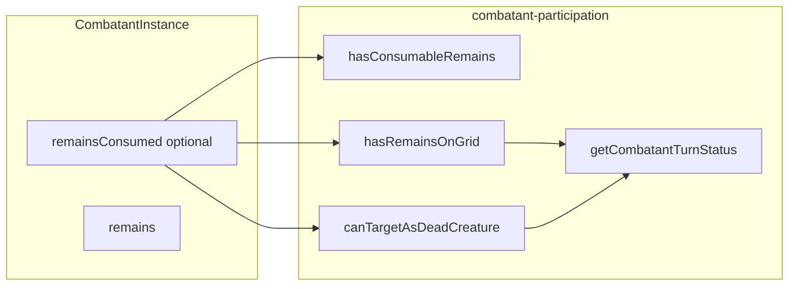

# Remains consumption (Option A)

## Data model

Add to `[combatant.types.ts](src/features/mechanics/domain/encounter/state/types/combatant.types.ts)`:

```ts
export type RemainsConsumptionRecord = {
  atRound: number
  spawnInstanceId?: string
}
```

On `[CombatantInstance](src/features/mechanics/domain/encounter/state/types/combatant.types.ts)`:

- `remainsConsumed?: RemainsConsumptionRecord` — set when a replacement spawn consumes the corpse; **absent** means remains are still usable for targeting/presence (subject to other rules).

Document next to `remains` / `diedAtRound`: consumption does **not** delete the combatant; it only records that the tactical remains were used.

## Core rule (single source of truth)

**Usable / on-grid remains** require `remainsConsumed` to be **absent**. All predicates that mean “there is still a body to interact with” should incorporate `!c.remainsConsumed`.

## Participation helpers (`[combatant-participation.ts](src/features/mechanics/domain/encounter/state/combatant-participation.ts)`)

1. `**hasConsumableRemains(c)`** (new, exported) — match your spec:
  `isDeadCombatant(c) && !!c.remains && !c.remainsConsumed`
   (Useful for corpse-driven authoring / Animate Dead–style “needs a real remains kind”.)
2. `**hasRemainsOnGrid(c)`** — your formula is `isDeadCombatant(c) && !c.remainsConsumed`. **Important:** the current implementation is **not** keyed on `isDeadCombatant`; it only checks `remains` and excludes `disintegrated`. Switching purely to `isDeadCombatant && !remainsConsumed` **changes behavior** for synthetic **0 HP without `diedAtRound`** (today `hasRemainsOnGrid` can still be true with explicit `remains`; `canTargetAsDeadCreature` still allows implicit corpse at 0 HP).
  **Recommendation in this plan:** implement `**hasRemainsOnGrid` = prior body-presence logic AND `!remainsConsumed`**, where “prior body-presence logic” is the existing `remains`/`disintegrated` check (keep current semantics for undefined remains / dust / disintegrated), **plus** `!remainsConsumed`. That satisfies “no on-grid remains if consumed” without tying grid presence exclusively to `diedAtRound`.
   If you **insist** on the exact two-liner (`isDeadCombatant && !remainsConsumed`), add it as a follow-up and update tests/fixtures (e.g. add `diedAtRound` to corpses in spawn tests) so the engine stays consistent.
3. `**canTargetAsDeadCreature(c)`** — add `if (c.remainsConsumed) return false` before existing HP/remains checks so dead-creature spells cannot target a consumed corpse.
4. `**hasBattlefieldPresence` / `getCombatantTurnStatus`** — once `canTargetAsDeadCreature` and `hasRemainsOnGrid` respect consumption, presence and `canBeTargetedOnGrid` for defeated targets stay aligned with “no token / no body” after consumption.
5. `**CombatantTurnStatus.skipReason`** — extend union in `[combatant.types.ts](src/features/mechanics/domain/encounter/state/types/combatant.types.ts)` with `'remains-consumed'`. In `resolveAutoSkipReason`, add precedence after banished / off-grid and before generic `defeated` (e.g. if `remainsConsumed` and still defeated: use `'remains-consumed'` so UI can distinguish “corpse replaced” from an ordinary knockout). `**shouldAutoSkipCombatantTurn**` already skips all defeated combatants; no change required unless you want skip when only consumed (not needed if consumption implies 0 HP).

## Spawn / resolution

1. `**[resolveSpawnMonsterIds](src/features/mechanics/domain/encounter/resolution/action/spawn-resolution.ts)**` — for `mapMonsterIdFromTargetRemains`, if `spawnTarget.remainsConsumed` is set, return `[]` (same as dust/disintegrated: nothing to animate).
2. `**[applyActionEffects` spawn branch](src/features/mechanics/domain/encounter/resolution/action/action-effects.ts)** — after successful `mergeCombatantsIntoEncounter` **and** when `applyGridSpawnReplacementFromTarget` runs (or whenever replacement semantics apply for `mapMonsterIdFromTargetRemains` / `inheritGridCellFromTarget`), **patch `spawnTarget`** in `combatantsById` with:
  `remainsConsumed: { atRound: nextState.roundNumber, spawnInstanceId: built[0]?.instanceId }`
   Use the same `updateCombatant` / mutation pattern as elsewhere so history stays intact.
3. **Optional:** if a spawn path succeeds **without** grid replacement but still “consumes” the corpse in the future, set `remainsConsumed` there too; **this pass** only hooks the existing replacement path you already use for Animate Dead–style flows.

## Revival / healing

`[applyHealingToCombatant](src/features/mechanics/domain/encounter/state/damage-mutations.ts)` already clears `remains` and `diedAtRound` on revive. Extend the same spread to `**remainsConsumed: undefined`** so a revived creature does not carry stale consumption.

## Tests

- `[combatant-participation.test.ts](src/features/mechanics/domain/encounter/state/combatant-participation.test.ts)`: consumption set → `hasRemainsOnGrid` false / `canTargetAsDeadCreature` false / `hasConsumableRemains` false; `getCombatantTurnStatus` presence and skipReason `'remains-consumed'` if you add that branch.
- `[spawn-resolution.test.ts](src/features/mechanics/domain/encounter/resolution/action/spawn-resolution.test.ts)`: consumed target → empty ids.
- `[apply-action-effects.spawn-grid.test.ts](src/features/mechanics/domain/encounter/resolution/action/apply-action-effects.spawn-grid.test.ts)`: assert `**fallen`** (or source id) has `remainsConsumed` after successful spawn + grid replacement.

## Exports

Re-export new type and `hasConsumableRemains` from `[state/index.ts](src/features/mechanics/domain/encounter/state/index.ts)` if other features import from the barrel.




