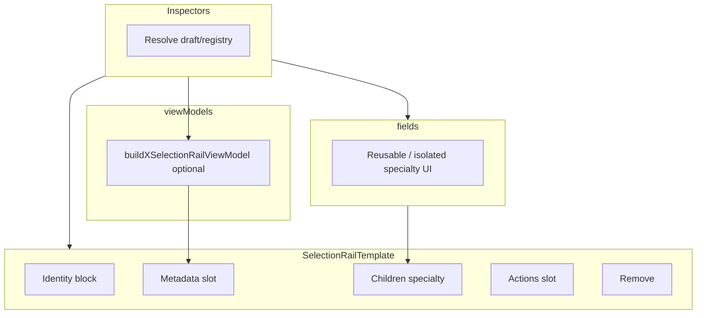

# Right rail: tab-first structure and Selection shell

## Migration constraints (this pass)

- **LocationTab is form-safe:** Extracting the Location panel must **preserve existing RHF, submit, and validation semantics** for **homebrew** (`form` + `handleSubmit`) and **system-patch** (`ConditionalFormRenderer` + patch driver). **`tabs/location/sections/`** should be **presentational** (headings, `Stack`, captions, slots)—unless there is already a **clear, existing form boundary** (there is not today). Do not split one logical form into multiple `<form>` elements or nested submit paths just to match section titles.
- **Shell migration in two steps (when helpful):**
  1. **Rename/move only:** `PlacedObjectRailTemplate` → `SelectionRailTemplate` (and helpers/metadata row component renames, path moves). Keep the **current prop surface** (`objectTitle`, `labelField`, `linkedDisplayName`, etc.) unless the mechanical rename already makes a tiny `title` alias trivial—**do not** combine large folder moves with API reshaping in one step.
  2. **API simplification:** Then evolve toward **`children`-based specialty** (and optional `title` vs `objectTitle` consolidation) in a **separate** change set; skip step 2 in the same commit as step 1 if the diff would be noisy.
- **View-model builders are optional per inspector:** Ship **folder structure + shared types + a few exemplar builders** (e.g. existing `buildCellFillSelectionRailViewModel`). It is **explicitly acceptable** for some inspectors to stay more direct (inline strings/rows) in this pass to limit churn.
- **`adapters/` stays at `rightRail/adapters/`:** Do not move persistence/draft glue into `tabs/selection/fields/` or `templates/`.
- **Compatibility re-exports:** Prefer **thin** `export { X as OldName }` from barrels during migration **if** import churn is material; plan a **follow-up cleanup pass** to **remove** those shims once imports point at canonical names (`SelectionTab`, `CellSelectionInspector`, etc.).
- **Documentation:** Update [`docs/reference/locations/location-workspace.md`](docs/reference/locations/location-workspace.md) in this initiative (paths, component names, subfolder ownership).

## Build sequence (ordered)

Execute in this order to keep diffs reviewable and tests green at each checkpoint. Skip or combine steps only when a single PR is already small.

| Phase | Goal | Primary outputs | Depends on |
| ----- | ---- | --------------- | ---------- |
| **A — Scaffold** | Create `tabs/location/` and `tabs/selection/`; move files with `git mv`; fix relative imports | New tree; no behavior change | — |
| **B — Shell step 1** | Rename/move template + helpers + metadata rows component; optional `PlacedObjectRailTemplate` → `SelectionRailTemplate` **alias export** in old path if needed | Neutral names; **same props** as today | A |
| **C — Selection composition** | `LocationEditorSelectionPanel` → `SelectionTab`; `LocationCellAuthoringPanel` → `CellSelectionInspector`; thin re-exports from `rightRail/index.ts` | Dispatcher + cell inspector at new paths; shims | A, B |
| **D — Split inspectors** | Break up `LocationMapSelectionInspectors.tsx` into `inspectors/*.tsx`; optional barrel re-exporting public API | Smaller files; same exports | C — **done** |
| **E — Specialty fields** | Move stair/linked/edge-label fragments into `tabs/selection/fields/` | Clearer ownership; no adapter moves | D preferred; light overlap OK — **done** |
| **F — Location tab** | Extract `LocationTab` / `SystemLocationTab`; presentational `sections/`; wire from edit workspaces | Form-safe Location panel | A (independent of B–E if desired) |
| **G — Shell step 2** | Children-based `SelectionRailTemplate` API (optional separate PR) | Simpler template props | B stable |
| **H — View models** | Shared `SelectionRailViewModel` type + exemplar builders only where useful | Less duplication in hot paths | B or G depending on touch points |
| **I — Docs** | Update `location-workspace.md` | Accurate paths/names | A–F landed (or doc PR after) |
| **J — Cleanup** | Remove shim re-exports; canonical imports | No `OldName` aliases | I + stable main |

**Suggested PR boundaries:** (1) **A+B+C** — structure + shell rename + selection rename + shims; (2) **D+E** — inspector split + fields; (3) **F** — location tab; (4) **G** — template API; (5) **H** — view models as needed; (6) **I**; (7) **J**. Merge **F** in parallel with **D+E** if two contributors and no conflicting files.

**Checkpoint commands:** `pnpm test` (or project test script) for `rightRail` tests + affected route tests after each phase; optional `pnpm lint` on touched paths.

**Todo mapping (frontmatter):** `scaffold-tabs` → A; `shell-rename-move` → B; `selection-tab` → C; `split-inspectors-files` → D; `selection-fields-extract` → E; `location-tab` → F; `shell-api-children` → G; `view-models` → H; `docs` → I; `remove-shims` → J.

## Follow-up — Item 1: Split `LocationMapSelectionInspectors.tsx`

**Current state:** [`LocationMapSelectionInspectors.tsx`](src/features/content/locations/components/workspace/rightRail/tabs/selection/inspectors/LocationMapSelectionInspectors.tsx) (~887 lines) holds shared stair types, stair pairing / endpoint form internals, and four exported inspectors.

**Goal:** One module per concern, with **unchanged public exports** for [`SelectionTab.tsx`](src/features/content/locations/components/workspace/rightRail/tabs/selection/SelectionTab.tsx) (and any tests that import `StairWorkspaceInspect` / `StairPairingContext` from the inspectors module).

**Suggested file layout**

| New module | Contents |
|------------|----------|
| `inspectors/selectionInspectorTypes.ts` (or `stairSelection.types.ts`) | `StairWorkspaceInspect`, `StairPairingContext` — types only; imported by object inspector + `SelectionTab` |
| `inspectors/LocationMapObjectInspector.tsx` | `LocationMapObjectInspector` + `LocationMapObjectInspectorProps`; keep stair-specific subcomponents in this file until Item 2 moves them to `fields/` |
| `inspectors/LocationMapPathInspector.tsx` | `LocationMapPathInspector` + props type |
| `inspectors/LocationMapEdgeInspectors.tsx` | `LocationMapEdgeInspector`, `LocationMapEdgeRunInspector` + props; shared helpers `EDGE_RUN_AXIS_LABEL`, `edgeRunHumanLabel` colocated or small `edgeInspector.shared.ts` |
| `inspectors/index.ts` (optional barrel) | Re-export all public symbols so `SelectionTab` can `import { … } from './inspectors'` |

**Migration order (low churn)**

1. Extract **types-only** file first; update `SelectionTab` imports if the import path for `StairWorkspaceInspect` / `StairPairingContext` changes.
2. Extract **path** and **edge** inspectors (fewer internal dependencies than object).
3. Extract **object** inspector last (largest; depends on stair helpers).

**Constraints**

- No behavior changes; **no** new persistable state in field-local `useState`.
- Prefer **narrow imports** from defining modules (per `location-workspace.md` contributor rules); avoid growing aggregate barrels unless a single entry point is useful for `SelectionTab` only.

**Definition of done**

- **No giant mixed inspector file** remains for the targeted entities (object, path, edge, edge-run, shared stair types): responsibilities live in separate modules as laid out above—not one monolith bundling unrelated inspectors.
- **Imports updated** everywhere that referenced the old file or barrel; no dead re-exports left behind without intent.
- **No behavior change** (render output, persistence, validation, and user flows match pre-split).
- **Tests still pass** at the same level of coverage as before (rail/selection tests green; fix paths only as needed).

---

## Follow-up — Item 2: `tabs/selection/fields/`

**Boundary — what `fields/` is for**

[`tabs/selection/fields/`](src/features/content/locations/components/workspace/rightRail/tabs/selection/fields/) holds **reusable** or **isolated specialty UI fragments**: focused RHF/MUI chunks (a row, a small form section, a duplicated label field) that can be composed by an inspector without owning the full selection story.

**Boundary — what `fields/` is not for**

| Exclude | Reason |
|--------|--------|
| **Persistence adapters** | Draft/registry glue stays under [`rightRail/adapters/`](src/features/content/locations/components/workspace/rightRail/adapters/) at the rail root. |
| **Generic templates** | Layout shells such as [`SelectionRailTemplate`](src/features/content/locations/components/workspace/rightRail/tabs/selection/templates/SelectionRailTemplate.tsx) stay in `templates/`; `fields/` does not replace or duplicate template responsibilities. |
| **Full inspector orchestration** | Resolving selection from `mapSelection`, wiring `gridDraft`, `flush`, registry lookups, and dispatching which inspector runs—stays in **`inspectors/`** (e.g. `SelectionTab`, `LocationMapObjectInspector`). |

**Goal:** Move eligible fragments (stair pairing, stair endpoint, linked-location picker row, edge label `TextField`, etc.) out of bloated inspector files into `fields/` so inspectors stay orchestrators that **import** fragments, not implementations of every sub-UI.

**Good candidates**

| Fragment (current home) | Suggested module |
|-------------------------|------------------|
| `linkedTargetPickerFieldLabel`, linked-location `OptionPickerField` block | `fields/LinkedLocationPickerField.tsx` or `linkedLocationSelectionField.tsx` |
| `StairPairingLinkFormFields`, `StairPairingLinkForm`, `StairPairingControls`, `LocationMapStairEndpointInspectForm`, `STAIR_LINK_STATUS_LABEL` | `fields/StairPairingFields.tsx` or split into `StairPairingLinkForm.tsx` + `StairEndpointForm.tsx` if files stay large |
| Edge / edge-run **Label** `TextField` (duplicated between inspectors) | `fields/EdgeLabelField.tsx` |

**Region metadata:** [`LocationMapRegionMetadataForm`](src/features/content/locations/components/workspace/rightRail/tabs/selection/inspectors/LocationMapRegionMetadataForm.tsx) can stay a **form-level** module under `inspectors/`; optional later extract of **field rows only** into `fields/RegionMetadataFields.tsx` if it reduces noise **without** moving adapter calls or full orchestration into `fields/`.

**Composition**

- Field modules receive **callbacks + props** from parent inspectors; they compose inside `SelectionRailTemplate` **`children`** or **`metadata`** slots as today.
- Inspectors remain **domain-aware**; `fields/` is **not** a second generic form system or a place to hide template logic.

**Dependency order:** Prefer completing **Item 1** (split) so object inspector file size drops before extracting **fields**; Item 2 can start with edge label + linked picker (smaller extractions) in parallel if desired.

---

## Recommendation summary

- **Folder split first, behavior second:** Create [`tabs/location/`](src/features/content/locations/components/workspace/rightRail/tabs/location/) and [`tabs/selection/`](src/features/content/locations/components/workspace/rightRail/tabs/selection/), move existing modules with `git mv`, then fix imports. Keeps diffs reviewable and avoids mixing moves with logic edits.
- **Rename the shell, not the domain:** [`PlacedObjectRailTemplate`](src/features/content/locations/components/workspace/rightRail/selection/PlacedObjectRailTemplate.tsx) is already used for paths, edges, and cell fills—not only placed objects. Neutral names (`SelectionRailTemplate`, `SelectionMetadataRows`, `selectionRail.helpers.ts`) match actual usage and match your target mental model.
- **Template stays generic; inspectors stay domain-aware:** Prefer pure `buildXSelectionRailViewModel` where it pays off; inspectors pass `<SelectionMetadataRows rows={…} />` into `metadata` and **specialty UI as `children`** once step 2 lands. Until then, **preserving current props** during step 1 is fine.
- **Split `LocationMapSelectionInspectors.tsx` after the shell rename:** The file is ~886 lines with distinct exports (`LocationMapObjectInspector`, path/edge/run inspectors, stair helpers). Physically moving each export to `tabs/selection/inspectors/*.tsx` in one pass is feasible if each file re-exports the same public names initially (or you update imports once).
- **Location tab:** Today the **Location** panel is **inline JSX** in [`LocationEditHomebrewWorkspace.tsx`](src/features/content/locations/components/workspace/LocationEditHomebrewWorkspace.tsx) (form + optional floor hint + `policyPanel`) and [`LocationEditSystemPatchWorkspace.tsx`](src/features/content/locations/components/workspace/LocationEditSystemPatchWorkspace.tsx) (patch form). Extract **`LocationTab`** (and optionally **`SystemLocationTab`**) under `tabs/location/` with `sections/` for **presentational** grouping only. Keep **one** homebrew `<form id={formId}>` wrapping `ConditionalFormRenderer` and **one** system-patch form story (patch driver + validation API) as today—sections wrap **children**, not separate forms.
- **Adapters:** Keep [`rightRail/adapters/`](src/features/content/locations/components/workspace/rightRail/adapters/) (e.g. [`regionMetadataDraftAdapter.ts`](src/features/content/locations/components/workspace/rightRail/adapters/regionMetadataDraftAdapter.ts)) at the rail root for this pass; it is persistence glue, not inspector chrome. Wire region **fields** from `fields/` into forms that still call the adapter.

## Target directory layout (incremental)

```text
rightRail/
  LocationEditorRightRail.tsx          # unchanged location at root
  LocationEditorRailSectionTabs.tsx
  locationEditorRail.helpers.ts
  types/
  adapters/
  __tests__/
  index.ts                             # re-exports; narrow public surface
  tabs/
    location/
      LocationTab.tsx                  # homebrew location panel body
      SystemLocationTab.tsx            # optional: system patch panel body
      sections/
        LocationTabFloorHint.tsx       # or inline small pieces
        LocationTabFormSection.tsx     # wraps ConditionalFormRenderer + section title
        LocationTabPolicySlot.tsx      # policyPanel slot
    selection/
      SelectionTab.tsx                 # replaces dispatcher role of LocationEditorSelectionPanel
      templates/
        SelectionRailTemplate.tsx      # renamed from PlacedObjectRailTemplate
        SelectionRailIdentityBlock.tsx # optional split from template file
      SelectionMetadataRows.tsx        # renamed from PlacedObjectPresentationMetadataRows
      selectionRail.helpers.ts         # renamed from placedObjectRail.helpers.ts
      viewModels/
        selectionRailViewModel.types.ts # SelectionRailViewModel, PresentationMetadataRow
        buildCellFillSelectionRailViewModel.ts  # or keep single helpers file exporting builders
        buildObjectSelectionRailViewModel.ts    # add as you extract from Object inspector
        buildPathEdgeRegionBuilders.ts          # incremental
      inspectors/
        CellSelectionInspector.tsx     # renamed from LocationCellAuthoringPanel
        ObjectSelectionInspector.tsx
        PathSelectionInspector.tsx
        EdgeSelectionInspector.tsx
        EdgeRunSelectionInspector.tsx  # matches mapSelection 'edge-run'
        RegionSelectionInspector.tsx   # thin wrapper over LocationMapRegionMetadataForm or inlined
      fields/
        RegionMetadataFields.tsx       # fragments from LocationMapRegionMetadataForm
        StairsPairingFields.tsx        # StairPairingLinkForm*, etc.
        LinkedLocationPickerField.tsx  # if worth isolating
        EdgeLabelField.tsx             # edge label / notes
      LocationMapRegionMetadataForm.tsx # move from selection/ root OR fold into RegionSelectionInspector
```

**Note:** If `LocationMapRegionMetadataForm.tsx` stays a single file short-term, placing it under `inspectors/` or `fields/` is fine; the important part is **not** leaving specialty RHF sections inside `templates/`.

## Files: move / rename / create (concrete)

| Current | Action |
|---------|--------|
| [`selection/PlacedObjectRailTemplate.tsx`](src/features/content/locations/components/workspace/rightRail/selection/PlacedObjectRailTemplate.tsx) | Rename/split → `tabs/selection/templates/SelectionRailTemplate.tsx` (+ optional small `SelectionRailIdentityBlock` module) |
| [`selection/placedObjectRail.helpers.ts`](src/features/content/locations/components/workspace/rightRail/selection/placedObjectRail.helpers.ts) | Rename → `tabs/selection/selectionRail.helpers.ts` (or `viewModels/` + barrel) |
| [`selection/__tests__/placedObjectRail.helpers.test.ts`](src/features/content/locations/components/workspace/rightRail/selection/__tests__/placedObjectRail.helpers.test.ts) | Move/rename alongside helpers |
| [`panels/LocationCellAuthoringPanel.tsx`](src/features/content/locations/components/workspace/rightRail/panels/LocationCellAuthoringPanel.tsx) | Move/rename → `tabs/selection/inspectors/CellSelectionInspector.tsx` |
| [`selection/LocationEditorSelectionPanel.tsx`](src/features/content/locations/components/workspace/rightRail/selection/LocationEditorSelectionPanel.tsx) | Move/rename → `tabs/selection/SelectionTab.tsx` (export `SelectionTab`; see compatibility below) |
| [`selection/LocationMapSelectionInspectors.tsx`](src/features/content/locations/components/workspace/rightRail/selection/LocationMapSelectionInspectors.tsx) | Split into `inspectors/*.tsx`; delete or turn into thin re-export barrel during migration |
| [`selection/LocationMapRegionMetadataForm.tsx`](src/features/content/locations/components/workspace/rightRail/selection/LocationMapRegionMetadataForm.tsx) | Move under `inspectors/` or `fields/` + import updates |
| [`panels/index.ts`](src/features/content/locations/components/workspace/rightRail/panels/index.ts) | Remove or deprecate after `CellSelectionInspector` move |
| [`LocationEditHomebrewWorkspace.tsx`](src/features/content/locations/components/workspace/LocationEditHomebrewWorkspace.tsx) / [`LocationEditSystemPatchWorkspace.tsx`](src/features/content/locations/components/workspace/LocationEditSystemPatchWorkspace.tsx) | Replace inline `locationPanel` with `<LocationTab … />` / `<SystemLocationTab … />` |

**Compatibility (minimize churn):** In [`rightRail/index.ts`](src/features/content/locations/components/workspace/rightRail/index.ts), optionally `export { SelectionTab as LocationEditorSelectionPanel }` and `export type { SelectionTabProps as LocationEditorSelectionPanelProps }` until call sites are updated. Same pattern for `LocationCellAuthoringPanel` → `CellSelectionInspector` if needed. **Remove these shims** in a later **cleanup pass** (tracked todo `remove-shims`), once canonical imports are updated.

**Import surfaces to update:** [`components/index.ts`](src/features/content/locations/components/index.ts), [`workspace/index.ts`](src/features/content/locations/components/workspace/index.ts), [`locationEditWorkspaceRailPanels.tsx`](src/features/content/locations/routes/locationEdit/locationEditWorkspaceRailPanels.tsx), tests under `rightRail/**/__tests__`, and [`docs/reference/locations/location-workspace.md`](docs/reference/locations/location-workspace.md) path references.

## `SelectionRailTemplate` API

**After step 1 (rename/move):** Props can remain aligned with today’s `PlacedObjectRailTemplate` (`objectTitle`, `labelField`, `linkedDisplayName`, etc.) so file moves stay behavior-neutral.

**After step 2 (optional simplification):** Target shape—**migrate** `objectTitle` → `title`, and move **label / linked identity** out of named props into **`children`** where it reduces prop surface:

```tsx
type SelectionRailTemplateProps = {
  categoryLabel: string;
  title: string;
  placementLine?: string;
  metadata?: React.ReactNode;
  children?: React.ReactNode;       // specialty sections (label, linked name, stairs config, etc.)
  actionsSlot?: React.ReactNode;
  onRemoveFromMap?: () => void;
};
```

Render order (target): identity block → optional `metadata` → **`children`** → `actionsSlot` → optional remove (preserve current ordering when collapsing `labelField` into `children`).

## View-model shape

Introduce (or promote) a shared type in `viewModels/selectionRailViewModel.types.ts` where it helps:

- `SelectionRailViewModel`: `{ categoryLabel, title, placementLine?, metadataRows: PresentationMetadataRow[] }` (or equivalent).
- Reuse `PresentationMetadataRow`; keep **`buildCellFillSelectionRailViewModel`** as the primary exemplar. Add **`buildObject` / `buildPath` / `buildEdge` / `buildRegion`** helpers **only where** they clearly reduce duplication—**not** a requirement that every inspector call a builder in this pass.

## Components that will use `SelectionRailTemplate` (after refactor)

Same as today, plus consistency opportunities:

- **CellSelectionInspector** — cell-fill branch (already uses template + `buildCellFillSelectionRailViewModel`).
- **ObjectSelectionInspector** — primary consumer (stairs, linked location, label).
- **PathSelectionInspector** — path chain summary.
- **EdgeSelectionInspector** / **EdgeRunSelectionInspector** — edge kind + placement + presentation rows.
- **RegionSelectionInspector** — optional: wrap region header to match shell (today [`LocationMapRegionMetadataForm`](src/features/content/locations/components/workspace/rightRail/selection/LocationMapRegionMetadataForm.tsx) uses `SelectionRailIdentityBlock` only).

## Architectural boundaries (answers to “where to draw the line”)



- **Shared template:** layout + slots only; no registry lookups.
- **View models:** pure data for labels, placement lines, and metadata rows.
- **Fields:** reusable RHF/MUI fragments (stairs pairing, region rows, edge label).
- **Inspectors:** orchestration, callbacks to `gridDraft`, and wiring `flush` for debounced fields.

## What to leave for later (intentional stop-short)

- **Deep refactors inside `useLocationEditWorkspaceModel`** or route field config splitting for Location sections—out of scope.
- **Mandating** `buildXSelectionRailViewModel` on every entity—optional; exemplars + structure first.
- **Barrel explosion:** prefer updating defining-module imports per [`docs/reference/locations/location-workspace.md`](docs/reference/locations/location-workspace.md) contributor rules; only extend [`rightRail/index.ts`](src/features/content/locations/components/workspace/rightRail/index.ts) / [`components/index.ts`](src/features/content/locations/components/index.ts) where a stable public API is needed.
- **Map tab:** do not add; current [`LocationEditorRailSectionTabs`](src/features/content/locations/components/workspace/rightRail/LocationEditorRailSectionTabs.tsx) is already Location + Selection only.

## Verification

- After each **build sequence** phase: run rail-focused tests and fix imports before the next phase.
- Run existing tests: `rightRail/__tests__/LocationEditorRailSectionTabs.test.tsx`, `tabs/selection/__tests__/SelectionTab.test.tsx`, `tabs/selection/__tests__/selectionRail.helpers.test.ts`, `regionMetadataDraftAdapter.test.ts` if imports change.
- Quick manual smoke: Selection tab for `none`, `cell` (empty + fill), `object`, `path`, `edge`, `edge-run`, `region`; Location tab homebrew + system patch (submit + patch save still behave as before).

---

## Follow-up — Path inspector + reusable name/description (optional)

**Scope:** Keep **simple** — one treatment for **all** paths (kinds today are only `road` | `river` in [`LocationMapPathAuthoringEntry`](shared/domain/locations/map/locationMap.types.ts); **walls** are edge features, not path kinds).

**Region refactor (same initiative):** After introducing the shared **`tabs/selection/fields/`** name + description module(s), **replace** the current **inline** name and description field implementation in [`LocationMapRegionMetadataForm`](src/features/content/locations/components/workspace/rightRail/tabs/selection/inspectors/LocationMapRegionMetadataForm.tsx) with that module. **Do not** change persistence semantics: keep the existing **RHF** form boundary, **`regionMetadataDraftAdapter`**, **`useDebouncedPersistableField`** for description (if present), and **flush** registration — only swap **presentational** field rows so region and path share one UI building block.

### Target UX (Selection → path)

- **Category** slot: **`Path`** (not “Map”).
- **Title** slot: human label for **`entry.kind`** (e.g. River / Road), not a generic “Path” title.
- **Placement** slot: reuse **`formatCellPlacementLine`** from [`selectionRail.helpers.ts`](src/features/content/locations/components/workspace/rightRail/tabs/selection/selectionRail.helpers.ts) for a single representative cell (e.g. first in `cellIds`) — same “cell string” family as objects/cell fill.
- **Remove** the kind **Chip** badge from metadata; kind identity moves to **title**.
- **Name + description** fields for **every** path (same rules for all current kinds). Compose as **`children`** (or `metadata`) of [`SelectionRailTemplate`](src/features/content/locations/components/workspace/rightRail/tabs/selection/templates/SelectionRailTemplate.tsx).

### Architecture fit

- **Shell:** Fits **`SelectionRailTemplate`** + existing helpers; **no** need for placed-object **registry** / `presentationRowsFromPresentation` unless paths later get registry variants.
- **Optional** `buildPathSelectionRailViewModel` in [`viewModels/`](src/features/content/locations/components/workspace/rightRail/tabs/selection/viewModels/) — parity with cell-fill exemplar only if it reduces duplication.

### Data model and wiring (required for persisted name/description)

- Today `LocationMapPathAuthoringEntry` is `{ id, kind, cellIds }` only — **no** `name` / `description`.
- Extend the **shared type**, **`gridDraft.pathEntries`** ([`locationGridDraft.types.ts`](src/features/content/locations/components/authoring/draft/locationGridDraft.types.ts)), **normalize/validation**, and **save/API** paths (same class of change as edge `label` or region fields).
- **Selection rail:** add **`onPatchPathEntry(pathId, patch)`** (mirror [`onPatchEdgeEntry`](src/features/content/locations/components/workspace/rightRail/tabs/selection/SelectionTab.tsx)) from workspace → [`SelectionTab`](src/features/content/locations/components/workspace/rightRail/tabs/selection/SelectionTab.tsx) → [`LocationMapPathInspector`](src/features/content/locations/components/workspace/rightRail/tabs/selection/inspectors/LocationMapPathInspector.tsx).

### Modular name + description (`fields/`)

- Extract a **presentational** module under **`tabs/selection/fields/`** (e.g. `RailNameDescriptionFields` or `PathNameDescriptionFields`) — two string fields, labels, optional multiline for description, optional helper text.
- **Reuse** across any inspector that uses `SelectionRailTemplate`: pass **values + callbacks** from the parent; compose inside **`children`** (same pattern as [`EdgeLabelField`](src/features/content/locations/components/workspace/rightRail/tabs/selection/fields/edgeLabelField.tsx)).
- **Region adoption:** **`LocationMapRegionMetadataForm`** stops duplicating name/description **TextField** (or equivalent) markup; it **imports** the shared fields component and wires **`Controller`** / **`register`** / debounced description to the same form values and **`onPatchRegion`** flow as today.
- **Persistence is not generic:** path updates **`gridDraft.pathEntries`**; region uses [`LocationMapRegionMetadataForm`](src/features/content/locations/components/workspace/rightRail/tabs/selection/inspectors/LocationMapRegionMetadataForm.tsx) + [`regionMetadataDraftAdapter`](src/features/content/locations/components/workspace/rightRail/adapters/regionMetadataDraftAdapter.ts). Shared module = **UI + local control**; each inspector keeps **patch adapter / flush** semantics.
- **Debouncing:** If description should match region UX (flush before save), reuse **`useDebouncedPersistableField`** or register flush like region metadata — see [`location-workspace.md`](docs/reference/locations/location-workspace.md) debounced persistable section.

**Todo mapping:** `path-inspector-name-description` (frontmatter).
