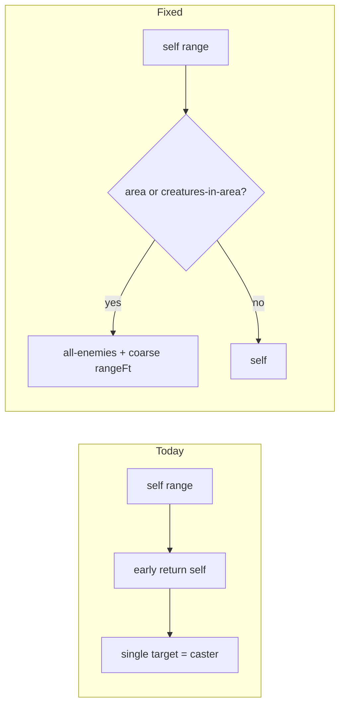

# Self-range AoE spell combat targeting

## Problem

In `[spell-combat-adapter.ts](src/features/encounter/helpers/spell-combat-adapter.ts)`, `buildSpellTargeting` returns `{ kind: 'self' }` whenever `spell.range.kind === 'self'` **before** it evaluates area targeting. That misclassifies spells like [Burning Hands](src/features/mechanics/domain/rulesets/system/spells/data/level1-a-l.ts) and [Thunderwave](src/features/mechanics/domain/rulesets/system/spells/data/level1-m-z.ts): encounter resolution uses `[getActionTargets](src/features/mechanics/domain/encounter/resolution/action/action-targeting.ts)`, which only returns `[actor]` for `self`, so saving-throw AoE only applied to the caster.

## Implementation

**File:** `[src/features/encounter/helpers/spell-combat-adapter.ts](src/features/encounter/helpers/spell-combat-adapter.ts)`

1. **Reorder logic** — After the `hasSpawn` branch and **before** `if (spell.range?.kind === 'self') return { kind: 'self' }`:
  - Read the primary targeting effect (reuse `getSpellTargetingEffect(spell)` for consistency with `requiresSight` / `creatureTypeFilter`).
  - If `targeting.kind === 'targeting'` and (`targeting.area != null` **or** `targeting.target === 'creatures-in-area'`), return `{ kind: 'all-enemies', creatureTypeFilter: getSpellCreatureTypeFilter(spell), ...sight, ...rangeFieldForArea }`.
2. **Compute `rangeFieldForArea`:**
  - If `spell.range.kind !== 'self'`: keep current behavior — use existing `rangeField` from `deriveSpellRangeFt(spell.range)` (distance/touch spells with AoE, e.g. Grease/Fireball).
  - If `spell.range.kind === 'self'` and `targeting.area` exists: set `{ rangeFt: targeting.area.size }` as a **coarse** maximum reach from the caster (matches authored `AreaOfEffectTemplate.size` in `[area.types.ts](src/features/mechanics/domain/effects/area.types.ts)`; used for Thunderwave cube 15, Burning Hands cone 15, etc.).
  - If self-range + `creatures-in-area` but **no** `area` object: omit `rangeFt` (same as today: no spatial cap until content is fixed).
3. **Remove duplicate branches** — The later `if (targeting?.area)` / `creatures-in-area` returns for `all-enemies` become redundant for the **first** targeting effect once handled above; keep a single code path or guard so behavior stays identical for non–self-range area spells.

## Tests

**File:** `[src/features/encounter/helpers/encounter-helpers.test.ts](src/features/encounter/helpers/encounter-helpers.test.ts)`

- **New test:** e.g. Thunderwave-shaped spell — `range: { kind: 'self' }`, `creatures-in-area` + `area: { kind: 'cube', size: 15 }`, top-level `save` — expect `targeting.kind === 'all-enemies'` and `targeting.rangeFt === 15`.
- **Update** `maps area targeting to all-enemies`: `makeSpell` defaults to `range: { kind: 'distance', value: { value: 120, unit: 'ft' } }`, so after the change the built action should include `rangeFt: 120`. Change assertion to `expect.objectContaining({ kind: 'all-enemies', rangeFt: 120 })` (or explicit full object).

Run: `npm run test:run -- src/features/encounter/helpers/encounter-helpers.test.ts` (and any other suite that snapshots spell actions if present).

## Optional doc touch-up

**File:** `[docs/reference/effects.md](docs/reference/effects.md)` §72–93 (Area targeting and encounter combat)

- Add a short bullet: when `EncounterState.space` / `placements` exist, **caster-to-target distance** can be enforced via `CombatActionTargetingProfile.rangeFt` (from spell range or, for self-centered areas, a coarse `area.size` cap).
- Keep explicit that **template intersection** (cone/sphere from a chosen point, allies in area, etc.) is still not modeled — avoids contradicting the existing limitations section.

## Authored `creatures-in-area` vs allies (friendly fire)

**Does `creatures-in-area` account for allies?**

- **In content / rules text:** Yes in principle — the targeting shape is the right place to express “each creature in the area” (which per SRD can include allies, or only enemies, or creatures you designate, depending on the spell). `description.full` remains authoritative for nuance.
- **In encounter resolution today:** **No** — `[buildSpellTargeting](src/features/encounter/helpers/spell-combat-adapter.ts)` maps area spells to `CombatActionTargetingProfile.kind: 'all-enemies'`, and `[isValidActionTarget](src/features/mechanics/domain/encounter/resolution/action/action-targeting.ts)` keeps hostile AoE on **enemies only** (see also `[docs/reference/effects.md](docs/reference/effects.md)` §72–84: mixed allegiance not modeled).
- **Proper direction (follow-up, not this PR):** Support incidental ally damage and “opponent in line with ally in template” by combining (1) **spatial** intersection of authored `area` with placements, (2) a **target pool** broader than `all-enemies` (e.g. all combatants in template, or selectable subset), and (3) **hostility / willing** rules so buffs and harmful AoE don’t share one wrong default. That likely means new or extended `CombatActionTargetingProfile` kinds plus resolver changes — not a tweak to the self-range fix alone.

**This plan** only fixes self-range AoE mapping to `all-enemies` + coarse `rangeFt`; it does **not** add allies to the pool.

## Out of scope (per your earlier audit)

- True AoE geometry, LOS through walls (`lineOfSightClear` stubs), moving zones, **mixed-allegiance / friendly-fire target pools**, or **ally-inclusive** `creatures-in-area` — no engine change beyond this adapter/range heuristic.

