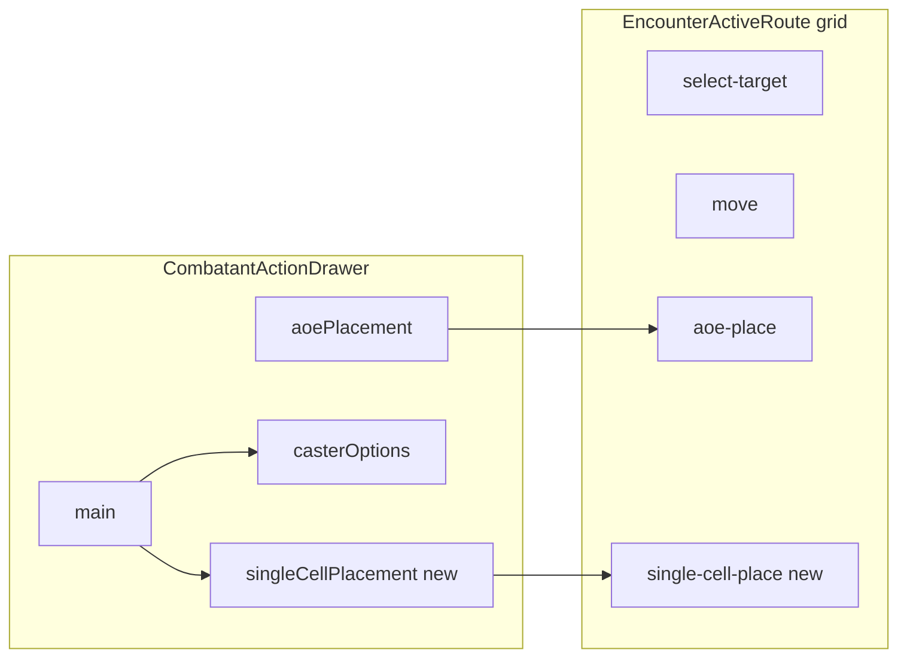

# Single-cell placement drawer and map mode

## Current baseline

- Drawer views today: `[CombatantActionDrawerView](src/features/encounter/components/active/drawers/CombatantActionDrawer.tsx)` is `'main' | 'aoePlacement' | 'casterOptions'`; `effectiveView` prioritizes AoE when `aoeStep !== 'none'`, else `localSubView` (`main` | `casterOptions` only).
- Readiness already uses `[getSingleCellPlacementRequirement](src/features/mechanics/domain/encounter/resolution/action/action-requirement-model.ts)` + `[validateSingleCellPlacement](src/features/mechanics/domain/encounter/resolution/action/action-requirement-model.ts)` via `[isSingleCellPlacementSatisfied](src/features/mechanics/domain/encounter/resolution/action/action-requirement-model.ts)` and `[ctx.selectedSummonCellId](src/features/mechanics/domain/encounter/resolution/action/action-resolution-requirements.ts)`.
- Map clicks for non-AoE empty cells currently trigger **movement** (`[EncounterActiveRoute.handleCellClick](src/features/encounter/routes/EncounterActiveRoute.tsx)`); there is no branch for “pick one cell for an action.”
- Grid interaction modes: `[GridInteractionMode](src/features/encounter/domain/interaction/encounter-interaction.types.ts)` is `'select-target' | 'move' | 'aoe-place'`; `[EncounterRuntimeContext](src/features/encounter/routes/EncounterRuntimeContext.tsx)` forces `'aoe-place'` when `aoeStep !== 'none'`.

## 1) Declarative requirement shape (mechanics)

**File:** `[action-requirement-model.ts](src/features/mechanics/domain/encounter/resolution/action/action-requirement-model.ts)`

- Extend the `single-cell-placement` branch of `ActionRequirement` to match the intended shape:
  - `purpose?: 'spawn' | 'teleport' | 'effect-origin' | 'object-placement' | 'reposition'`
  - `ctaLabel?: string`
  - Keep existing numeric/boolean fields; align with your spec (`rangeFt?`, `lineOfSightRequired?`, `mustBeUnoccupied?`) by **preserving current defaults** in `[getActionRequirements](src/features/mechanics/domain/encounter/resolution/action/action-requirement-model.ts)` when building from spawn effects (today’s behavior stays valid: range from spawn metadata or action, LoS/unoccupied defaults).
- When emitting a requirement from a spawn with `placement.kind === 'single-cell'`, set `purpose: 'spawn'` (first consumer).
- Add a small pure helper, e.g. `getPlacementCtaLabel(req: SingleCellPlacementRequirement): string`, implementing:
  - `req.ctaLabel` if present
  - else purpose-based defaults (e.g. teleport → “Choose Destination”, effect-origin → “Choose Origin”, default → “Choose Placement”)
- Rename step label `[STEP_LABELS.singleCellPlacement](src/features/mechanics/domain/encounter/resolution/action/action-requirement-model.ts)` from “Summon placement” to something neutral (e.g. “Placement”).

**File:** `[action-resolution-requirements.ts](src/features/mechanics/domain/encounter/resolution/action/action-resolution-requirements.ts)`

- Replace summon-specific copy in `[getActionResolutionReadiness](src/features/mechanics/domain/encounter/resolution/action/action-resolution-requirements.ts)` for the `single-cell-placement` branch with generic messages, e.g.:
  - empty selection: `getPlacementCtaLabel(req)` or a short “Choose placement” line derived from purpose
  - invalid cell: “Invalid placement” (not “Invalid summon placement”)
- Optionally rename `ActionResolutionRequirementKind` from `'spawn-placement'` to `'single-cell-placement'` for consistency; if renamed, update `[getActionResolutionRequirements](src/features/mechanics/domain/encounter/resolution/action/action-resolution-requirements.ts)` and any switch sites (incremental, grep-driven).

**File:** `[encounter-resolve-selection.ts](src/features/encounter/domain/interaction/encounter-resolve-selection.ts)`

- Keep passing the same cell id into `getActionResolutionReadiness` (see naming below).

## 2) Naming: generic placement cell state (optional but recommended)

Today: `[useEncounterState](src/features/encounter/hooks/useEncounterState.ts)` uses `selectedSummonCellId` / `setSelectedSummonCellId`.

- **Rename** to something generic (e.g. `selectedSingleCellPlacementCellId` / `setSelectedSingleCellPlacementCellId`) across hook, `[EncounterRuntimeContext](src/features/encounter/routes/EncounterRuntimeContext.tsx)`, `[EncounterActiveRoute](src/features/encounter/routes/EncounterActiveRoute.tsx)`, drawer props, and `ActionResolutionReadinessContext` field name—**or** keep the internal state name and only expose generic **prop** names on the drawer (`selectedPlacementCellId`) with a one-line alias. Pick one approach and apply consistently to avoid split-brain.

## 3) Drawer: view model + main CTA + panel

**File:** `[CombatantActionDrawer.tsx](src/features/encounter/components/active/drawers/CombatantActionDrawer.tsx)`

- Extend `[CombatantActionDrawerView](src/features/encounter/components/active/drawers/CombatantActionDrawer.tsx)`: add `'singleCellPlacement'`.
- Expand `localSubView` state to `'main' | 'casterOptions' | 'singleCellPlacement'`.
- `**effectiveView` priority:** `aoePlacement` (unchanged) → `**singleCellPlacement` when `localSubView` says so** → `casterOptions` → `main`. This keeps AoE authoritative and matches the “sibling views” model.
- **Main view:** When `getSingleCellPlacementRequirement(selectedActionDefinition)` is defined, render a compact section (parallel to Spell options):
  - Primary button: label from `getPlacementCtaLabel(req)`.
  - `onClick` → `setLocalSubView('singleCellPlacement')` and invoke a new parent callback, e.g. `onEnterSingleCellPlacementMode?.()` (see §4).
  - Summary line when a cell is selected: `Placement: {label}` using a formatter (§5).
- **New panel component:** `[SingleCellPlacementPanel.tsx](src/features/encounter/components/active/drawers/drawer-modes/SingleCellPlacementPanel.tsx)` (new), modeled on `[AoePlacementPanel.tsx](src/features/encounter/components/active/drawers/drawer-modes/AoePlacementPanel.tsx)` (instructions + “Back” to main). No heavy chrome; middle content only varies by view, consistent with existing pattern.
- **Footer:** For `singleCellPlacement`, use a single **Done** / **Back** style primary button returning to `main` (mirror `casterOptions` footer), not the resolve CTA—so users don’t confuse placement with resolve.
- **Lifecycle:** Existing `useLayoutEffect` that resets `localSubView` on `selectedActionId` / `open` / `aoeStep` should be extended so leaving AoE still works and switching actions clears the placement subview (already resets caster draft via action id effect elsewhere).

**Props to add (drawer + wrappers):**

- `onEnterSingleCellPlacementMode?: () => void`
- `onExitSingleCellPlacementMode?: () => void` (call when leaving subview or on drawer close)
- `formatPlacementCellLabel?: (cellId: string) => string` **or** precomputed `placementSummaryLabel` from route—keeps mechanics out of the drawer if you prefer.

Thread through `[AllyActionDrawer.tsx](src/features/encounter/components/active/drawers/AllyActionDrawer.tsx)` / `[OpponentActionDrawer.tsx](src/features/encounter/components/active/drawers/OpponentActionDrawer.tsx)` like other optional props.

## 4) Grid interaction mode + map wiring

**File:** `[encounter-interaction.types.ts](src/features/encounter/domain/interaction/encounter-interaction.types.ts)`

- Add `'single-cell-place'` to `GridInteractionMode`.

**File:** `[EncounterRuntimeContext.tsx](src/features/encounter/routes/EncounterRuntimeContext.tsx)`

- Add state for **placement hover** separate from AoE: e.g. `singleCellPlacementHoverCellId` + setter (in hook or context—prefer `[useEncounterState](src/features/encounter/hooks/useEncounterState.ts)` next to `aoeHoverCellId` for symmetry).
- Extend `[selectGridViewModel](src/features/encounter/space/space.selectors.ts)` call site with a **new optional overlay** (parallel to `aoe`) for single-cell placement pick: caster cell, range from requirement, hover id, confirmed cell id from selected placement cell.
- **Mutual exclusion:** `interactionMode === 'single-cell-place'` must disable movement reach highlights and creature-target targeting highlights (same pattern as `aoe-place`—today `[movementHighlightActive](src/features/encounter/routes/EncounterActiveRoute.tsx)` checks `interactionMode !== 'aoe-place'`; extend to exclude `'single-cell-place'`).
- **Priority vs AoE:** If `aoeStep !== 'none'`, keep existing behavior (AoE wins). Do not enter single-cell mode while AoE is active.

**File:** `[EncounterActiveRoute.tsx](src/features/encounter/routes/EncounterActiveRoute.tsx)`

- `**handleCellClick`:** Before movement / target selection, if `interactionMode === 'single-cell-place'` and `selectedAction` has a single-cell requirement:
  - Run `[validateSingleCellPlacement](src/features/mechanics/domain/encounter/resolution/action/action-requirement-model.ts)` with caster cell from active combatant.
  - If invalid: set a **placement error** string (reuse `placementError` only if it does not conflict with AoE—if risky, add `singleCellPlacementError` state in hook).
  - If valid: set selected placement cell id, clear error, call `onExitSingleCellPlacementMode` is **not** required yet—user may re-pick; optional “confirm” can stay implicit (selected cell is the value).
- `**handleCellHover`:** When in `'single-cell-place'`, update placement hover id; when not, avoid writing that state.
- **Callbacks passed to drawer:** `onEnterSingleCellPlacementMode` sets `interactionMode` via exported `[setInteractionMode](src/features/encounter/routes/EncounterRuntimeContext.tsx)`; `onExitSingleCellPlacementMode` resets to `'select-target'` and clears hover.
- **Drawer `onClose`:** Ensure placement mode clears (wrap `handleCloseDrawer`).

## 5) Grid view model + shared helpers (reuse with AoE)

**File:** `[space.selectors.ts](src/features/encounter/space/space.selectors.ts)`

- Add optional `singleCellPlacement` overlay to `selectGridViewModel` opts (name TBD: `placementPick` is fine).
- Per-cell flags (minimal): in-range band, invalid hover (out of range / blocked tile / failed validation), confirmed selection highlight.
- **Abstract shared logic** with AoE where it already overlaps:
  - Cast-range check matches `[isValidAoeOriginCell](src/features/encounter/space/space.selectors.ts)` distance + walkable tile checks; consider extracting `isWithinCastRangeAndWalkable(space, casterCellId, cellId, rangeFt)` used by both AoE origin validation and placement **range preview**.
  - Full validity for placement still delegates to `validateSingleCellPlacement` (LoS + occupancy).

**File:** `[EncounterGrid.tsx](src/features/encounter/components/active/grid/EncounterGrid.tsx)`

- Extend `[cellColor](src/features/encounter/components/active/grid/EncounterGrid.tsx)` / cursor logic to account for placement overlay flags (mirror AoE tinting style for consistency).

**New helper:** e.g. `formatGridCellLabel(space, cellId)` in `[space.helpers.ts](src/features/encounter/space/space.helpers.ts)` (or next to grid creation) returning `C7`-style labels from cell `x`/`y` (0-based → letter + 1-based row as in your example).

## 6) UX copy + header / hover status

**File:** `[encounter-header-model.ts](src/features/encounter/domain/header/encounter-header-model.ts)`

- Add a branch for `interactionMode === 'single-cell-place'` (similar to AoE “select a point…”) so the header matches the new mode. Prefer using `effectiveView` inputs if you pass `placementPickActive` into header args, or infer from `interactionMode` only.

**File:** `[deriveGridHoverStatus.ts](src/features/encounter/helpers/deriveGridHoverStatus.ts)`

- When placement pick is active, return short hints (“Out of range”, “Blocked line of sight”, “Occupied”) based on validation reasons—reuse `PlacementValidationReason` mapping.

## 7) Tests and docs

- Update / add tests in `[action-requirement-model.test.ts](src/features/mechanics/domain/encounter/resolution/action/action-requirement-model.test.ts)` for `getPlacementCtaLabel`, purpose on spawn-derived requirements, and readiness messages if asserted.
- Update `[encounter-header-model.test.ts](src/features/encounter/domain/header/encounter-header-model.test.ts)` for the new interaction mode.
- Light touch on `[docs/reference/resolution.md](docs/reference/resolution.md)`: document `single-cell-placement` requirement, drawer view name, and map mode.

## 8) Acceptance checklist (manual)

- Summon with `single-cell` spawn: CTA appears on main, opens subview, map picks one cell, summary on main, resolve enables when other reqs satisfied.
- AoE spells: unchanged (origin lock, hover, confirm).
- Caster options: unchanged.
- Creature target selection: unchanged when not in `'single-cell-place'`.
- No multi-cell / footprint / corpse logic added.

## Out of scope (explicit)

- Multi-tile creatures, corpse replacement, pathfinding, animations, resolve pipeline consuming placement for spawn execution (only readiness + state in this pass unless already trivially wired).

