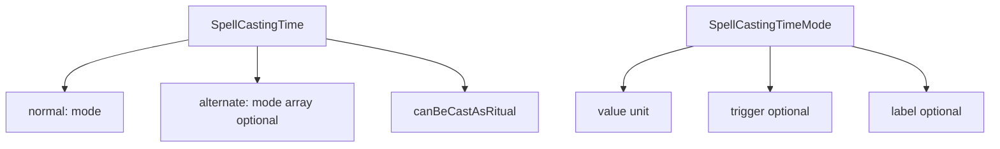

# Refactor spell `castingTime` model

## Target domain shape

In [`spell.types.ts`](src/features/content/spells/domain/types/spell.types.ts):

- **Remove** per-mode `ritual?: boolean` and ritual-only duplicate alternates from data.
- **Introduce** optional `label?: string` on each mode for named variants (overgrowth vs enrichment, etc.).
- **Keep** `trigger?: string` on modes where reactions / bonus-action riders need it (unchanged semantics from today’s `normal`).

```ts
export type SpellCastingTimeMode = {
  value: number;
  unit: CastingTimeUnit;
  trigger?: string;
  label?: string;
};

export type SpellCastingTime = {
  normal: SpellCastingTimeMode;
  /** Present only for spells with multiple distinct casting modes (e.g. Plant Growth). Omit for single-mode spells. */
  alternate?: SpellCastingTimeMode[];
  canBeCastAsRitual: boolean;
};
```

**Convention:** `alternate` exists **only** when the spell has more than one meaningful casting-time mode in rules text. Single-mode spells use `normal` only and omit `alternate`. Ritual eligibility is **only** `canBeCastAsRitual` at the top level.

**Example — Plant Growth** ([`level3-m-z.ts`](packages/mechanics/src/rulesets/system/spells/data/level3-m-z.ts)):

```ts
castingTime: {
  normal: { value: 1, unit: 'action', label: 'Overgrowth' },
  alternate: [{ value: 8, unit: 'hour', label: 'Enrichment' }],
  canBeCastAsRitual: false,
},
```

## Rules constant and ritual resolution (new `rules/` folder)

Create [`src/features/content/shared/domain/rules/rules.constants.ts`](src/features/content/shared/domain/rules/rules.constants.ts) exporting:

- `RITUAL_CASTING_TIME_BONUS_MINUTES = 10` (aligned with [`rulesConcepts.vocab.ts`](src/features/content/shared/domain/vocab/rulesConcepts.vocab.ts)).

Create [`src/features/content/shared/domain/rules/ritualCastingTime.ts`](src/features/content/shared/domain/rules/ritualCastingTime.ts):

```ts
export function resolveRitualCastingTimeInMinutes(normalMinutes: number): number {
  return normalMinutes + RITUAL_CASTING_TIME_BONUS_MINUTES;
}
```

Re-export from [`src/features/content/shared/domain/index.ts`](src/features/content/shared/domain/index.ts). Keep rules math in shared domain, not in display-only modules.

## Display and ritual UI

[`spellCastingTimeDisplay.ts`](src/features/content/spells/domain/details/display/spellCastingTimeDisplay.ts):

- Format each mode with existing unit wording; when `label` is set, prepend or suffix it so both modes read clearly (e.g. `Overgrowth: 1 action` — exact phrasing is an implementation detail).
- Join `normal` then each `alternate` with `; ` (or consistent separator). **Do not** emit a separate line for ritual-only alternates: those are represented by `canBeCastAsRitual` + badge (same idea as today’s `omitRitualAlternates`, but ritual is no longer a duplicate mode in data).
- Replace `spellCastingTimeHasRitual` with `castingTime.canBeCastAsRitual` (or keep a one-line helper).

[`spellCastingTimeDetail.tsx`](src/features/content/spells/domain/details/display/spellCastingTimeDetail.tsx): ritual badge when `canBeCastAsRitual`.

## Encounter / combat

[`spell-combat-adapter.ts`](src/features/encounter/helpers/spells/spell-combat-adapter.ts): **action economy uses `castingTime.normal` only** (`buildSpellActionCost` reads `normal.unit`). Multi-mode spells default to the primary combat mode in `normal` (Plant Growth stays action for overgrowth).

## Repo

[`spellRepo.ts`](src/features/content/spells/domain/repo/spellRepo.ts): ensure DTO typing matches new `SpellCastingTime` shape.

## System spell data (bulk update)

All entries under [`packages/mechanics/src/rulesets/system/spells/data/`](packages/mechanics/src/rulesets/system/spells/data/) move to the new shape.

**Mechanical mapping:**

| Old | New |
|-----|-----|
| Single mode `{ normal: { value, unit, trigger? } }`, no ritual | `normal` only, `canBeCastAsRitual: false` |
| `alternate` entries that were only `{ ritual: true }` (same value/unit as normal) | Omit `alternate`; set `canBeCastAsRitual: true` |
| Multi-mode with distinct times (e.g. Plant Growth) | `normal` + `alternate` with optional `labels`; `canBeCastAsRitual` per spell |
| Multi-line `castingTime` in source (same as single `normal`) | Flatten to one `normal` object with `value`, `unit`, `trigger?` |

**Plant Growth** is no longer an outlier in prose only: both modes live in structured `castingTime` with labels; description / notes can stay as-is or be trimmed later.

## Tests and docs

- Update fixtures in [`build-spell-combat-actions.test.ts`](src/features/encounter/helpers/__tests__/spells/build-spell-combat-actions.test.ts) and [`spell-catalog-audit.test.ts`](src/features/encounter/helpers/__tests__/spells/spell-catalog-audit.test.ts).
- Update [`docs/reference/effects.md`](docs/reference/effects.md) for `castingTime.normal` / `alternate` / `label` / ritual.

## Out of scope / follow-ups

- **Campaign / DB spells:** no migration; server `ritual` field unchanged unless you unify later.
- **Forms:** [`spellForm.types.ts`](src/features/content/spells/domain/forms/types/spellForm.types.ts) alignment with `canBeCastAsRitual` can follow.

## Verification

Run typecheck / targeted tests after changes.


