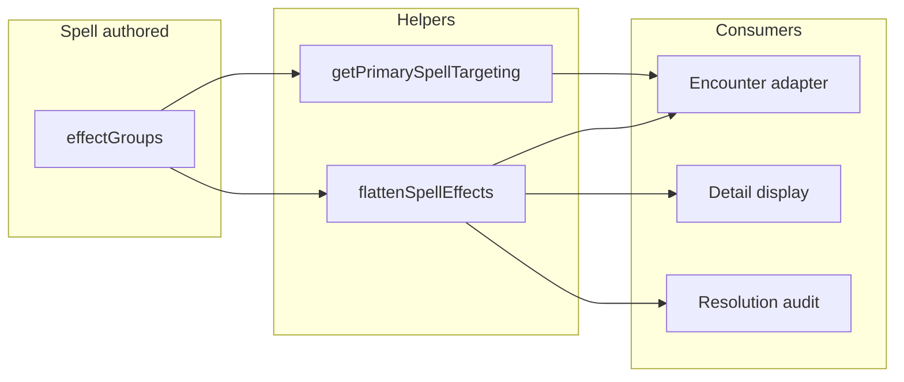

# Spell `effectGroups` refactor

## Current state (verified)

- [`spell.types.ts`](src/features/content/spells/domain/types/spell.types.ts): `SpellBase.effects` is `SpellEffects` (= `Effect[]`), mixing targeting rows with real effects.
- Mechanics [`TargetingEffect`](packages/mechanics/src/effects/effects.types.ts) is `EffectBase<'targeting'> & { target, area?, ... }` — reuse via `Omit<Extract<Effect, { kind: 'targeting' }>, 'kind'>` (or equivalent) for **`SpellEffectTargeting`**, no new target/area vocabulary.
- Heavy consumers: [`spell-combat-adapter.ts`](src/features/encounter/helpers/spells/spell-combat-adapter.ts) (targeting, AoE template, hostility inputs, flattening for combat actions), [`spell-resolution-classifier.ts`](src/features/encounter/helpers/spells/spell-resolution-classifier.ts), [`spell-hostility.ts`](src/features/encounter/helpers/spells/spell-hostility.ts), [`spell-resolution-audit.ts`](src/features/encounter/helpers/spells/spell-resolution-audit.ts), [`spellRangeAreaDisplay.ts`](src/features/content/spells/domain/details/display/spellRangeAreaDisplay.ts), [`spellAttackSaveDisplay.ts`](src/features/content/spells/domain/details/display/spellAttackSaveDisplay.ts), [`getSpellResolutionStatus`](src/features/content/spells/domain/types/spellResolution.ts), [`battlefield-spatial-movement-modifiers.ts`](packages/mechanics/src/combat/state/battlefield/battlefield-spatial-movement-modifiers.ts), [`scripts/audit-spell-touch-willing.ts`](scripts/audit-spell-touch-willing.ts).
- Forms: [`spellForm.registry.ts`](src/features/content/spells/domain/forms/registry/spellForm.registry.ts) parses a JSON **string** field `effects` into an array — repoint to `effectGroups`.
- Server: [`campaignSpell.validate.ts`](server/features/content/spells/services/campaignSpell.validate.ts) requires `body.effects` array; [`campaignSpell.normalize.ts`](server/features/content/spells/services/campaignSpell.normalize.ts) / [`spells.service.ts`](server/features/content/spells/services/spells.service.ts) persist `effects`.
- System catalog: [`SpellEntry`](packages/mechanics/src/rulesets/system/spells/types.ts) currently `Pick`s `effects`; all [`packages/mechanics/src/rulesets/system/spells/data/*.ts`](packages/mechanics/src/rulesets/system/spells/data/) (~30 files) use `effects: [...]`.

**Not in scope** for spell-authored migration: monster `MonsterSpecialAction` / normalization tests that still use `kind: 'targeting'` inside **non-spell** action payloads ([`normalization.test.ts`](packages/mechanics/src/rulesets/system/normalization.test.ts) mummy glare). Combat **action** `effects` in tests ([`action-resolution.spells-core.test.ts`](packages/mechanics/src/combat/tests/action-resolution.spells-core.test.ts)) are `CombatActionDefinition.effects`, not `Spell.effects`.

## Target types

Add to [`spell.types.ts`](src/features/content/spells/domain/types/spell.types.ts) (or a small sibling `spellEffectGroups.types.ts` re-exported from the domain index):

- `SpellEffect` = `Exclude<Effect, { kind: 'targeting' }>` (authored outcomes only).
- `SpellEffectTargeting` = fields from `TargetingEffect` **without** `kind` (same fields as today’s targeting row, including optional `EffectMeta` fields via `Omit<..., 'kind'>`).
- `SpellEffectGroup` = `{ targeting?: SpellEffectTargeting; effects: SpellEffect[] }`.
- Replace `SpellBase.effects` with **`effectGroups: SpellEffectGroup[]`**.
- `SpellHpThresholdResolution.aboveMaxHpEffects`: change to **`SpellEffect[]`** (already untargeted in practice; adapter filters targeting today).
- Remove or narrow `SpellEffects` alias to `SpellEffect[]` for spell-only payloads.

Add a **single** helper module (e.g. [`src/features/content/spells/domain/spellEffectGroups.ts`](src/features/content/spells/domain/spellEffectGroups.ts)) used by encounter + details + audits:

- `flattenSpellEffects(spell)` — concat all `group.effects` (primary consumer for “what are the mechanical rows?”).
- `getPrimarySpellTargeting(spell)` — `spell.effectGroups[0]?.targeting` (document as “primary” for combat adapter; matches today’s “first targeting row” behavior).
- Optional: `walkSpellEffectGroups(spell, visit)` for audits that need both targeting + nested `onFail` trees.

**Optional `targeting` in a group:** Keep `targeting?` — spells like [`arcane-eye`](packages/mechanics/src/rulesets/system/spells/data/level4-a-l.ts) have only non-targeting effects; groups without targeting are valid.

## Data migration (system spells)

Mechanical migration from flat `effects` to `effectGroups` in every system spell file:

1. Walk the flat `effects` array in order.
2. Maintain a current group `{ targeting?, effects: SpellEffect[] }`.
3. For each row:
   - If `kind === 'targeting'`: if the current group **already has** `targeting` set, **push** the current group and start a new one; then set `targeting` on the new group (strip `kind`).
   - Else if `kind === 'targeting'` and the current group has **no** `targeting` yet: set `targeting` (supports **emanation before targeting**, e.g. [`aura-of-life`](packages/mechanics/src/rulesets/system/spells/data/level4-a-l.ts): emanation + targeting + modifiers — one group, targeting from the targeting row, effects order preserved).
   - Else: append to `current.effects` as `SpellEffect` (non-targeting rows).
4. Push the final group.

Validate with TypeScript: no `kind: 'targeting'` remains inside `effects` arrays.

**Outliers to sanity-check after migration:** any spell whose flat list had **two** top-level targeting rows (rare); the algorithm splits into two groups. **aura-of-life** is the main structural oddity (emanation + targeting); handled by the rule above.

Update [`SpellEntry`](packages/mechanics/src/rulesets/system/spells/types.ts) to `Pick<..., 'effectGroups'>` instead of `'effects'`.

## Consumer updates

| Area | Change |
|------|--------|
| **Combat adapter** | Replace `spell.effects` with `flattenSpellEffects(spell)` for mechanics; replace `getSpellTargetingEffect` with `getPrimarySpellTargeting` + reconstruct a temporary `Effect` for code that still expects `Extract<Effect,{kind:'targeting'}>` **only inside the adapter** if needed, or refactor branches to use `SpellEffectTargeting` directly. `getSpellCreatureTypeFilter` should read from primary targeting object. `findSpellDamageEffect` / `spellShouldUseEffectsSequence` — scan flattened `SpellEffect[]`. `buildSpellEffectsAction` — enrich flattened groups’ effects (same as today). |
| **Classifier** | `SUPPORT_ONLY_KINDS`: drop `'targeting'`; run on **flattened** `SpellEffect[]` only. |
| **Hostility** | `requiresWilling` from `getPrimarySpellTargeting(spell)`; `walkNestedEffects` on flattened spell effects. |
| **Resolution audit** | `collectEffectKinds`, `computeSpellTargetingAuditFlags`, etc.: iterate `effectGroups` — apply `walkNestedEffects` to each group’s `effects`; **additionally** inspect each `group.targeting` for area/flags (today those lived as `kind: 'targeting'` in the walk). |
| **spellResolution.ts** | `hasStructured` / notes — use flattened effects or `effectGroups` length + content. |
| **Display** | `formatSpellRangeAreaDisplay`: first group whose `targeting` has `area` (or `isTargetingWithArea`-style guard on `SpellEffectTargeting`). `formatSpellAttackSaveDisplay`: first top-level `save` in flattened effects. |
| **battlefield** | `getSpeedMultiplyProductFromSpell`: pass flattened spell effects. |
| **audit script** | Touch spell: read primary targeting from `getPrimarySpellTargeting`. |

## Forms and API

- [`SpellFormValues`](src/features/content/spells/domain/forms/types/spellForm.types.ts): rename JSON field from `effects` → **`effectGroups`** (string), or keep one JSON field but **parse** to `effectGroups` (prefer rename for clarity).
- [`spellForm.registry.ts`](src/features/content/spells/domain/forms/registry/spellForm.registry.ts): `parseEffectsJson` → parse `effectGroups` array; update labels, placeholder, `patchBinding.domainPath`, `formatForDisplay` (e.g. “N group(s)”).
- [`spellRepo.ts`](src/features/content/spells/domain/repo/spellRepo.ts) DTO: `effectGroups` instead of `effects` for campaign spells.
- **Server**: [`validateSpellInputBody`](server/features/content/spells/services/campaignSpell.validate.ts) require `effectGroups` array (each element: object with optional `targeting` and `effects` array). [`normalize`](server/features/content/spells/services/campaignSpell.normalize.ts) + [`spells.service.ts`](server/features/content/spells/services/spells.service.ts): persist `effectGroups`.
- **Backward compatibility (recommended):** On read/normalize, if `effectGroups` missing but legacy `effects` present, run the **same migration function** once and treat as `effectGroups` so existing DB rows do not break. New writes only emit `effectGroups`.

## Tests

- **Unit tests** for the new helper module (flatten, primary targeting, migration edge cases: targeting-only, no targeting, emanation+targeting, two targeting rows).
- Update [`build-spell-combat-actions.test.ts`](src/features/encounter/helpers/__tests__/spells/build-spell-combat-actions.test.ts) fixtures to `effectGroups`.
- Update [`campaignSpell.normalize.test.ts`](server/features/content/spells/services/campaignSpell.normalize.test.ts) (and validate tests if any) for `effectGroups`.
- Add one representative spell-level test using **AoE targeting + save + nested onFail** (either in helper tests or combat adapter tests) using the **new** shape.

## Docs / follow-up

- **Deliverable summary** in the PR: key files, list any spells that needed manual grouping decisions, note legacy read path for campaign DB.
- **Follow-up enabled:** authoring UI can bind one `SpellEffectGroup` per repeat block (targeting fields + effect rows) without reintroducing targeting as an effect kind.

