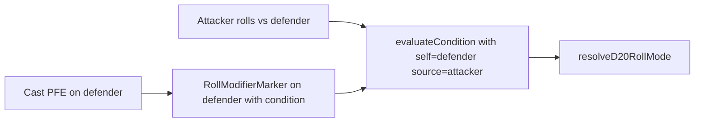

# Spell roll modifiers (PFE) and combat debug visibility

## What you are seeing

Two separate issues explain “disadvantage not in the debug log”:

1. **The engine likely never applies the PFE marker to attack resolution** — so the roll stays `normal` and you only get one debug line (see below).
2. **Even when the roll is `normal`, attack debug is dropped** — `[action-resolver.ts](src/features/mechanics/domain/encounter/resolution/action/action-resolver.ts)` only sets `debugDetails` when `attackDebug.length > 1`, but `[formatAttackRollDebug](src/features/mechanics/domain/encounter/resolution/action/resolution-debug.ts)` always returns at least one line (`roll mode: …`). So a single line (`roll mode: normal`) yields **no** `debugDetails` in the log.

```293:304:src/features/mechanics/domain/encounter/resolution/action/action-resolver.ts
    const attackDebug = formatAttackRollDebug(actor, target, attackerMarkers, defenderMarkers, attackRange, rollMod)
    nextState = appendEncounterLogEvent(nextState, {
      ...
      debugDetails: attackDebug.length > 1 ? attackDebug : undefined,
    })
```

---

## 1) Is spell disadvantage modeled correctly?

**Partially.** `roll-modifier` effects create `[RollModifierMarker](src/features/mechanics/domain/encounter/state/types/combatant.types.ts)` entries and `[resolveRollModifier](src/features/mechanics/domain/encounter/resolution/action/action-resolver.ts)` merges them with condition-based attack mods. However, **Protection from Evil is not wired correctly end-to-end**:

### A. Wrong `appliesTo` for “attacks against the warded creature”

`[resolveRollModifier](src/features/mechanics/domain/encounter/resolution/action/action-resolver.ts)` collects:

- **Attacker** markers with context `'attack rolls'`.
- **Defender** markers with context `'attacks against'`.

PFE in `[level1-m-z.ts](src/features/mechanics/domain/rulesets/system/spells/data/level1-m-z.ts)` uses `appliesTo: 'attack-rolls'`. That value is meant for **outgoing** attacks (attacker-side). The protected creature is the **defender**, so this should match other spells that use `**attacks against`** (e.g. `[level4-m-z.ts](src/features/mechanics/domain/rulesets/system/spells/data/level4-m-z.ts)` lines 137–138, `[level2-a-f.ts](src/features/mechanics/domain/rulesets/system/spells/data/level2-a-f.ts)`).

`matchesRollContext` does not map `attack-rolls` → defender incoming context, so **the PFE marker on the target never participates** in `defenderMarkers`.

### B. `effect.condition` is not enforced at roll time for `roll-modifier`

`[applyActionEffects](src/features/mechanics/domain/encounter/resolution/action/action-effects.ts)` applies `roll-modifier` **unconditionally** (unlike `modifier` numeric effects, which call `modifierEffectAppliesToTarget`). The optional `condition` on `[EffectMeta](src/features/mechanics/domain/effects/effects.types.ts)` is **not copied** onto `RollModifierMarker`.

For PFE, `[EXTRAPLANAR_CREATURE_TYPES](src/features/mechanics/domain/rulesets/system/monsters/extraplanar-creature-types.ts)` uses `target: 'source'` — at cast time `[modifierEffectAppliesToTarget](src/features/mechanics/domain/encounter/resolution/action/action-effects.ts)` would interpret `source` as the **caster**, which is wrong for “extraplanar **attackers**.” The condition must be evaluated when resolving the **attack** (`self` = defender, `source` = attacker) per `[evaluateCondition](src/features/mechanics/domain/conditions/evaluateCondition.ts)` + `[combatantToCreatureSnapshot](src/features/mechanics/domain/encounter/state/combatant-evaluation-snapshot.ts)`.

**Plan (engine):**

- Add optional `condition?: Condition` to `RollModifierMarker` and populate it from `effect.condition` when applying `roll-modifier` in `[action-effects.ts](src/features/mechanics/domain/encounter/resolution/action/action-effects.ts)` (do **not** gate application on `modifierEffectAppliesToTarget` for roll-modifiers that need attacker-aware evaluation).
- In `[resolveRollModifier](src/features/mechanics/domain/encounter/resolution/action/action-resolver.ts)`, after collecting candidate markers, **filter** those with `condition` using `evaluateCondition(condition, { self: defenderSnapshot, source: attackerSnapshot })` (and extend if future markers need `target` semantics).
- **Content fix:** change PFE `appliesTo` from `'attack-rolls'` to `**'attacks against'`** in `[level1-m-z.ts](src/features/mechanics/domain/rulesets/system/spells/data/level1-m-z.ts)`.

### C. Hardening: hyphen vs space in `appliesTo`

Authoring mixes `'attack rolls'`, `'attack-rolls'`, and `'attacks against'`. `[matchesRollContext](src/features/mechanics/domain/encounter/resolution/action/action-resolver.ts)` uses substring checks that fail for `attack-rolls` vs `attack rolls`. **Normalize** when comparing (e.g. replace `-` with space, lowercase) so attacker-side markers stay consistent without mass-editing every spell row.

### D. Saving throws (scope note)

`[saving-throw](src/features/mechanics/domain/encounter/resolution/action/action-resolver.ts)` resolution uses `getSaveModifiersFromConditions` only — it does **not** merge `RollModifierMarker` with `appliesTo: 'saving-throws'`. Spell/monster data that assumes those markers affect saves is **not enforced** yet. Call this out in the plan as **follow-up** if you want parity with attack rolls.

---

## 2) Enrich debug log output (advantage / disadvantage / normal)

**Attack rolls**

- Change `debugDetails` guard from `attackDebug.length > 1` to `**attackDebug.length > 0`** (or always pass `attackDebug`) so the first line `roll mode: …` always appears in debug mode.
- Optionally tighten `[formatAttackRollDebug](src/features/mechanics/domain/encounter/resolution/action/resolution-debug.ts)` to add an explicit line when **no** spell markers contributed (e.g. `spell markers: none`) so absence is visible vs “forgot to render.”

**Saving throws**

- `[formatSaveDebug](src/features/mechanics/domain/encounter/resolution/action/resolution-debug.ts)` currently returns `[]` when `saveRollMod === 'normal'`, so **no** save debug lines appear for typical saves. Change to **always** emit at least `save roll mode: ${saveRollMod}` (and keep condition lines when non-normal), matching attack behavior.
- Update `[action-resolver.ts](src/features/mechanics/domain/encounter/resolution/action/action-resolver.ts)` save branch to use `saveDebug.length > 0` consistently.

**Docs**

- After code changes, adjust the `[resolution.md` §4.6](docs/reference/resolution.md) table if behavior of `formatSaveDebug` / attack debug gates changes.

---

## 3) Tests

- Add focused tests (Vitest) for:
  - `resolveRollModifier`: PFE-style defender marker + extraplanar attacker `creatureType` → `disadvantage`; non-extraplanar → no extra disadvantage from that marker.
  - `matchesRollContext` normalization (`attack-rolls` vs `attack rolls`).
  - Optional: snapshot or assertion that `attack-hit` / save events include `debugDetails` with a single `roll mode: normal` line when appropriate.

---

## Architecture sketch (roll-time condition)




