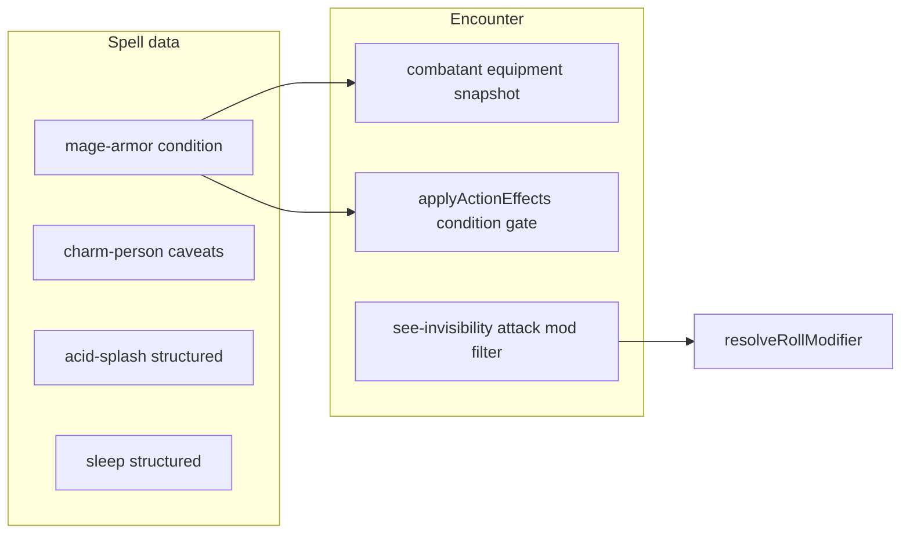

# Plan: Spell authoring, caveats, and See Invisibility vs invisible

## 1. Mage Armor — “Target must not be wearing armor”

**Canonical pattern** (already used for Draconic Resilience / Unarmored Defense in `[classes.ts](src/features/mechanics/domain/rulesets/system/classes.ts)`): gate the effect with:

```ts
condition: {
  kind: 'state',
  target: 'self',
  property: 'equipment.armorEquipped',
  equals: null,
},
```

**Spell data** (`[level1-m-z.ts](src/features/mechanics/domain/rulesets/system/spells/data/level1-m-z.ts)`): add this `condition` to the `modifier` effect for `mage-armor`. Tighten the existing flavor `note` so it focuses on “ends if target dons armor” / Dex +13 (the eligibility rule is now structurally encoded). Per [effects.md §9](docs/reference/effects.md), add `resolution.caveats` only if something remains under-modeled after this change.

**Character stat resolution**: `[resolveStatDetailed](src/features/mechanics/domain/resolution/resolvers/stat-resolver.ts)` already filters modifiers by `evaluateCondition`; no change required once the spell carries `condition`.

**Encounter enforcement** (so the buff is not applied blindly):

- Add a minimal equipment snapshot on `[CombatantInstance](src/features/mechanics/domain/encounter/state/types/combatant.types.ts)`, e.g. optional `equipment?: { armorEquipped?: string | null }` (mirrors `[CreatureSnapshot](src/features/mechanics/domain/conditions/evaluation-context.types.ts)`).
- Populate it in `[buildCharacterCombatantInstance](src/features/encounter/helpers/combatant-builders.ts)` from `character.combat?.loadout?.armorId` (present on `[CharacterDetailDto](src/features/character/read-model/character-read.types.ts)`); for monsters, set `armorEquipped: null` (typical “not wearing armor” for Mage Armor eligibility; natural AC is separate).
- In `[applyActionEffects](src/features/mechanics/domain/encounter/resolution/action/action-effects.ts)`, before applying AC `modifier` effects, build an `[EvaluationContext](src/features/mechanics/domain/conditions/evaluation-context.types.ts)` for the **target** (and actor as `source` if needed) and call `evaluateCondition` when `effect.condition` is present; if false, skip the modifier and append a short encounter note so the table sees the gate failed.

**Tests**: extend an existing encounter test (e.g. `[action-resolution.test.ts](src/features/mechanics/domain/encounter/tests/action-resolution.test.ts)`) with a case: armored loadout → Mage Armor modifier not applied; unarmored → applied.

---

## 2. Charm Person — “Ends early if you or your allies damage the target”

**Reality**: Removing charm when the charmer or an ally deals damage is not modeled in `[action-effects.ts](src/features/mechanics/domain/encounter/resolution/action/action-effects.ts)` / damage pipeline today ([resolution.md §4.5](docs/reference/resolution.md) does not list this).

**Authoring** (`[level1-a-l.ts](src/features/mechanics/domain/rulesets/system/spells/data/level1-a-l.ts)`):

- Add `[spell.resolution.caveats](docs/reference/effects.md)` with one clear line, e.g. that the spell ends if the caster or any ally damages the target, and that this is **not** enforced in encounter resolution yet.
- Optionally split the existing long `note`: keep friendly/aftermath text as `category: 'flavor'`, and move the damage-early-end sentence into the caveat only (avoids duplicate “under-modeled” + caveat both driving `partial` for the same fact). `[getSpellResolutionStatus](src/features/content/spells/domain/types/spellResolution.ts)` will report `partial` because of `caveats` — expected until an engine hook exists.

**Future (out of scope unless you expand the plan)**: on damage application, if victim has `charmed` with `sourceInstanceId` matching the caster instance, check attacker side and call `removeConditionFromCombatant` — needs ally/instance graph rules.

---

## 3. Author Acid Splash and Sleep (exit `stub`)

**Acid Splash** (`[cantrips-a-l.ts](src/features/mechanics/domain/rulesets/system/spells/data/cantrips-a-l.ts)`):

- Replace the lone `note` with structured effects aligned with [effects.md §5](docs/reference/effects.md) and existing cantrips: `targeting` (`creatures-in-area` + 5 ft `sphere`), top-level `save` (`dex`), `onFail` → `damage` (`acid`, `1d6`, `levelScaling: cantripDamageScaling('d6')` from `[shared.ts](src/features/mechanics/domain/rulesets/system/spells/shared.ts)`).
- Keep a concise `note` for anything still not simulated (e.g. two-creature wording / object splash if your edition differs) with `category: 'under-modeled'` **only** if the rules text is not fully captured — otherwise `flavor` or omit.

**Sleep** (`[level1-m-z.ts](src/features/mechanics/domain/rulesets/system/spells/data/level1-m-z.ts)`):

- Add `targeting` + `save` (`wis`) + `onFail` → `condition` `incapacitated` to match the first sentence of your `description.full`.
- Add a `note` with `category: 'under-modeled'` for everything the engine does not resolve: second save → unconscious, damage/action to wake, elf / exhaustion immunity, HP-based sleep budgets if applicable. This matches the “intentionally under-modeled” pattern in [effects.md §8](docs/reference/effects.md).

Run `[npm run test:run -- src/features/encounter/helpers/spell-catalog-audit.test.ts](docs/reference/effects.md)` after edits (reporting-only per docs).

---

## 4. See Invisibility — do not apply invisible attack modifiers across “viewer”

**Problem**: `[getIncomingAttackModifiers](src/features/mechanics/domain/encounter/state/condition-rules/condition-queries.ts)` / `[getOutgoingAttackModifiers](src/features/mechanics/domain/encounter/state/condition-rules/condition-queries.ts)` flatten all conditions. `[invisible](src/features/mechanics/domain/encounter/state/condition-rules/condition-definitions.ts)` contributes incoming disadvantage and outgoing advantage; a creature with state `[see-invisibility](src/features/mechanics/domain/rulesets/system/spells/data/level2-g-z.ts)` should **ignore** those when they are the attacker (they see the invisible target) or the defender (they see the invisible attacker).

**Approach** (no change to `CONDITION_RULES`):

- Add a focused helper (e.g. in `condition-queries.ts`) that uses existing `[getActiveConsequencesWithOrigin](src/features/mechanics/domain/encounter/state/condition-rules/condition-queries.ts)` to collect `attack_mod` entries **with** `conditionId`, then:
  - For **incoming** mods on `defender`, drop consequences from `invisible` if `[hasState](src/features/mechanics/domain/encounter/state/shared.ts)``(attacker, 'see-invisibility')`.
  - For **outgoing** mods on `attacker`, drop consequences from `invisible` if `hasState(defender, 'see-invisibility')`.
- Replace the flat `getIncomingAttackModifiers` / `getOutgoingAttackModifiers` usage in `[resolveRollModifier](src/features/mechanics/domain/encounter/resolution/action/action-resolver.ts)` with this paired attacker/defender API (same signature for range: melee vs ranged).

**Debug**: Update `[formatAttackRollDebug](src/features/mechanics/domain/encounter/resolution/action/resolution-debug.ts)` if it assumes the old flat helpers, so logs stay consistent.

**Tests**: Add a case in `[action-resolution.test.ts](src/features/mechanics/domain/encounter/tests/action-resolution.test.ts)` (or the file that already covers invisible + attack rolls): invisible defender vs attacker with `see-invisibility` state → attack should not gain disadvantage from invisibility alone (control: without state, disadvantage applies).

---

## Dependency / ordering




Implement **See Invisibility** and **Mage Armor** encounter pieces together if you touch `action-resolver.ts` in one pass; spell-only edits for Charm / Acid Splash / Sleep can land independently.

---

## Engine-blocked authoring (follow-up backlog)

**Roadmap:** Use [engine_blocked_authoring_20260320.plan.md](engine_blocked_authoring_20260320.plan.md) for phased engine work (Phases 1–4 landed: charm-on-damage, equipment snapshot + Mage Armor-style invalidation, Sleep save chain + wake, LOS/sight seams + `requiresSight`).

**Still open (non-spatial, §2.5):** spell slots / healing upcast at runtime; contextual Charm save advantage (allies fighting); form/stat-block swap; cast-time choice payload; Flesh to Stone–style staged saves; monster armor derivation from stat blocks. **Contagion** repeat-save track (3/3) is implemented via `outcomeTrack` — disadvantage on chosen ability and healing Con save to clear Poisoned remain caveats on the spell.

**Still open (spatial / adapter):** [effects.md §3](docs/reference/effects.md) — `creatures-in-area` maps to **all-enemies**; Acid Splash and similar need honest notes or future geometry ([resolution.md §9](docs/reference/resolution.md)).

**Related docs:** [effects.md §10 Known Unsupported](docs/reference/effects.md), [resolution.md](docs/reference/resolution.md) targeting + visibility seams.