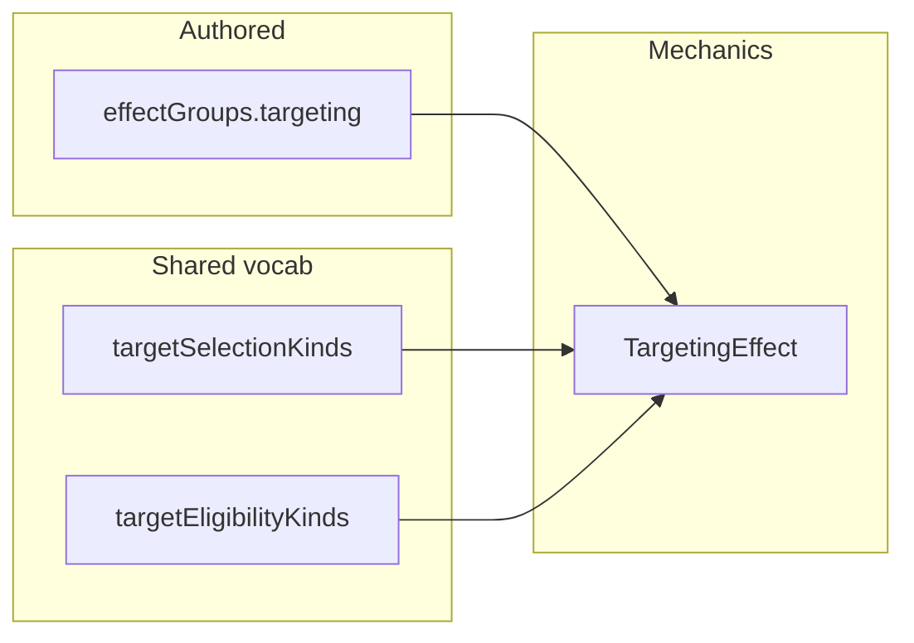

# Structured spell effect targeting refactor

## Scope: no legacy DB content support

**Out of scope:** read-path normalization, migration helpers for persisted Mongo/API campaign spells, or wiring upgrades into [`campaignSpell.normalize.ts`](server/features/content/spells/services/campaignSpell.normalize.ts). **No one-off DB migration script** (no ad-hoc script to rewrite stored `effectGroups` in Mongo or elsewhere). Assume **no requirement** to load old flat `target` strings from the database after this change. Persisted data in the wild is **not** addressed by this plan.

## Current state (grounded)

- [`packages/mechanics/src/effects/effects.types.ts`](packages/mechanics/src/effects/effects.types.ts): `TargetingEffect` uses `target: TargetingEffectTarget` (flat union in [`packages/mechanics/src/effects/targeting.types.ts`](packages/mechanics/src/effects/targeting.types.ts)) plus optional `targetType?: 'creature'` — redundant with the flat id.
- [`src/features/content/spells/domain/types/spell.types.ts`](src/features/content/spells/domain/types/spell.types.ts): `SpellEffectTargeting = Omit<Extract<Effect, { kind: 'targeting' }>, 'kind'>` — **no separate spell shape**; changing `TargetingEffect` updates the spell domain automatically.
- Authored spells: **~30+ files** under [`packages/mechanics/src/rulesets/system/spells/data/`](packages/mechanics/src/rulesets/system/spells/data/) with `effectGroups[].targeting` using `target: 'one-creature' | …` (often **plus** `targetType: 'creature'`). Spells do **not** use `creatures-entered-during-move` today; monsters do.
- Combat/audit: [`src/features/encounter/helpers/spells/spell-combat-adapter.ts`](src/features/encounter/helpers/spells/spell-combat-adapter.ts) branches on `targeting.target` (e.g. `creatures-in-area`, `one-dead-creature`). [`src/features/encounter/helpers/monsters/monster-combat-adapter.ts`](src/features/encounter/helpers/monsters/monster-combat-adapter.ts) branches on `MonsterSpecialAction.target` for AoE vs entered-during-move.
- **Outlier to fix during authored migration:** [`level3-a-l.ts`](packages/mechanics/src/rulesets/system/spells/data/level3-a-l.ts) has at least one `targeting` with only `target` + `area` (no `targetType`) — add explicit `targetType: 'creature'` when converting to structured form.

## 1. Shared vocab (canonical axes)

Add **[`src/features/content/shared/domain/vocab/spellTargeting.vocab.ts`](src/features/content/shared/domain/vocab/spellTargeting.vocab.ts)** (single file — matches `areaOfEffect.vocab.ts` pattern: `id`, `name`, `rulesText`, `as const` array, derived unions, `Map` lookups, `get*ById`, `get*RulesText`).

- **Selection ids:** `one` | `chosen` | `in-area` | `entered-during-move` (per your spec).
- **Eligibility ids:** `creature` | `dead-creature` | `object` (per your spec).

Export from [`src/features/content/shared/domain/vocab/index.ts`](src/features/content/shared/domain/vocab/index.ts).

**Display helpers** (same vocab file or a small sibling module under `src/features/content/spells/domain/details/display/` — e.g. `spellTargetingDisplay.ts`):

- **`formatSpellEffectTargetingLabel(t)`** — composes selection + eligibility into strings like **“One creature”**, **“Chosen creatures”**, **“Creatures in area”**, **“Dead creature”**, **“Objects in area”** using vocab `name` + light grammar (no parsing of flat ids).

Mechanics already imports shared vocab (e.g. [`areaOfEffect.vocab.ts`](src/features/content/shared/domain/vocab/areaOfEffect.vocab.ts)); **`TargetingEffect` should import `TargetSelectionKind` / `TargetEligibilityKind` from this vocab** (not duplicate unions).

## 2. Mechanics: `TargetingEffect` and `targeting.types.ts`

- Replace flat `target: TargetingEffectTarget` with:
  - `selection: TargetSelectionKind`
  - `targetType: TargetEligibilityKind` (**this subsumes the old optional `targetType?: 'creature'`** — remove that field).
- Preserve existing optional fields on `TargetingEffect`: `requiresWilling`, `creatureTypeFilter`, `rangeFeet`, `requiresSight`, `count`, `canSelectSameTargetMultipleTimes`, `area` (unchanged from [`effects.types.ts`](packages/mechanics/src/effects/effects.types.ts) ~281–295).
- **Update [`targeting.types.ts`](packages/mechanics/src/effects/targeting.types.ts):**
  - Remove `TargetingEffectTarget` as a primary model (delete or keep a **deprecated** alias only if something external still references it briefly during the PR — prefer full removal once call sites are migrated).
  - **`MonsterSpecialActionTarget`:** replace the flat extract with a **narrow structured type** aligned with the two monster uses today, e.g. `{ selection: 'in-area' | 'entered-during-move'; targetType: 'creature' }` (or `Pick<…>` from the vocab types). Update [`monster-actions.types.ts`](src/features/content/monsters/domain/types/monster-actions.types.ts) accordingly.

## 3. Migrate authored data (bulk)

- **All spell data files** under [`packages/mechanics/src/rulesets/system/spells/data/*.ts`](packages/mechanics/src/rulesets/system/spells/data/) — replace `target: '…'` with `selection` + `targetType`; **remove** duplicate `targetType: 'creature'` where it only mirrored the old flat id.
- **Necromancy / dead targets:** `one-dead-creature` → `selection: 'one', targetType: 'dead-creature'` (not `creature`).
- **Monster stat blocks** using `MonsterSpecialAction.target` and/or embedded `kind: 'targeting'` (e.g. [`monsters-m-o.ts`](packages/mechanics/src/rulesets/system/monsters/data/monsters-m-o.ts) Dreadful Glare) — migrate to the structured shape.
- **Mechanical verification:** run `pnpm`/`vitest` / `tsc` after bulk replace; spot-check grep for `one-creature` / flat `target:` in spell targeting should be **gone** from data (except comments/docs if any).

**Reference mapping** (for the migration only, not a runtime module unless tests need a tiny private table):

| Old flat `target` | `selection` | `targetType` |
|-------------------|-------------|--------------|
| `one-creature` | `one` | `creature` |
| `one-dead-creature` | `one` | `dead-creature` |
| `chosen-creatures` | `chosen` | `creature` |
| `creatures-in-area` | `in-area` | `creature` |
| `creatures-entered-during-move` | `entered-during-move` | `creature` |

## 4. Update consumers (no flat-id branching)

| Area | File(s) | Change |
|------|---------|--------|
| Combat adapter | [`spell-combat-adapter.ts`](src/features/encounter/helpers/spells/spell-combat-adapter.ts) | `deriveCombatAreaTemplate`, `buildSpellTargeting`, dead-creature detection: use `selection` + `targetType` (e.g. `selection === 'in-area'` instead of `target === 'creatures-in-area'`; `targetType === 'dead-creature'` instead of `one-dead-creature`). |
| Audit | [`spell-resolution-audit.ts`](src/features/encounter/helpers/spells/spell-resolution-audit.ts) | Same. |
| Monsters | [`monster-combat-adapter.ts`](src/features/encounter/helpers/monsters/monster-combat-adapter.ts) | Compare `selection` for `in-area` vs `entered-during-move`. |
| Scripts | [`scripts/audit-spell-touch-willing.ts`](scripts/audit-spell-touch-willing.ts) | `selection === 'one' && targetType === 'creature'`. |
| Tests | [`spellEffectGroups.test.ts`](src/features/content/spells/domain/__tests__/spellEffectGroups.test.ts), [`build-spell-combat-actions.test.ts`](src/features/encounter/helpers/__tests__/spells/build-spell-combat-actions.test.ts), [`normalization.test.ts`](packages/mechanics/src/rulesets/system/normalization.test.ts), [`action-resolution.death-and-targeting.test.ts`](packages/mechanics/src/combat/tests/action-resolution.death-and-targeting.test.ts), [`monster-combat-adapter.test.ts`](src/features/encounter/helpers/__tests__/monsters/monster-combat-adapter.test.ts) | Update fixtures to structured targeting. |

## 5. Forms / authoring

- [`spellForm.registry.ts`](src/features/content/spells/domain/forms/registry/spellForm.registry.ts): tweak `effectGroups` **helper text** to show the new `targeting` shape (`selection`, `targetType`, optional `area`, `requiresSight`, …).
- [`spellForm.types.ts`](src/features/content/spells/domain/forms/types/spellForm.types.ts): no structural change unless something references `targeting` explicitly — only if needed.

## 6. Tests to add (acceptance)

- **Vocab:** ids stable, lookups, `formatSpellEffectTargetingLabel` cases.
- **Structured examples:** at least one AoE (`in-area` + `area`) and one single-target (`one` + `creature`) in spell/group tests or display tests.
- **Regression:** existing spell/combat tests updated.
- **Not required:** tests for `normalizeRawCampaignSpellToCanonical` upgrading legacy `effectGroups` (no legacy DB path in scope).

## Documentation / follow-up

- **Do not** treat [`docs/reference/effects.md`](docs/reference/effects.md) as a required deliverable in this pass (per your rule to avoid unsolicited markdown edits); **optional follow-up** is to update examples there to `selection` / `targetType`.
- **Follow-up enabled:** object-target spells (`targetType: 'object'`) with `selection` `one` / `in-area` without new flat ids; cleaner authoring UI for effect groups.
- **Not planned here:** one-off DB migration scripts or normalize-layer upgrades for old stored `target` — same as “no legacy DB support” above.

## Deliverables summary

1. Shared vocab + exports + display helpers.
2. Mechanics `TargetingEffect` + monster special action types.
3. Full authored migration (spells + monsters + tests).
4. Consumer updates (encounter + scripts).
5. **No** campaign/DB read-path bridge, **`targeting-legacy` runtime module for stored content, or one-off DB migration script**.
6. Short summary in PR: key files, outliers (`one-dead` + eligibility cleanup, `targeting` missing `targetType`), follow-ups.
