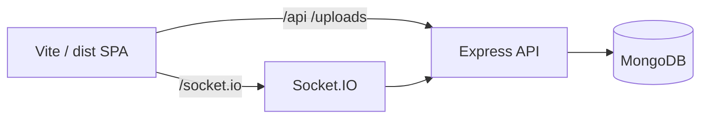

# RPG World Builder

> Dungeons & Dragons campaign tooling: character creation, world content, combat, and live play.

Test

## What it is

RPG World Builder is a web app for running D&D-style campaigns: create and store characters, author campaign-specific content (spells, monsters, locations, equipment), simulate combat, and host game sessions with realtime sync. Rules are data-driven via a shared **mechanics** package and per-campaign **ruleset patches** over a system SRD catalog.

The default system ruleset is **SRD 5.2.1** (`SRD_CC_v5_2_1`) — see [Legal](#legal--srd-attribution) below.

## Features

### Accounts & campaigns

- Registration, login, campaign membership, invites
- Campaign ruleset patches and content overrides

### Characters

- Step-based character builder (public home + in-campaign)
- Saved characters (MongoDB)
- Level-up flow

### World content (per campaign)

- CRUD for classes, races, spells, monsters, equipment, skill proficiencies
- Dynamic forms and list pages (MUI Data Grid)

### Locations

- Location workspace, map authoring, placed objects  
- See [`docs/reference/locations/README.md`](docs/reference/locations/README.md)

### Combat & play

- **Encounter simulator** — dev/testing combat UI (`/campaigns/:id/encounter`)
- **Game sessions** — lobby → setup → play with Socket.IO sync
- Shared combat engine in `packages/mechanics`

### Messaging

- Campaign conversations (realtime via Socket.IO)

## Tech stack

| Layer | Technologies |
|-------|----------------|
| Frontend | React 19, TypeScript, Vite 7, React Router 7, MUI, Emotion, React Hook Form |
| Backend | Node.js, Express, TypeScript (`tsx`), Mongoose, Socket.IO |
| Shared | `packages/mechanics` (`@rpg-world-builder/mechanics`) |
| Test | Vitest, Testing Library, Playwright |
| Tooling | ESLint, Rollup bundle visualizer |

## Prerequisites

- **Node.js** 20+ (LTS recommended)
- **MongoDB** running locally or reachable via `MONGO_URI`

## Environment

Copy [`.env.example`](.env.example) to `.env` in the repo root and adjust values.

| Variable | Purpose | Default |
|----------|---------|---------|
| `PORT` | API + Socket.IO server | `5001` (matches Vite dev proxy) |
| `MONGO_URI` | MongoDB connection | `mongodb://localhost:27017` |
| `DB_NAME` | Database name | `dnd` |
| `AUTH_SECRET` | JWT / session signing | *(required in production)* |
| `CLIENT_URL` | CORS / auth redirects | `http://localhost:5173` |
| `IMAGE_BASE_URL` | Uploaded image base path | `/uploads/` |
| `OPENAI_API_KEY` | Chat features (optional) | — |
| `NODE_ENV` | `development` / `production` | `development` |

## Getting started

### Install dependencies

```bash
npm i
```

### Development (frontend + API)

Runs Vite (`http://localhost:5173`) and the API server concurrently. Vite proxies `/api`, `/uploads`, and `/socket.io` to `PORT` (default **5001**).

```bash
npm run dev
```

### Frontend or backend only

```bash
npm run dev:frontend   # Vite only
npm run dev:backend    # Express + Socket.IO (nodemon)
```

### Production build

```bash
npm run build          # location-objects manifest + tsc + Vite client build
npm start              # API server (tsx server/index.ts)
```

Serve the `dist/` client separately (static host or reverse proxy) unless you add static middleware to Express.

### Tests

```bash
npm run test:run       # Vitest
npm run test:e2e       # Playwright
```

### Bundle baseline (optional)

```bash
npm run build:verify   # analyze + baseline summary + entry-chunk checks
```

See [`docs/reference/build-baseline.md`](docs/reference/build-baseline.md).

## Project layout

```
src/
  app/              # Router, providers, layouts, route constants
  features/         # Feature modules (auth, campaign, content, combat, …)
  ui/               # Shared UI primitives and patterns
packages/
  mechanics/        # Rulesets, combat engine, system catalog (client + server)
server/
  features/         # API routes by domain
  shared/           # Models, middleware, config
shared/             # Cross-cutting domain (e.g. dice)
docs/               # Architecture and reference docs
```

## Documentation

| Topic | Location |
|-------|----------|
| Combat | [`docs/reference/combat/README.md`](docs/reference/combat/README.md) |
| Locations | [`docs/reference/locations/README.md`](docs/reference/locations/README.md) |
| Content routes | [`docs/reference/content/content-routes-architecture.md`](docs/reference/content/content-routes-architecture.md) |
| Bundle performance | [`docs/reference/build-baseline.md`](docs/reference/build-baseline.md) |
| Mechanics package | [`packages/mechanics/README.md`](packages/mechanics/README.md) |
| Contributors / agents | [`AGENTS.md`](AGENTS.md) |

## Architecture notes

- **SPA + API** — Vite dev server proxies API, uploads, and WebSockets to Express.
- **Rulesets** — System SRD in code (`packages/mechanics/src/rulesets/system`); campaign patches in MongoDB; client loads catalog asynchronously (`loadSystemCatalog`).
- **Shared mechanics** — Server imports `@/features/mechanics/domain/*` and `catalog.sync.ts`; browser uses async catalog chunks (see bundle baseline doc).



## Status & limitations

- **Encounter simulator** is for development and combat testing; it is not the full player-facing live-play product (see route comments in `src/app/routes.ts`).
- **Edition support** — production content targets **SRD 5.2.1** / 5.5e-compatible rules; multi-edition support is not a current goal.
- Some equipment and encumbrance rules are simplified or incomplete.
- Production static-hosting story for `dist/` is not wired into `server/app.ts` by default.

## Legal / SRD attribution

This project includes game rules content derived from Wizards of the Coast’s **System Reference Document**. It is **not** affiliated with, endorsed, sponsored, or approved by Wizards of the Coast LLC.

**Dungeons & Dragons**, **D&D**, and related marks are trademarks of Wizards of the Coast LLC in the United States and other countries.

### Required attribution (CC-BY-4.0)

Per the SRD license, this work includes material from the System Reference Document. Use the following attribution wherever you distribute or publish derivative works based on this repository’s SRD-derived content:

> This work includes material from the System Reference Document 5.2 (“SRD 5.2”) by Wizards of the Coast LLC, available at [https://www.dndbeyond.com/srd](https://www.dndbeyond.com/srd). The SRD 5.2 is licensed under the Creative Commons Attribution 4.0 International License, available at [https://creativecommons.org/licenses/by/4.0/legalcode](https://creativecommons.org/licenses/by/4.0/legalcode).

The in-repo system catalog implements **SRD 5.2.1** content (`SRD_CC_v5_2_1`); download the latest PDF from [D&D Beyond — SRD v5.2.1](https://www.dndbeyond.com/srd).

- Do **not** add extra attribution to Wizards beyond the statement above (per SRD legal text).
- You **may** describe compatible products as “compatible with fifth edition” or “5E compatible.”
- SRD / Creative Commons licensing does **not** cover streaming, fan art, or cosplay — see [Wizards Fan Content Policy](https://company.wizards.com/en/legal/fancontentpolicy).
- Custom campaign content you create in the app is your own; only the embedded system SRD data falls under the above license.

## License

Application code in this repository is private (`"private": true` in `package.json`) unless otherwise noted. **SRD-derived rules text and data** in `packages/mechanics` remain subject to **CC-BY-4.0** as described above when reused or redistributed.
