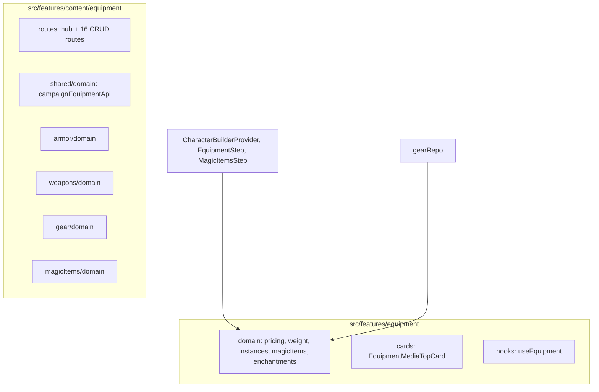

# Equipment Feature Consolidation Plan

**Goal:** Apply the subtype ownership template to all four equipment types (armor, weapons, gear, magicItems) and fold the top-level `src/features/equipment` into `src/features/content/equipment`, establishing a single canonical home for content equipment. Runtime/character equipment logic moves to `characterBuilder` domain.

---

## Domain Separation

Treat catalog/content equipment and runtime equipment instances as separate domains:

- **content/equipment** owns: item definitions, forms, validation, list/detail/create/edit flows
- **characterBuilder/domain/equipment** owns: owned-instance normalization, cost/weight calculation for character equipment, magic item budget tier

---

## Current State



**Key facts:**

- [src/features/equipment](src/features/equipment): Domain (pricing, weight, instances, magic item budget, enchantments), cards, hooks. Used by character builder and gearRepo.
- [src/features/content/equipment](src/features/content/equipment): 17 route files in `routes/`, shared `campaignEquipmentApi`, and four subtype folders (armor, weapons, gear, magicItems) each with `domain/` (repo, validation, forms, list, details).
- **Dead code:** `useEquipment` (delete), `getAvailableEnhancementTemplates` (delete). `EquipmentMediaTopCard` kept and moved to content/equipment/shared/components.

---

## Target Structure

```
src/features/characterBuilder/domain/equipment/
├── index.ts
├── calculateEquipmentCostCp.ts      # from features/equipment (includes getItemCostCp)
├── calculateEquipmentWeight.ts     # from features/equipment (uses weightToLb from @/shared/weight)
├── normalizeEquipmentInstances.ts  # from features/equipment
└── magicItems/
    ├── getMagicItemBudgetTier.ts
    └── index.ts

src/features/content/equipment/
├── routes/                         # Feature-level only: hub, registration, re-exports
│   ├── EquipmentHubRoute.tsx
│   └── index.ts                    # Re-exports from subtype routes
├── shared/
│   ├── components/
│   │   └── EquipmentMediaTopCard/  # moved from features/equipment/cards
│   └── domain/
│       └── campaignEquipmentApi.ts # existing
├── armor/
│   ├── routes/                     # ArmorListRoute, ArmorDetailRoute, ArmorCreateRoute, ArmorEditRoute, index
│   └── domain/                     # existing
├── weapons/
│   ├── routes/
│   └── domain/
├── gear/
│   ├── routes/
│   └── domain/
└── magicItems/
    ├── routes/
    └── domain/
```

**Shared weight utility:** `weightToLb` (used by gearRepo and calculateEquipmentWeight) moves to `@/shared/weight`.

---

## Phases

### Phase 0: Split domains and fold content equipment

**Goal:** Move runtime equipment logic to characterBuilder; move content-only pieces to content/equipment; remove features/equipment.

| Item | Destination | Notes |
|------|-------------|-------|
| `calculateEquipmentCostCp`, `getItemCostCp` | `characterBuilder/domain/equipment/calculateEquipmentCostCp.ts` | From pricing.ts |
| `calculateEquipmentWeight` | `characterBuilder/domain/equipment/calculateEquipmentWeight.ts` | Uses weightToLb from @/shared/weight |
| `weightToLb` | `@/shared/weight` | Used by gearRepo and calculateEquipmentWeight |
| `normalizeEquipmentInstances` | `characterBuilder/domain/equipment/normalizeEquipmentInstances.ts` | Runtime equipment state |
| `getMagicItemBudgetTier` | `characterBuilder/domain/equipment/magicItems/getMagicItemBudgetTier.ts` | Magic item budget for character |
| `EquipmentMediaTopCard` | `content/equipment/shared/components/EquipmentMediaTopCard/` | Keep (currently unused) |
| `useEquipment` | **Delete** | Dead |
| `getAvailableEnhancementTemplates` | **Delete** | Dead |
| `resolveEnchantmentTemplate` | **Delete** or migrate | Unused; delete unless needed |
| `domain/enchantments/` | **Delete** | Unused |

**Tasks:**

1. Add `weightToLb` to `@/shared/weight` (or new `weightUtils.ts` in shared/weight).
2. Create `characterBuilder/domain/equipment/` with `calculateEquipmentCostCp.ts`, `calculateEquipmentWeight.ts`, `normalizeEquipmentInstances.ts`.
3. Create `characterBuilder/domain/equipment/magicItems/` with `getMagicItemBudgetTier.ts`.
4. Add `characterBuilder/domain/equipment/index.ts` exporting all.
5. Move `EquipmentMediaTopCard` to `content/equipment/shared/components/`.
6. Delete `useEquipment`, `getAvailableEnhancementTemplates`, `resolveEnchantmentTemplate`, enchantments module.
7. Update imports: CharacterBuilderProvider, EquipmentStep, MagicItemsStep → `@/features/characterBuilder/domain/equipment`; gearRepo → `@/shared/weight` for weightToLb.
8. Remove `@/features/equipment` from vite.config.ts and tsconfig.app.json.
9. Delete `src/features/equipment` directory.

---

### Phase 1: Armor subtype (template application)

**Tasks:**

1. Create `content/equipment/armor/routes/`.
2. Move `ArmorListRoute.tsx`, `ArmorDetailRoute.tsx`, `ArmorCreateRoute.tsx`, `ArmorEditRoute.tsx` from `content/equipment/routes/` to `content/equipment/armor/routes/`.
3. Add `content/equipment/armor/routes/index.ts` exporting all four routes.
4. Update `content/equipment/routes/index.ts` to re-export from `./armor/routes` (and keep hub).
5. Fix imports in moved files (domain paths stay `../domain`).
6. Revalidate all affected barrel exports.
7. Verify auth/index.ts still receives routes via `content/equipment/routes` barrel.

---

### Phase 2: Weapons subtype

Same pattern as Phase 1: create `weapons/routes/`, move 4 route files, add index, update feature routes index, fix imports. Revalidate barrel exports after migration.

---

### Phase 3: Gear subtype

Same pattern: create `gear/routes/`, move 4 route files, add index, update feature routes index, fix imports. Revalidate barrel exports after migration.

---

### Phase 4: MagicItems subtype

Same pattern: create `magicItems/routes/`, move 4 route files, add index, update feature routes index, fix imports. Revalidate barrel exports after migration.

---

## Barrel Exports

Do not redesign barrels broadly. After each subtype migration, revalidate all affected barrel exports (e.g. `content/equipment/routes/index.ts`, `content/domain/repo`, `content/domain/validation`) to ensure they still compile and export correctly.

---

## Concerns and Mitigations

| Concern | Mitigation |
|---------|------------|
| **Semantic mixing** — content/equipment should own only content management, not character-builder utilities. | Runtime equipment logic (normalize, cost, weight, budget tier) lives in `characterBuilder/domain/equipment`. Content/equipment owns only item definitions, forms, validation, CRUD flows. Add this as an explicit ownership rule in docs. |
| **Dead code** — useEquipment, getAvailableEnhancementTemplates. | Delete during Phase 0. EquipmentMediaTopCard kept and moved to content/equipment/shared/components. |
| **Path alias removal** — `@/features/equipment` removed. | Update all consumers in Phase 0; remove alias from vite + tsconfig. |
| **Barrel exports** — content/domain/repo and content/domain/validation re-export from equipment subtypes. | No broad redesign. Revalidate after each subtype migration. |
| **Route registration** — auth/index.ts imports from `@/features/content/equipment/routes`. | Feature-level `routes/index.ts` re-exports from subtype routes; auth imports stay unchanged. |

---

## Validation (per phase)

- List, detail, create, edit routes work for the migrated subtype.
- Barrel exports compile.
- No broken imports.
- After Phase 0: Character builder equipment step and magic items step work; gear repo resolves.

---

## Deliverables Summary

- **Phase 0:** Runtime equipment logic in characterBuilder/domain/equipment; content-only pieces in content/equipment; features/equipment removed; dead code deleted; EquipmentMediaTopCard in shared/components.
- **Phases 1–4:** Each subtype owns `routes/` + `domain/`; feature-level `routes/` holds hub and re-exports; barrels revalidated after each migration.
- **Final:** Updated folder structure, exports, imports, and brief migration summary.
