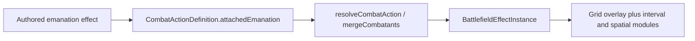

# Emanation and attached battlefield effects

This document is the **navigation hub** for how **emanations** and **persistent battlefield sphere effects** work across spells, monster special actions, and monster traits in encounter combat.

- **Field-level authoring rules** for the `emanation` effect kind: [effects.md § `emanation`](../reference/effects.md#emanation)
- **Monster trait patterns** (pairing `emanation` with `interval`, save DC, triggers): [monster-authoring.md § Traits: emanations and attached battlefield](../reference/monster-authoring.md#traits-emanations-and-attached-battlefield)
- **Turn/movement resolution** (intervals, spatial entry, speed): [resolution.md](../reference/resolution.md) (attached-aura notes; see §4.4 and tactical bullets around attached auras)

## 1. Purpose and scope

In this codebase, “emanation” refers to a chain of concepts:

1. **Authored content:** a root effect with **`kind: 'emanation'`** (`EmanationEffect` in [`effects.types.ts`](../../src/features/mechanics/domain/effects/effects.types.ts)).
2. **Combat adapter output:** optional **`CombatActionDefinition.attachedEmanation`** built by the spell or monster combat adapter (radius, `selectUnaffectedAtCast`, and a **`AttachedBattlefieldEffectSource`** identity).
3. **Runtime state:** **`BattlefieldEffectInstance`** rows on **`EncounterState.attachedAuraInstances`**, keyed by caster + source, with a spatial **`BattlefieldEffectAnchor`** and shared interval/overlap/speed resolution.

**Source vs caster vs anchor**

| Concept | Role |
| --- | --- |
| **`AttachedBattlefieldEffectSource`** | Which authored rules package the effect comes from (`spell` / `monster-action` / `monster-trait`). |
| **`casterCombatantId`** | Combatant who cast/owns the row (concentration for spells, synthetic “actor” for `applyActionEffects`, same-side suppression where used). |
| **`BattlefieldEffectAnchor`** | Where the sphere is centered on the grid (`creature` / `place` / `object`). Spell and monster action/trait resolution **today** default to **`{ kind: 'creature', combatantId: caster }`**. |

## 2. Authored content shape

Author **`EmanationEffect`** with:

- **`attachedTo: 'self'`** — required by the type; adapters only promote to **`attachedEmanation`** when this is satisfied and the area is a sphere.
- **`area: { kind: 'sphere', size: <feet> }`**
- **`selectUnaffectedAtCast: boolean`** — `true` only for Spirit Guardians–style “creatures that ignore this aura”; see [effects.md](../reference/effects.md#emanation).

**Adapter gate**

- Spells: **`deriveAttachedEmanation`** in [`spell-combat-adapter.ts`](../../src/features/encounter/helpers/spell-combat-adapter.ts)
- Monster special actions: **`deriveMonsterAttachedEmanation`** in [`monster-combat-adapter.ts`](../../src/features/encounter/helpers/monster-combat-adapter.ts)

If **`attachedTo !== 'self'`** or the area is not a sphere, **`attachedEmanation`** is omitted (no persistent attached row from that path).

Pair **`emanation`** with a **`targeting`** effect whose **`area`** matches the sphere for consistent templates and audits (see [effects.md](../reference/effects.md#emanation)).

## 3. Source identity (`AttachedBattlefieldEffectSource`)

Defined in [`attached-battlefield-source.ts`](../../src/features/mechanics/domain/encounter/state/attached-battlefield-source.ts):

| `kind` | Payload | Typical use |
| --- | --- | --- |
| `spell` | `spellId` | PC/NPC casts a spell with `emanation` |
| `monster-action` | `monsterId`, `actionId` | Special action whose effects include `emanation` |
| `monster-trait` | `monsterId`, `traitIndex` | Trait-sourced persistent aura |

**Stable instance ids:** **`attachedAuraInstanceId(source, actorId)`** — unique per source + casting combatant.

**Spell concentration:** **`concentrationLinkedMarkerIdForSpellAttachedEmanation(spellId)`** links concentration cleanup to the attached row; dropping concentration calls **`removeAttachedAurasForSpell`** ([`concentration-mutations.ts`](../../src/features/mechanics/domain/encounter/state/concentration-mutations.ts)).

## 4. Spells

- **Adapter:** [`buildSpellCombatActions`](../../src/features/encounter/helpers/spell-combat-adapter.ts) attaches **`attachedEmanation`** when **`deriveAttachedEmanation`** succeeds. Root **`targeting`** plus **`deriveSpellHostility`** determine whether combat targeting is **`self`** (non-hostile auras) vs **`all-enemies`** (hostile emanations); see **`buildSpellTargeting`** and [`spell-hostility.ts`](../../src/features/encounter/helpers/spell-hostility.ts).
- **Resolvable effects:** `targeting` and `emanation` are stripped from immediate resolution; **`interval`** / **`modifier`** may be deferred for specific spells (e.g. Spirit Guardians) while the grid aura is active.
- **Resolve:** [`resolveCombatAction`](../../src/features/mechanics/domain/encounter/resolution/action/action-resolver.ts) calls **`addAttachedAuraInstance`** with **`anchor: { kind: 'creature', combatantId: selection.actorId }`**, **`unaffectedCombatantIds`** from selection, and optional **`saveDc`**.
- **Concentration:** spell-sourced rows are removed when concentration on that spell ends (same file family as `removeAttachedAurasForSpell`).

## 5. Monster special actions

- Only **`MonsterSpecialAction`** builds that include **`emanation`** get **`deriveMonsterAttachedEmanation`** ([`monster-combat-adapter.ts`](../../src/features/encounter/helpers/monster-combat-adapter.ts)). Weapon and natural attack branches do not.
- **`source`** is **`{ kind: 'monster-action', monsterId, actionId }`** with **`actionId`** from the runtime action id for that special action.
- **`monsterSpecialResolvableEffects`** removes **`interval`** and **`modifier`** from immediate resolution when an emanation is present (aligned with spell behavior: grid handles overlap).

## 6. Monster traits

- **Builders:** [`buildAttachedAuraInstancesFromMonsterTraits`](../../src/features/mechanics/domain/encounter/runtime/monster-runtime.ts) / **`collectMonsterTraitAttachedAuras`** scan traits for **`emanation`** + trigger gating (same context rules as other trait effects).
- **Source:** **`{ kind: 'monster-trait', monsterId, traitIndex }`**.
- **Anchor:** creature on the monster combatant (**`combatantInstanceId`**).
- **When instances appear:** merged in **`mergeCombatantsIntoEncounter`** when **`monstersById`** and **`monsterRuntimeContext`** are provided ([`runtime.ts`](../../src/features/mechanics/domain/encounter/state/runtime.ts)). Save DC for the row can come from **`resolveTraitSaveDcFromEffects`**.

## 7. Runtime resolution and grid (shared)

All sources share the same pipeline once **`BattlefieldEffectInstance`** exists.

| Concern | Primary modules |
| --- | --- |
| Origin cell | [`resolveBattlefieldEffectOriginCellId`](../../src/features/mechanics/domain/encounter/state/battlefield-effect-anchor.ts) |
| Turn-boundary intervals | [`battlefield-interval-resolution.ts`](../../src/features/mechanics/domain/encounter/state/battlefield-interval-resolution.ts) |
| Movement entry (`spatialTriggers: ['enter']`) | [`battlefield-spatial-entry-resolution.ts`](../../src/features/mechanics/domain/encounter/state/battlefield-spatial-entry-resolution.ts) |
| Spatial speed multipliers | [`battlefield-spatial-movement-modifiers.ts`](../../src/features/mechanics/domain/encounter/state/battlefield-spatial-movement-modifiers.ts) |
| Shared helpers (sphere check, synthetic actions, DC injection) | [`battlefield-attached-aura-shared.ts`](../../src/features/mechanics/domain/encounter/state/battlefield-attached-aura-shared.ts) |
| Loading spell/trait effects by source | [`battlefield-attached-source-effects.ts`](../../src/features/mechanics/domain/encounter/state/battlefield-attached-source-effects.ts) |

## 8. Encounter UI (high level)

- **Selection:** If the selected action has **`attachedEmanation`**, the drawer can show **`AttachedEmanationSetupPanel`** for **`selectUnaffectedAtCast`** and bind **`unaffectedCombatantIds`** ([`EncounterActiveRoute.tsx`](../../src/features/encounter/routes/EncounterActiveRoute.tsx), [`CombatantActionDrawer.tsx`](../../src/features/encounter/components/active/drawers/CombatantActionDrawer.tsx)). Self-centered emanations **do not** use the normal AoE point-and-place step for template placement (see comments in `CombatantActionDrawer`).
- **Grid:** Active instances are resolved to **`originCellId` + radius** in [`EncounterRuntimeContext.tsx`](../../src/features/encounter/routes/EncounterRuntimeContext.tsx) and passed into [`selectGridViewModel`](../../src/features/encounter/space/space.selectors.ts) as **`persistentAttachedAuras`**; cell styling uses **`persistentAttachedAura`** via [`cellVisualState.ts`](../../src/features/encounter/components/active/grid/cellVisualState.ts).

Place- or object-anchored persistent effects are **not** fully wired through cast UI; see **Gaps** below.

## 9. End-to-end flow (diagram)

## 10. Gaps before full integration

These items block “full” integration of every SRD-style emanation scenario in UI and resolve without caveats:

| Gap | Description |
| --- | --- |
| **Anchor authoring** | [`CombatActionDefinition.attachedEmanation`](../../src/features/mechanics/domain/encounter/resolution/combat-action.types.ts) does not carry anchor mode. [`action-resolver.ts`](../../src/features/mechanics/domain/encounter/resolution/action/action-resolver.ts) always sets **`anchor: { kind: 'creature', combatantId: actor }`**. Place, object, or “target creature” anchors from content are not selectable at cast time yet. |
| **UI routing** | Today, **`attachedEmanation`** implies the caster-centered drawer path (unaffected setup, no AoE origin for the persistent row). Place-anchored persistent auras would need a **branch** (e.g. require **`aoeOriginCellId`** from [`ResolveCombatActionSelection`](../../src/features/mechanics/domain/encounter/resolution/action-resolution.types.ts) and map to **`anchor: { kind: 'place', cellId }`**). |
| **Single-cell vs AoE** | [`SingleCellPlacementPanel`](../../src/features/encounter/components/active/drawers/drawer-modes/SingleCellPlacementPanel.tsx) is driven by **`getActionRequirements`** spawn/single-cell rules ([`action-requirement-model.ts`](../../src/features/mechanics/domain/encounter/resolution/action/action-requirement-model.ts)), not by emanation. Point-based spells typically use **AoE origin** placement, not that panel. |
| **Content** | Spells that are **not** caster-centered (e.g. sphere at a point, object-centered 15 ft) remain documented in **`resolution.caveats`** / notes until adapters map player selection → **`BattlefieldEffectInstance.anchor`**. |
| **Polish (non-blocking)** | Per-spell labels on the grid, pre-cast footprint preview, monster-action duration tied to attached row removal analogous to concentration — optional follow-ups once anchor wiring exists. |

## See also

- [effects.md § `emanation`](../reference/effects.md#emanation) — authoritative effect fields and limitations
- [monster-authoring.md § Traits: emanations](../reference/monster-authoring.md#traits-emanations-and-attached-battlefield)
- [resolution.md](../reference/resolution.md) — attached aura interval, movement entry, spatial speed
- [space.md § Movement](../reference/space.md) — movement budget and spatial presentation
