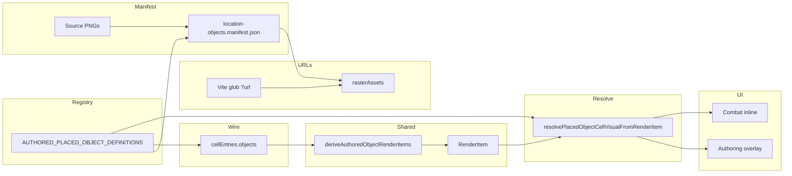

# Placed objects: end-to-end flow (reference)

This document is the **single narrative** for how **registry-defined** props and markers become **pixels on the map** and in **combat**, without duplicating the domain map ([`domain.md`](./domain.md)) or the workspace UI ([`location-workspace.md`](./location-workspace.md)).

**Operational commands** (manifest regeneration, CI validation): [`assets/system/locations/objects/README.md`](../../assets/system/locations/objects/README.md).

---

## Mental model

- **Family** = top-level key in `AUTHORED_PLACED_OBJECT_DEFINITIONS` (e.g. `table`, `door`). **`kind`** in the place palette / `activePlace` is this id.
- **Variant** = family-scoped row (`variants[variantId]`) with **`assetId`**, optional **`footprint`** (feet), optional **`cellAnchor`** (square placement).
- **Persisted cell object** = `LocationMapCellAuthoringEntry.objects[]` entry: wire **`kind`** (`LocationMapObjectKindId`), optional **`authoredPlaceKindId`**, optional **`variantId`**, plus ids for the editor.
- **Edge** (`placementMode: 'edge'`) uses the **same registry** for palette + preview assets; **map** drawing stays **vector** (`edgeEntries`), not raster sprites on cells.

---

## Flow (high level)

---

## 1. Registry (source of truth)

- **File:** `src/features/content/locations/domain/model/placedObjects/locationPlacedObject.registry.ts`
- **`AuthoredPlacedObjectVariantDefinition`:** `assetId` (manifest key), optional **`footprint`**, **`placementMode`** on the family (`cell` | `edge`), **`palette category`**, **`runtime`** (blocking, cover, …).
- **Selectors / persistence:** `locationPlacedObject.selectors.ts` (and `.core`), `locationPlacedObject.persistence.ts` — map **family + host scale** → persisted **`kind`** / **`authoredPlaceKindId`** for new saves.

---

## 2. Assets and manifest

- **Generated manifest:** `assets/system/locations/objects/location-objects.manifest.json` (Option A: `map` + `preview` slices per `assetId`; edge families **preview-only** for `map`).
- **Generator / validation:** `scripts/location-objects-assets/` — `npm run build:location-objects-manifest`, `npm run validate:location-objects`.
- **`variantToAssetId.json`:** optional family→variant→`assetId` map used by the validator; **not** the runtime resolver (registry is authoritative for definitions).

---

## 3. Bundled URLs (client)

- **Module:** `locationPlacedObjectRasterAssets.vite.ts` (eager `import.meta.glob` of `*.png` with `?url`) registers `sourceFile → URL` in `locationPlacedObjectRasterAssets.core.ts`.
- **Preview + map:** `getPlacedObjectPreviewUrlForAssetId`, `getPlacedObjectMapImageUrlForAssetId` read **`location-objects.manifest.json`** and resolve the PNG path through the registered map.

---

## 4. Placement → draft → wire

- **Palette / toolbar:** `getPlacePaletteItemsForScale` → `MapPlacePaletteItem` with **`previewImageUrl`**; `LocationMapEditorPlaceTray` sets **`activePlace`** (`linked-content` | `map-object`, **`kind`**, **`variantId`**).
- **Click resolution:** `placementRegistryResolver.ts` → `resolvePlacementCellClick` / `resolvePlacedKindToAction` → **`buildPersistedPlacedObjectPayload`** (or link intent) → mutations to **`gridDraft`** and `cellEntries`.
- **Mappers:** `domain/authoring/map/cellAuthoringMappers.ts` — `cellDraftToCellEntries` / `cellEntriesToDraft` round-trip **`objects[]`** including **`variantId`** when present.

---

## 5. Shared render item derivation

- **Helpers:** `shared/domain/locations/map/locationMapAuthoredObjectRender.helpers.ts`
- **`deriveLocationMapAuthoredObjectRenderItems`:** builds **`LocationMapAuthoredObjectRenderItem`** (per-cell list: `authorCellId`, `combatCellId`, `kind`, optional `authoredPlaceKindId`, etc.) for **presentation** — used by authoring overlays and combat underlay filtering.

---

## Parity: feet per cell and `cellPx` (workspace vs encounter)

The resolver is deterministic: **same** `PlacedObjectGeometryLayoutContext` → **same** layout/anchor numbers. **Inputs** often differ between surfaces — that is **not** automatic “drift”; compare sources before filing a bug.

| Concern | Workspace (authoring) | Encounter / combat |
|--------|------------------------|---------------------|
| **Feet per cell** | `resolveAuthoringCellUnitFeetPerCell` (`locationCellUnitAuthoring.ts`) — full `grid.cellUnit` table (e.g. `5ft` → 5, `25ft` → 25). | **Always** `ENCOUNTER_TACTICAL_CELL_FEET` (**5** ft/cell) on the tactical grid (`locationMapCombat.constants.ts`). `cellUnitToCombatCellFeet` only **validates** `grid.cellUnit` for encounter conversion (`5ft` / `25ft`); it does **not** vary tactical cell size. **10 ft tactical cells are not implemented** until product needs them. |
| **`cellPx`** | Responsive `squareCellPx` / `squareGridGeometry.cellPx` (`useLocationAuthoringGridLayout`). | Fixed tactical size `BASE_CELL_SIZE` in `CombatGrid.tsx`. |

**Examples (same `grid.cellUnit` string on an encounter-grid map):**

| `grid.cellUnit` | Authoring `feetPerCell` (editor layout) | `grid.cellFeet` / placed-object context in combat |
|-----------------|----------------------------------------|---------------------------------------------------|
| `5ft` | 5 | 5 |
| `25ft` | 25 | **5** (tactical scale is always 5 ft/cell) |

**Unsupported for encounter conversion:** `grid.cellUnit` values not in `ENCOUNTER_MAP_CELL_UNITS_SUPPORTED` (e.g. `100ft`) **throw** when building encounter space from a map — they are not silently mapped to another tactical size.

---

## 6. Visual resolution (labels, URLs, layout)

- **Module:** `domain/presentation/map/resolvePlacedObjectCellVisual.ts`
- **`resolvePlacedObjectCellVisualFromRenderItem`:** maps render item + optional **`PlacedObjectGeometryLayoutContext`** (built via `buildPlacedObjectGeometryLayoutContextFromAuthoring` / `buildPlacedObjectGeometryLayoutContextFromEncounter` in `shared/domain/locations/map/placedObjectGeometryLayoutContext.ts`; same shape as legacy **`PlacedObjectCellVisualFootprintLayoutContext`**) → **`PlacedObjectCellVisual`** (raster URL, footprint size in px, **anchor offsets** for square placement).
- **Footprint math:** `shared/domain/locations/map/placedObjectFootprintLayout.ts`, `placedObjectPlacementAnchorLayout.ts`; **authoring `cellUnit`:** `resolveAuthoringCellUnitFeetPerCell` (`locationCellUnitAuthoring`).
- **Display:** `PlacedObjectCellVisualDisplay.tsx` — `` **`object-fit`** from `placedObjectMapSprite.constants.ts`: **`contain`** when there is no footprint layout box (fixed icon size); **`cover`** when **`layoutWidthPx` / `layoutHeightPx`** are set so the raster **fills** the footprint box on screen. Footprint dimensions are multiplied by **`PLACED_OBJECT_FOOTPRINT_RASTER_DISPLAY_INSET_SCALE`** (~0.97) at paint time so art sits slightly inside the nominal box and avoids grid-border overlap (resolver output unchanged). May crop if PNG aspect ≠ footprint. See **Sprite fit** below.
- **Geometry tests:** `domain/presentation/map/__tests__/resolvePlacedObjectCellVisual.geometry.test.ts` locks layout/anchor outputs for representative registry variants (large rect, circle, long rect).

### Multi-cell footprint layout and interaction risks

Registry **footprint** (feet) maps to a pixel layout box via **`computePlacedObjectFootprintMaxExtentPx`** + **`resolvePlacedObjectFootprintLayoutPx`**. The **major axis** (max of width/depth for rects, diameter for circles) in “cells” is `majorFt / feetPerCell`; the allowed **`maxExtentPx`** grows with that span (up to **`PLACED_OBJECT_FOOTPRINT_MAX_EXTENT_CELLS`**, e.g. 6 cells) so wide objects are not forced into a single **`cellPx`** square.

**Risks (documented for contributors and future hit-testing work):**

- **DOM / ownership:** Rasters still mount under the **anchor** cell’s overlay. Visual overflow into **neighbors** is expected; there is no separate DOM node per covered cell.
- **Pointer / selection:** Select mode and **`[data-map-object-id]`** targets are **not** a full multi-cell hit mesh. Clicks on the **neighbor** cell may not select the object whose art overlaps that cell; conversely, transparent padding around the image can still affect hit targets depending on wrapper **`pointer-events`**.
- **Stacking:** Z-order follows **cell render order**; large sprites can paint **over** adjacent terrain, paths, or icons in ways that feel arbitrary without a dedicated multi-cell layer policy.
- **Combat:** Same resolver path; large sprites may crowd **tokens** or adjacent underlays.
- **Sprite fit:** **`object-fit: cover`** for footprint-resolved rasters fills the **display** box (resolver **`layoutWidthPx` / `layoutHeightPx`** × **`PLACED_OBJECT_FOOTPRINT_RASTER_DISPLAY_INSET_SCALE`**) so props like a **5×3 ft** table read **~full cell width** on a 5 ft/cell grid, with a small uniform inset to reduce grid-border overlap. **`contain`** is only used for legacy fixed-size icons. **`cover`** may crop edges if the PNG is more square than the footprint or has transparent padding — prefer art cropped to the footprint aspect for predictable results.

**Surface vs resolver:** Workspace and encounter may differ in **overflow**, **clipping**, and **z-index** around the leaf; **nominal** layout width/height and anchor offsets come only from the resolver + geometry context. **Display** applies the footprint inset scale on the `` only. Drift in painted pixels with the same context is a shell or asset issue, not footprint math.

---

## 7. Where it renders

| Context | Components / notes |
|---------|-------------------|
| **Map editor (cells)** | `LocationMapCellAuthoringOverlay` inside `GridEditor` / `HexGridEditor` (`renderCellContent`); `LocationGridAuthoringSection` passes **`gridCellUnit`**, **`squareCellPx`** for footprint context. |
| **Place preview** | Synthetic render item from `buildPlacePreviewRenderItem` when hovering in place mode. |
| **Combat (tactical)** | `CombatGrid` → `LocationMapAuthoredObjectIconsCellInline`; **`footprintLayout`** from `buildPlacedObjectGeometryLayoutContextFromEncounter` — same **`SQUARE_GRID_GAP_PX`** and **`applyPlacementAnchor: true`** as authoring so registry **`cellAnchor`** offsets align wide objects to cell boundaries. |
| **Layer order (editor)** | Cell fill → paths → edges (SVG under grid) → **cell rasters** above grid — see [`location-workspace.md`](./location-workspace.md) (authored base-map layer order). |

**Select mode hit-testing:** `[data-map-object-id]` on object wrappers; resolver priority in `domain/authoring/editor/selectMode/` (see workspace doc).

---

## 8. Combat runtime (not the same as authored overlay)

- **Encounter `GridObject`** rows may carry **`authoredPlaceKindId`** for hydration; **token** visuals vs **placed-object** underlay are **not** the same system — see [`combat/client/grid.md`](../combat/client/grid.md). **Presentation** for a kind can still align via **`resolvePlacedObjectCellVisualFromPlacedKind`** where applicable.

---

## 9. Future follow-ups: building form and map footprint (planned)

The **building** placed-object family uses **footprint-oriented** registry variants (`compact_1cell`, `wide_2cell`, …) and is related to **structural form classes** and **`buildingMeta`** on the location side. Core types, defaults, and **`deriveBuildingObjectRecommendation`** live under `shared/domain/locations/building/`.

**Plan (source of truth for scope and non-goals):** [Building form map variants](../../../.cursor/plans/building_form_map_variants_b471881f.plan.md).

**Suggested follow-ups** (not implemented as part of that plan’s closure; track against the plan and related schema work):

- Wire **`deriveBuildingObjectRecommendation`** into the city (or site) map **place tool** so the **default `variantId`** for a new building marker reflects **`buildingMeta`** + optional **form class** when known.
- Optional **persistence** of chosen **form class** on the building location row when the API can store it without losing merge semantics.
- **`deep_2cell`** (or similar) **registry variant** plus **multi-cell placement** rules if product needs depth beyond the v1 footprint set.
- Align with **§16 placement backpointer** (`cityPlacementRef` / `placementId`) when the [location modeling schema plan](../../../.cursor/plans/location_modeling_schema_plan_b86f6970.plan.md) implements it — not a client-only shortcut.
- Optional **one-time data migration** for persisted **`variantId`** strings that still use removed ids (e.g. legacy `residential` / `civic`), if campaigns must preserve distinct footprints instead of resolving unknown keys to the family default via `resolveFamilyVariant`.

---

## 10. Related code index (quick)

| Area | Path |
|------|------|
| Registry | `domain/model/placedObjects/locationPlacedObject.registry.ts` |
| Building form / map variant derivation (shared) | `shared/domain/locations/building/deriveBuildingObjectRecommendation.ts`, `locationBuildingForm.defaults.ts`, `locationBuilding.types.ts` |
| Selectors / persistence | `domain/model/placedObjects/locationPlacedObject.selectors*.ts`, `locationPlacedObject.persistence.ts` |
| Placement resolver | `domain/authoring/editor/placement/placementRegistryResolver.ts` |
| Render items | `shared/domain/locations/map/locationMapAuthoredObjectRender.helpers.ts` |
| Resolve visual | `domain/presentation/map/resolvePlacedObjectCellVisual.ts`, `PlacedObjectCellVisualDisplay.tsx` |
| Sprite `object-fit` (contain vs cover) | `domain/presentation/map/placedObjectMapSprite.constants.ts` |
| Geometry context (factories) | `shared/domain/locations/map/placedObjectGeometryLayoutContext.ts` |
| Combat feet from `grid.cellUnit` | `locationCellUnitCombat.ts`, `locationMapCombat.constants.ts` |
| Authoring vs combat feet parity tests | `shared/domain/locations/map/__tests__/locationCellUnitCombat.parity.test.ts` |
| Resolver geometry tests | `domain/presentation/map/__tests__/resolvePlacedObjectCellVisual.geometry.test.ts` |
| Editor overlay | `components/mapGrid/LocationMapCellAuthoringOverlay.tsx` |
| Combat inline icons | `components/mapGrid/LocationMapAuthoredObjectIconsLayer.tsx` |
